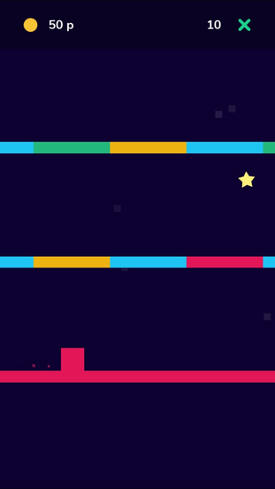
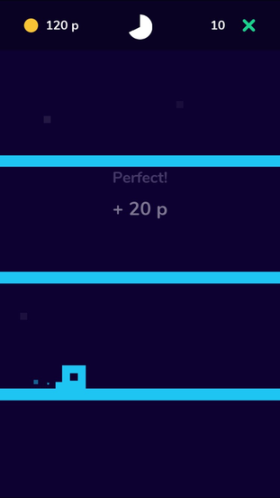
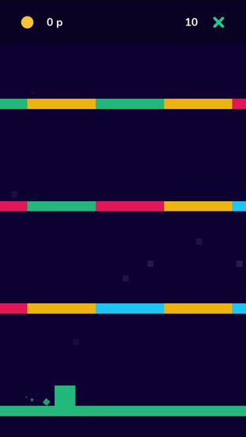
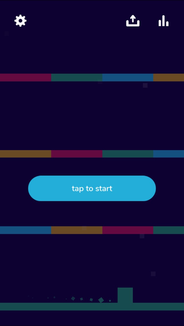

# Developer Interview with AntiSocial Games

### Tell everyone a bit about yourself and team.
My name is __Stein Ove Helset__ and together with __Camilla Frøland__, we run __AntiSocial Games__. We’re a Norwegian couple currently living in Malaga, Spain.

We both love creating games and since I know how to program and she can create the art, we have all we need.

We have tried to create games before, but somewhere during the last 5-10% of the games we’ve lost motivation and started something new. In October 2018 we decided to start a challenge: 12 games in 12 months. We just released our fifth game and are super excited to continue.

Our newest game is called __Scolors__ and 2 days after we launched it, it got featured on the App Store under __«new games we love»__. We have had a lot of positive feedback on this game, everyone seems to love it and that is really motivating. Right now we’re working on a really exciting update for the game. It will be released very soon!

### Tell everyone where you came up with the idea for this game. What were your inspirations?
The idea for __Scolors__ came up when we were sitting and talking about games. This is how most of our ideas are generated. We sit and talk and try to come up with new concepts and mechanics, and then we write down those we like best.

There were no particular inspirations for the game. We both like to play with colors in games and we think colors is a great way of spriting up a gameplay.

### What version of cocos2d-x or Cocos Creator did you use?
We use __cocos2d-x v3.17.1__. I want to give __Cocos Creator__ a try. But right now I just want to focus on learning more about __Cocos2d-x__ and become better at C++. The development time of our games isn’t very long, so I don’t know how much time we’ll save by switching.

### How did you decide to use Cocos products instead of Unity, Unreal Engine or SDL?
__Cocos2d-x__ seemed like a very good choice after reading about different game engines and testing them out. __Cocos2d-x__ gives you a good amount of help when it comes to sprites, animations, scenes, etc. Unity and some of the other engines just seems too bloated when it comes to this.

We also like the fact that __Cocos2d-x__ is open source. This way we can check out how the different parts are built and that can make it easier to debug and understand how things can be done.

### What features did the engine offer you that made development easy? What do you wish the engine did better?
Even though I didn’t know C++ when I started to use __Cocos2d-x__, the simplicity of the engine made it easy to understand how to build games. 

### What tools did you use besides the engine?
__Cocos2d-x__ was the only tool we used when we created the game. The programming was done in Xcode and the graphics were made in Adobe Photoshop.

### What 3rd party libraries did you need to use? 
We did not use any 3rd party libraries except plugins from __SDKBOX__.

### Did you create the art yourself? What tools?
Yes, Camilla did all of the art in the game. To create them she used Adobe Photoshop.

### Did you create the music yourself? What tools?
No, we did not create the music our self. The music is made by Eric Matyas (https://soundimage.org).

### Will you continue to make games in the future?
Definitely! Making games are so much fun. 

We are going to keep doing our 12 games in 12 months challenge and hopefully, our games will be played and loved by a lot of people.

### Do you use SDKBOX? If so, what plugins are you currently using?
Yes. We’ve implemented the IAP, Play, AdsPlus, Review, and OneSignal. Using __SDKBOX__ made it really easy to implement these plugins.

Writing these plugins from scratch would take a lot of time. So we’re really happy that there’s a good solution for all of those things.

### Lastly, any advice for those also making games on how to get to a release point?
Try to build a little bit on your game every day. Projects shouldn’t have too large a scope. Chewing over too much at a time might lead to you losing your motivation.

----

You can play __Scolors__ on both the [__App Store__](https://itunes.apple.com/us/app/scolors/id1451650715) and [__Play Store__](https://play.google.com/store/apps/details?id=games.antisocial.scolors). You can also view the [__game play trailer__](https://youtu.be/vdwJYh7TlpA). 

