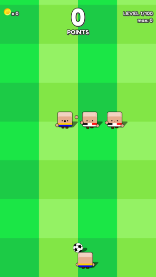
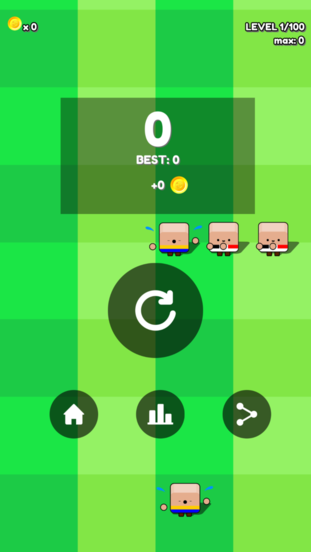

# Developer Interview with Rivers Games

### Tell everyone a bit about yourself and team.
We are __Rivers Games__, a Brazilian indie game studio, composed by one game designer/programmer (me, __Carlos Rios Jr.__) and a game designer/graphics designer (__Renan Nucci__). We both have day jobs, not related to gaming or programming, so game development is a hobby that we are taking seriously. Also, my wife, __Andréia Rios__, handles the admin tasks. She takes cares of iOS publishing too and has designed some games herself.

We started __Super Casual Soccer__ development in April 2017. Than, due some personal problems, we had to stop. We resumed development in November 18 and released the game for iOS on March 03, 2019. The Android version was released on March 06, 2019.

### Tell us where you came up with the idea for this game. What were your inspirations?
Soccer has a strong role in Brazilian culture, so we decide to create a casual game with this theme, with simple mechanics, lots of characters and very challenging gameplay. The drawings and animations was inspired by “Prison Architect” game art style. We are strong fans of minimalistic art.

### What version of Cocos2d-x or Cocos Creator did you use?
We used __Cocos2d-x 3.17__.

### How did you decide to use Cocos products instead of Unity, Unreal Engine or SDL?
First of all, it’s open source. We only used open source tools to build our games. Second, it’s lightweighter than Unity and Unreal Engine, while it’s much more functional than SDL, because it’s very easy to deploy to Android and iPhone after coding once. Finally, __Cocos2d-x__ has a incredible community, which is always willing to help the devs.

### What features did the engine offer you that made development easy? What do you wish the engine did better?
The pros:
  1. very good documentation
  2. outstanding code engineering, built  on top of its Node pattern
  3. very easy to deploy to multiple platforms
  4. command line tool that makes very easy to build, compile and test games
  5. it’s very easy to develop on Linux using Netbeans IDE
  6. incredible community as already said

### What tools did you use besides the engine?
We did use __Cocos Studio__ for animations, UI design and texture packing. We know it’s deprecated but works very well, despite some bugs. We managed to install __Cocos Studio__ on Ubuntu and it works very well. The main development was done on Ubuntu, using Netbeans IDE.

### What 3rd party libraries did you need to use? 
No 3rd party libraries was needed. __Cocos2d-x__ has everything.

### Did you create the art yourself? What tools?
Yes, we did. I did the UI interface and Renan made the drawings and animations. We used Inkscape to make all graphics assets.

### Did you create the music yourself? What tools?
No, we gathered free music and sound effects from the internet. Almost all was from freesound.com

### Will you continue to make games in the future?
Definitely yes, we plan to release at least 3 more games in 2019. 

### Do you use SDKBox? If so, what plugins are you currently using?
Yes, we used __SDKBox__. We used these plugins: __Share__, __Review__, __Appodeal__, __SDKBox Play__, __IAP__ and __Firebase__. We hope that the __SDKBox__ team continues to improve the plugins and the integration process.

### Lastly, any advice for those also making games on how to get to a release point?

I see game development as a combination of engineering and art skills. Sometimes it’s hard to combine these two factors to generate a real life game. Also, game development takes time, so it’s very important to test the feedback of real players as soon as possible, during the development, to avoid to release a game that nobody understands or wants to play. That’s why design thinking principles are very important in game development. __Super Casual Soccer__, for instance, ended up very different from its initial idea. I guess the rule of thumb here is to fail fast and fail cheap. Another thing to consider in the process is the marketing stuff, which we are still learning. It’s becoming very hard to promote a new game these days, due to a variety of new releases every day in both mobile platforms (besides, any suggestion on this will be very welcomed).

----

You can download __Super Casual Soccer__ from the [__App Store__](https://itunes.apple.com/br/app/super-casual-soccer/id1450400357?mt=8) or the [__Play Store__](https://play.google.com/store/apps/details?id=com.riversgames.soccer). You can also view the [__game play trailer__](https://www.youtube.com/watch?v=zmwzKp8RQnI)

Follow __Rivers Games__ on __Twitter:__ __@rivers_games__.

