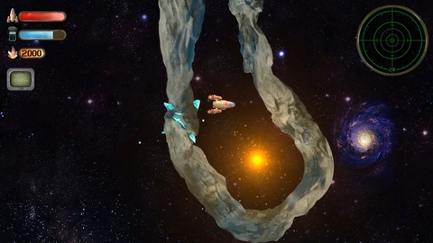
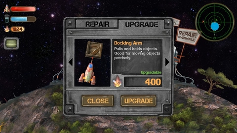
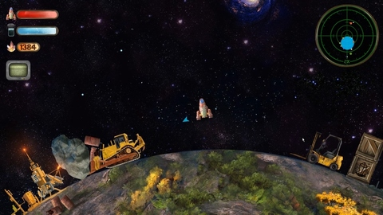
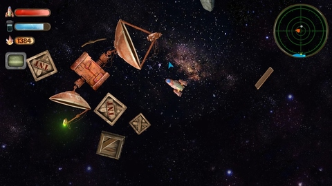
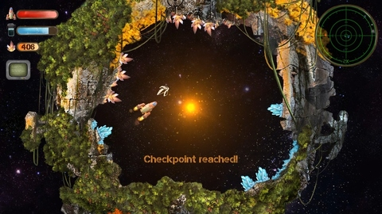
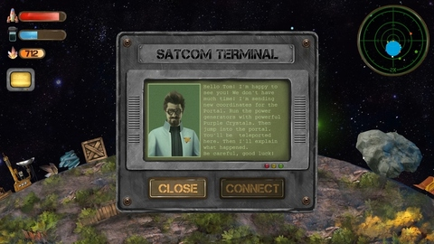
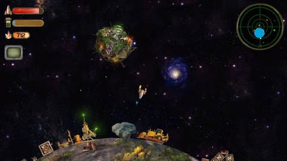
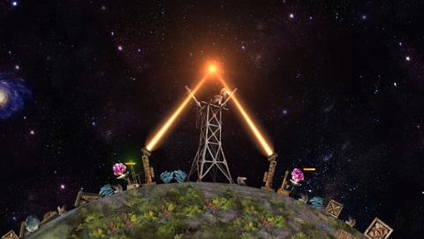

# Developer Interview with the Super Mega Space Game! Dev Team

### Tell everyone a bit about yourself and team.
Hi! My name is __Martin__. Our team consists of 3 people.
I'm designer/developer and my friend __Alex__ is digital paint artist. My wife __Estrella__ is a videographer and she helps us for video production. We usually work freelance on creative projects like 2D/3D animations, VFX and video production.

### Tell everyone where you came up with the idea for this game. What were your inspirations?
I'm an engineer and a hang-glider pilot. I always interested in physics and flight dynamics. I'm web developer who made web sites for fun and commercial. One day I was teaching my wife JavaScript and we made very simple physics simulator on JS. This is a video capture of that moment (1 year ago): https://youtu.be/yociWbPqlXk

In the beginning I didn't know where the project will go and I just wanted to put a game on mobile platforms. It needs to be physics based game because in physics you can make complex structures based on very simple rules which is manageable for small teams. I was familiar with several programming languages but I didn't want to make things from scratch and wanted to concentrate on the game . So I decided to go with JavaScript. I researched physics libraries and tools which I can use. 

### How did you decide to use Cocos products instead of Unity, Unreal Engine or SDL?
One of my friends recommended __Cocos2d-x__ because of it's performance and being open-sourced. I researched __Cocos__ products family and __Cocos Creator__ was good for my project. It has entity-component system that is mandatory for making a game for me and uses JavaScript, which I'm used to. Being open-source is a big plus for me because that means if you hit a limit of game engine you can improve and fix it for your game. I really did modify the engine when developing __Super Mega Space Game!__. During save and load game state I've modified __Cocos Creator API__ and used my own id system for scene nodes to save/restore states. Some other advantages with __Cocos__ is physics performance. I didn't make rock solid test but I observed a lot.

### What version of cocos2d-x or Cocos Creator did you use?
I've used __Cocos Creator 1.9.3__. I've tried to upgrade but camera rotation wasn't supported that time. I think it's already fixed now :) I really want to upgrade latest version after I released full version of __Super Mega Space Game!__

### What features did the engine offer you that made development easy? What do you wish the engine did better?
Good:
- First of all is JavaScript. JS is very flexible language. You can change definition of a function on the fly and get rid of many if-else statments, simply gain performance. 
- Event driven system is very useful and performance friendly.
- Cocos Creator's editor interface is very useful. You can quickly make prototypes.
- Physics engine is really good and high performance! 
- Being open-source is perfect! I've modified and added some custom events for my games load/save feature.

Can be improved:
- Audio engine can be improved! Generaly I like it but has some down sides and now I'm having fps lag issues caused by long and looped audio files on windows playform. (If it's already solved on new versions you can remove this comment)
- If  we had global render order option that would be great.
- Edit Text and mobile keyboard has some lag issues. So I'll make my own embeded keyboard for mobile (It's not critical for my game tough).
- We don't have an API to check network state, so I need to ping a server to detect it. (If it's already solved on new versions you can remove this comment)
- Controller/Joystick support would be nice.

### What tools did you use besides the engine?
We used VSCode for coding, Photoshop for graphics, Ableton Live for editing sound effects and composing music.

### What 3rd party libraries did you need to use? 
I used custom modified version of Gamejolt JavaScript API and GameAnalytics HTML5 API.

### Did you create the art yourself? What tools?
Art is created by my friend Alex. He used Photoshop and Wacom Cintiq tablet for paintings.

### Did you create the music yourself? What tools?
I've created the music. I use Ableton Live for composing. I have very old and cheap M-Audio MIDI keyboard. Medium level Cort electric guitar and Ibanez Steel Acoustic Guitar.

### Will you continue to make games in the future?
Of course we will! Making games was my childhood dream and hopefully if we can build a sustainable business with this project we have a lot of good project plans for gaming world!

### Do you use SDKBOX? If so, what plugins are you currently using?
I didn't use in the current phase of development. Next week I'll start implementation of several features and I'll use these plugins first:
- In-App Purchases
- Google Play Game Servies
- SDKBOX Ads
- SDKBOX Play
- Ratings & Reviews
- Social Sharing

### Lastly, any advice for those also making games on how to get to a release point?
As we are human we have feelings. Sometimes it's not easy to keep motivated for a long project. Sometimes you think it's not gonna be completed or be failed. Many days I felt like I will not be able to finish the project or it's not really good enough. Don't listen those feelings. If you like the game you made and it's enjoyable there should be many people around the world who will love it. Trust numbers and statics. Always focus forward!

Finally. Making games was my childhood dream and I want to share this dream with everybody. We want to complete this game together with community. Anybody can join us with feedback and ideas. We would love to see people adding value to the game with new ideas and this is gonna be much bigger than I imagined.

----

You can check out __Super Mega Space Game!__ on a variety of social platforms:
  - [__Homepage__](http://supermegaspacegame.com/)
  - [__Instagram__](https://www.instagram.com/supermegaspacegame/)
  - [__Twitter__](https://twitter.com/spmegaspacegame)
  - [__Discord__](https://discord.gg/UsewVX2)
  - [__You Tube__](https://www.youtube.com/channel/UCS7x4xO7IYlZWP4yeXBKJxA)

__Super Mega Space Game!__ is currently in beta phase and only published on [__Gamejolt__](https://gamejolt.com/games/supermegaspacegame/393454) and [__itch.io__](https://supermegaspacegame.itch.io/beta-release). Later, it will be on Google Play, Apple Store and Steam. Check out the [__full gameplay video__](https://www.youtube.com/watch?v=lLC2z6sXxwM)

