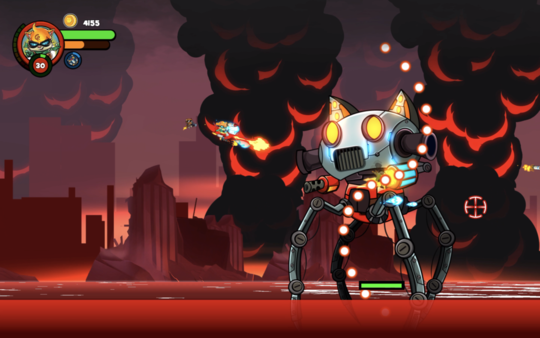
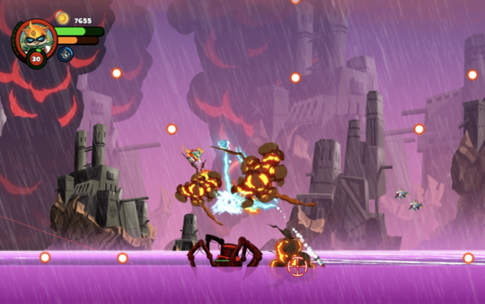
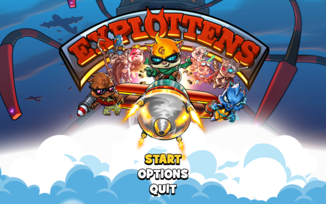
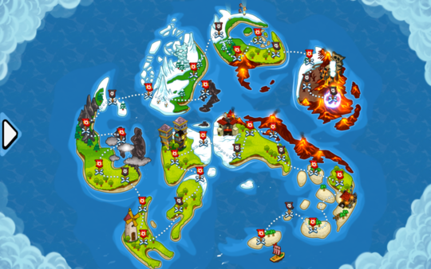
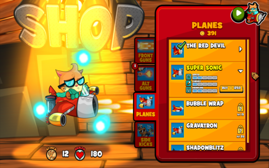
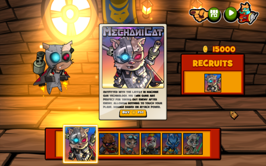

# Developer Interview with we.R.play

### Tell everyone a bit about yourself and team.
I’m __Bilal__ the Lead Developer of __Explottens__. I graduated from FAST university in 2012 and have been working at __we.R.play__ since then. I love making games and in the past 7 years I've created quite a few. Some of the more popular titles include __Scuba Steve, Beatleap, and Bloody Pixel Zombies__. I mostly use __Cocos2d-x__ for development, because it is fast, lightweight, and an open-source program.

__Ahmed Mehmood__ is our lead artist who's been working at __we.R.play__ for almost 5 years now. He did his bachelors in Telecomm Engineering, but followed his passion after graduation. Since joining us, he has been working on our internal games along with some of our major clients like WB, PocketGems, JamCity etc.

### Tell everyone where you came up with the idea for this game. What were your inspirations?
We had multiple inspirations when we were coming up with the characters, airplanes, and weapons! We wanted to draw super deformed kitties, inspired by Himaruya Hidekaz’s chibi characters (manga of Hetalia: Axis Powers). Character designs were inspired by many things. Our team is a huge fan of Star Wars, the manga Hetalia: Axis Powers, world history, and classical music. We had plans to make a Beethoven kitty that’d play the fifth symphony on a jet-propelled piano, striking lightning at the climax of the song (perhaps that's a bit too ambitious?). But overall, We would say the character designs are a mix of sci-fi, steampunk, & historical figures. 

### What version of cocos2d-x or Cocos Creator did you use?
__cocos2d-x 3.17.1__

### How did you decide to use Cocos products instead of Unity, Unreal Engine or SDL?
I was trained in __Cocos2d-x__, It made more sense to choose __Cocos2d-x__ at that time.

### What features did the engine offer you that made development easy? What do you wish the engine did better?
This engine gives you really good control over a lot of stuff. 2d modules are super polished. The action class is incredible and overall workflow is just awesome. However, I did face a lot of problems when we decided that this should be a desktop game. __Cocos2d-x__ does not support desktop as well as other engines. This ended up costing me over a year of extra work. Feature like video player wasn’t present. I had many performance and optimization issues which eventually got fixed. Also tried to port __Explottens__ to ps4 and failed. It was taking way too much time.

### What tools did you use besides the engine?
Spine , Photoshop, Illustrator, Texture Packer

### What 3rd party libraries did you need to use? 
We tried a lot of libraries for analytics and ads. But we ended up removing all of that and we just used GameAnalytics because it supports desktop games.

### Did you create the art yourself? What tools?
Photoshop and Illustrator

### Did you create the music yourself? What tools?
We outsourced music for the game which was done by Cafofo. http://www.estudiocafofo.com/

### Will you continue to make games in the future?
Yes that’s the plan. I will be exploring other engines after I’m completely done with explottens.

### Do you use SDKBox? If so, what plugins are you currently using?
No, we haven’t used SDKBox yet. But for our mobile version we most definitely will.

### Lastly, any advice for those also making games on how to get to a release point?
__Explottens__ itself took twice as much time as we hoped for. What I’ve learned is that we should lock down features in time to avoid making too many changes. Same goes for the art. In my case we redid the shop 5 times because we couldn’t get it right.

----

You can play __Explottens__ on [__Steam__](https://store.steampowered.com/app/630400/Explottens/). You can also view the [__game play trailer__](https://www.youtube.com/watch?v=pCGX57qJx-s). 

