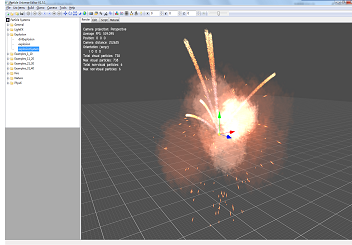
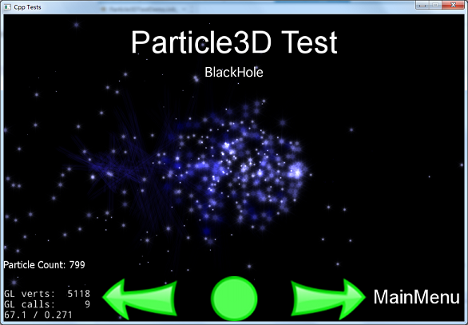

  <a href="#" class="btn" onclick="toggleLanguage()">中文</a>

##Advanced Topics

###BillBoard
You may not have heard of a `BillBoard` before. No, I'm not talking about an
advertisement on the side of a highway. Rather, `Billboard` is a special `Sprite`
that always faces the `Camera`. As you rotate the `Camera`, `Billboard` objects
also rotate. Using a`BillBoard` is a very common rendering technique. Take for
example a downhill skiing game. Any trees, rocks or other objects that are in
the way of the skier are `Billboard` objects.

This is how `Camera` and `Billboard` objects relate to each other.

`Billboard` objects are easy to create. `BillBoard` is derived from `Sprite`, so
it supports most of the features as a `Sprite` object. We can create one using the
following create method:


auto billboard = BillBoard::create("Blue_Front1.png", BillBoard::Mode::VIEW_POINT_ORIENTED);


You can also create a `Billboard` object for the camera XOY plane (like the plane
  of a floor) by changing the `BillBoard` objects mode:


auto billboard = BillBoard::create("Blue_Front1.png", BillBoard::Mode::VIEW_PLANE_ORIENTED);


These _create_ methods look a little different since an additional parameter of
__BillBoard::Mode__ is passed in. There are two __BillBoard::Mode__ types,
__VIEW_POINT_ORIENTED__ and __VIEW_PLANE_ORIENTED__.

__VIEW_POINT_ORIENTED__ is where the `BillBoard` object is oriented to the
`Camera`. Example:

 __VIEW_PLANE_ORIENTED__ is where the `BillBoard` is oriented towards the XOY plane
 of the `Camera`. Example:

You can also set properties for a `BillBoard` just like with any other `Node`.
These include, but are not limited to: __scale__, __position__, __rotation__.
Examples:


billboard->setScale(0.5f);
billboard->setPosition3D(Vec3(0.0f, 0.0f, 0.0f));
billboard->setBlendFunc(BlendFunc::ALPHA_NON_PREMULTIPLIED);
addChild(billboard);


###ParticleSystem3D
In Chapter 7, you learned about 2D particles and how to use them. When you use 3D
you might also want to use a 3D particle system for rich, advanced effects. Many
of the same concepts apply for a 3D particle system as they did with a 2D particle
system. Cocos2d-x currently supports __Particle Universe__ (http://www.fxpression.com/)
for particle system construction. __Particle Universe__ provides a special particle
editor that allows you to quickly and easily set up a variety of effects, such as
explosions, fire, blood and other special effects. This editor uses a __pu__ file
extension when saving or exporting.

When you are happy with your particle and ready to use it in code, exporting to
its built-in format of __pu__ is enough! Cocos2d-x supports this format directly.
Also, as `ParticleSystem3D` is derived from `Node`, it supports most of the
features that `Node` supports. `PUParticleSystem3D` is an object type specifically
for dealing with __Particle Universe__ particles. `PUParticleSystem3D` offers two
ways for creating particles.

The first way is to build a particle by passing in a __Particle Universe__ file
and its corresponding __material file__. Remember from Chapter 7 that a
__material file__ is what describes the particle. This is required. Example:


auto ps = PUParticleSystem3D::create("lineStreak.pu", "pu_mediapack_01.material");
ps->startParticleSystem();
this->addChild(ps);


The second way is to build the particle system only by passing a __particle universe__
file. When you create a particle this way, besides loading the particle, all
__material files__ in the same folder as the particle file will automatically be
loaded. Here is an example:


auto ps = PUParticleSystem3D::create("electricBeamSystem.pu");
ps->startParticleSystem();

this->addChild(ps);


  __Note:__ using this method will result in an increase in loading times and
consumes more memory since everything will be loaded. If you know what __material__
you want to use and don't need to load everything, using the first method would
be preferred.

In these images below, on the left is the particle in __particle universe__, while
on the right is the effect running in Cocos2d-x:

 

Once you have your particle, you can interact with it it fairly obvious ways. You
can interact with with the __particle system__ as a whole, starting, stopping,
pausing, resuming and obtaining the total number of particles:


virtual void startParticleSystem() override;
virtual void stopParticleSystem() override;
virtual void pauseParticleSystem() override;
virtual void resumeParticleSystem() override;
virtual int getAliveParticleCount() const override;


As `PUParticleSystem3D` is derived from `Node` you can run `Action` and `Sequence`
objects on your particles! Example:


auto ps = PUParticleSystem3D::create("blackHole.pu", "pu_mediapack_01.material");
ps->setPosition(-25.0f, 0.0f);

auto moveby = MoveBy::create(2.0f, Vec2(50.0f, 0.0f));
auto moveby1 = MoveBy::create(2.0f, Vec2(-50.0f, 0.0f));

ps->runAction(RepeatForever::create(Sequence::create(moveby, moveby1, nullptr)));
ps->startParticleSystem();


Combining `Action` and `Sequence` objects could produce an interesting black hole
effect:

Just like with other 3D objects you can also combine 3D objects using `AttachNode`.
This allows for creating rich models. Example:


auto sprite3d = Sprite3D::create("orc.c3b");
sprite3d->setPosition3D(Vec3(0.0f, 0.0f, 0.0f));
sprite3d->setRotation3D(Vec3(0.0f, 180.0f, 0.0f));

auto animation = Animation3D::create("orc.c3b");
if (animation)
{
    auto animate = Animate3D::create(animation);
    sprite3d->runAction(RepeatForever::create(animate));
}

auto handler = PUParticleSystem3D::create("lightningBolt.pu");
handler->startParticleSystem();
sprite3d->getAttachNode("Bip001 L Hand")->addChild(handler);

this->addChild(sprite3d);


