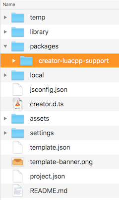
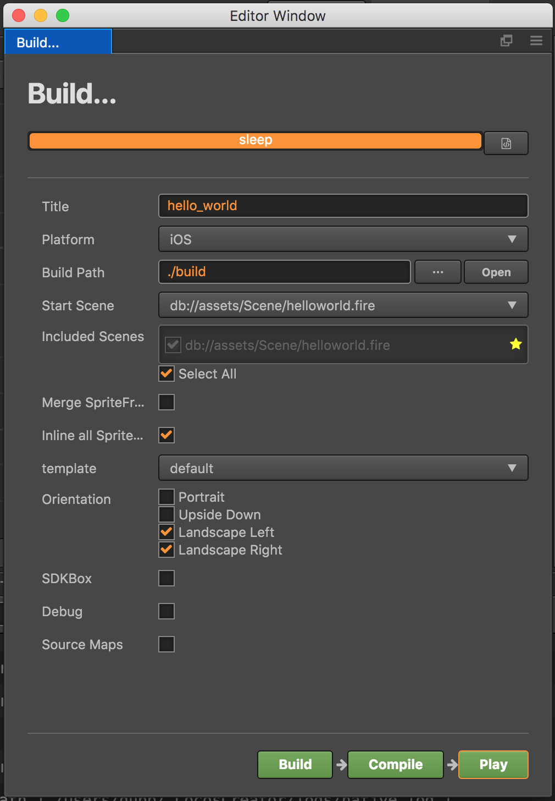

## Using Cocos Creator With C++ and Lua Projects
__Cocos Creator__ supports JavaScript, built in. Edit your `Scenes` and source code all from within. However, If you are a C++ or Lua developer, __Cocos Creator__ allows exporting of `Scenes` to sour code for further development. Why isn't C++ built in, you ask? There is no need to re-invent the wheel. There are many really good development environments out there. Writing a text editor is no trivial task. For this reason, it is best to allow developers to edit source code in the editor of their choice.

### What Is Supported?
__Cocos2d-x v3.14__ and __Cocos Creator v1.4__ and above are required. If you find some `Nodes` are not supported, upgrading __Cocos2d-x__ and __Cocos Creator__ may add support for them.

The following `Nodes` are supported.

Node | Node | Node | Node | Node
--- | --- | --- | --- | ---
Scene | Sprite | Canvas | ScrollView | Label
EditBox | ParticleSystem | TiledMap | Button | ProgressBar
RichText | SpineSkeleton | Widget | Animations | VideoPlayer
WebView | Slider | Toggle | ToggleGroup | PageView
Mask | Collider | Prefab | DragonBones

### Installing The Plugin
Adding C++ and Lua language support to __Cocos Creator__ is easy:

* clone the [Creator To Cocos2d-x repo](https://github.com/cocos2d/creator_to_cocos2dx).
* from this repo, copy the __creator_project/packages/creator_luacpp_support__ folder into your __Creator project__ in __packages__. directory

    

    In the __Project__ menu inside __Creator__ a new menu option will appear __LuaCPP Support__.

    

### Plugin Setup
To run the plugin:

* select __Project__ -> __LuaCPP Support__ -> __Setup Target Project__. It is required to tell __Cocos Creator__ where to build all the necessary files.

    

* select __Build__.

* use the resulting dialog box to set the build options that you need.

    

* always use the __Build__ button to build your project before running it. The result is all the needed code and resources to drop into your external build system.

  * C++ projects use these paths:
    source code: __NATIVE_PROJECT_ROOT/Classes/reader__
    resources: __NATIVE_PROJECT_ROOT/Resources/creator__

  * LUA projects use these paths:
    source code: __NATIVE_PROJECT_ROOT/frameworks/runtime-src/Classes/reader__
    resources: __NATIVE_PROJECT_ROOT/frameworks/runtime-src/Resources/Creator__

### Moving from Creator to an external build system
After using the __Build__ function the source code and resources are exported to the filesystem. From here, you can use these items in an external build system.

#### Header and Include search paths
It is still necessary to set some __header__ and __include__ __search paths__.

  For C++:
    ```sh
    reader
    ```
  For Lua:
    ```sh
    reader
    reader/collider
    reader/animation
    reader/dragonbones/cocos2dx
    reader/dragonbones/armature
    reader/dragonbones/animation
    reader/dragonbones/events
    reader/dragonbones/factories
    reader/dragonbones/core
    reader/dragonbones/geom
    ```

#### Android
When developing for Android the __Android.mk__ needs to be modified. There are a few simple lines to add,

  For C++:
    ```sh
    LOCAL_STATIC_LIBRARIES += creator_reader

    # _COCOS_LIB_ANDROID_BEGIN
    # _COCOS_LIB_ANDROID_END

    $(call import-module, ./../../Classes/reader)  # import module path
    ```

  For Lua:
    ```sh
    # for lua
    include $(CLEAR_VARS)
    LOCAL_MODULE := creator_reader_lua
    LOCAL_MODULE_FILENAME := libcreatorreaderlua
    LOCAL_ARM_MODE := arm
    LOCAL_SRC_FILES := $(cpp_src) \
    lua-bindings/creator_reader_bindings.cpp \
    lua-bindings/reader/lua_creator_reader_auto.cpp \
    lua-bindings/reader/lua_creator_reader_manual.cpp \
    lua-bindings/dragonbones/lua_dragonbones_manual.cpp \
    lua-bindings/dragonbones/lua_dragonbones_auto.cpp

    LOCAL_STATIC_LIBRARIES += creator_reader_lua

    # _COCOS_LIB_ANDROID_BEGIN
    # _COCOS_LIB_ANDROID_END

    $(call import-module, ./../../Classes/reader)
    ```

### Example Usage
Once everything is done, you can add code to tie everything together. It's elegant and simple:

For C++ projects, just 1 step:
```cpp
// mygame.cpp
#include "reader/CreatorReader.h"

void some_function()
{
    creator::CreatorReader* reader = creator::CreatorReader::createWithFilename("creator/CreatorSprites.ccreator");

    // will create the needed spritesheets + design resolution
    reader->setup();

    // get the scene graph
    Scene* scene = reader->getSceneGraph();

    // ...and use it
    Director::getInstance()->replaceScene(scene);
}
```

For Lua projects, require 2 steps:

  * register the creator reader bindings
    ```cpp
    #include "reader/lua-bindings/creator_reader_bindings.hpp"

    ...

    register_creator_reader_manual(L);
    ```

  * add code to access the exported files.
    ```lua
    local creatorReader = cc.CreatorReader:createWithFilename('creator/CreatorSprites.ccreator')
    creatorReader:setup()
    local scene = creatorReader:getSceneGraph()
    cc.Director:getInstance():replaceScene(scene)
    ```

### How to use ColliderManager
`ColliderManager` is used to manage collisions. Every `Scene` has an instance of `ColliderManager`. You can use it to listen for collision events:

```c++
creator::CreatorReader* reader = creator::CreatorReader::createWithFilename("creator/CreatorSprites.ccreator");

// will create the needed spritesheets + design resolution
reader->setup();

// get the scene graph
Scene* scene = reader->getSceneGraph();

auto colliderManager = scene->getColliderManager();

colliderManager->registerCollitionCallback([=](creator::Contract::CollisionType type, creator::Collider* collider1, creator::Collider* collider2) {
        if (type == creator::Contract::CollisionType::ENTER)
            colliderManager->enableDebugDraw(true);

        if (type == creator::Contract::CollisionType::EXIT)
            colliderManager->enableDebugDraw(false);

}, "");
```
To read about additional features of `ColliderManager`, refer to [the header file](https://github.com/cocos2d/creator_to_cocos2dx/tree/master/creator_project/packages/creator-luacpp-support/reader/collider/ColliderManager.h).
