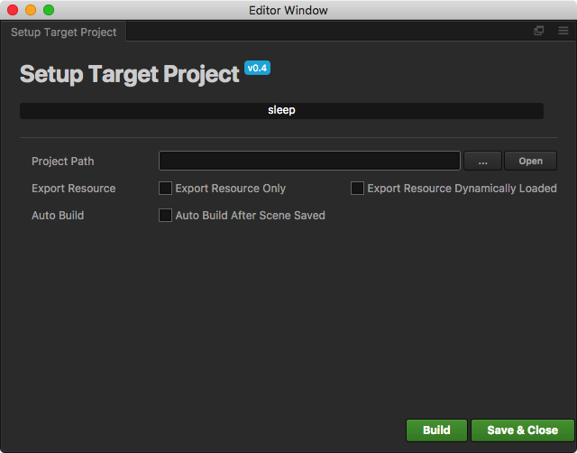
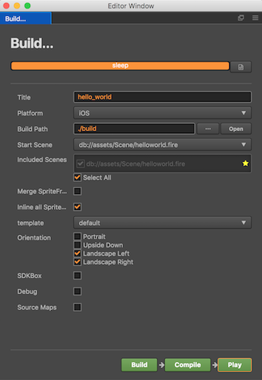

## Using Cocos Creator With C++ and Lua Projects
__Cocos Creator__ supports JavaScript, built in. Edit your `Scenes` and source code all from within. However, If you are a C++ or Lua developer, __Creator__ allows exporting of `Scenes` to sour code for further development. Why isn't C++ built in, you ask? There is no need to re-invent the wheel. There are many really good development environments out there. Writing a text editor is no trivial task. For this reason, it is best to allow developers to edit source code in the editor of their choice.

### What Is Supported?
__Cocos2d-x v3.14__ and __Cocos Creator v1.4__ and above are required. If you find some `Nodes` are not supported, upgrading __Cocos2d-x__ and __Cocos Creator__ may add support for them.

The following `Nodes` are supported.
Node | Node | Node | Node | Node
--- | --- | --- | --- | ---
Scene | Sprite | Canvas | ScrollView | Label
EditBox | ParticleSystem | TiledMap | Button | ProgressBar
RichText | SpineSkeleton | Widget | Animations | VideoPlayer
WebView | Slider | Toggle | ToggleGroup | PageView
Mask | Collider | Prefab | DragonBones

### Installing The Plugin
Adding C++ and Lua language support to __Cocos Creator__ is easy:

* clone the [Creator To Cocos2d-x repo](https://github.com/cocos2d/creator_to_cocos2dx).
* from this repo, copy the __creator_project/packages/creator_luacpp_support__ folder into your __Creator project__ in __packages__. directory

    

  In the __Project__ menu inside __Creator__ a new menu option will appear
  __LuaCPP Support__.

    

### Plugin Setup
To run the plugin:

* select __Project__ -> __LuaCPP Support__ -> __Setup Target Project__.

  

  It is required to tell __Cocos Creator__ where to build all the necessary files.

* select __Build__.

  

* use the resulting dialog box to set the build options that you need.

  

* always use the __Build__ button to build your project before running it. The result is all the needed code and resources to drop into your external build system.

  * C++ projects use these paths:
    source code: __NATIVE_PROJECT_ROOT/Classes/reader__
    resources: __NATIVE_PROJECT_ROOT/Resources/creator__

  * LUA proojects use these paths:
    source code: __NATIVE_PROJECT_ROOT/frameworks/runtime-src/Classes/reader__
    resources: __NATIVE_PROJECT_ROOT/frameworks/runtime-src/Resources/Creator__

### Exporting A Scene To Source Code

###
