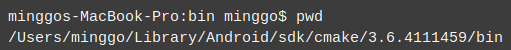

## Android

### generateJsonModelDebug FAILED
To solve this issue, please import the project into __Android Studio__, click
`Build/Refresh Linked C++ Projects`.

### Android Studio uses the __ninja__ build system
__Android Studio__, itself, uses __ninja__ to build native codes. There is __ninja__ binary under __Cmake__ folder. If __Android Studio__ cannot find __ninja__ on __Windows__, it is the __Android Studio__ issue. You should set an environment variable that specifies the path to __ninja__:

  

[__ninja binaries__](https://github.com/ninja-build/ninja/releases) are available as is [__ninja documentation__](https://ninja-build.org/).