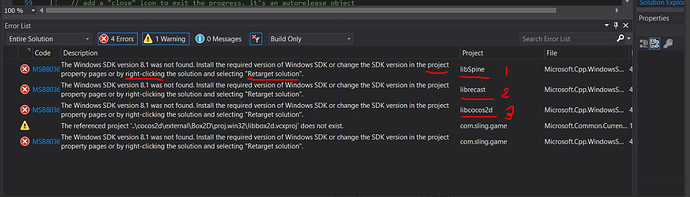

## FAQ Of Commonly Asked Technical Questions

### Windows
#### Re-target the Windows SDK
If you see these types of errors:

  

This is because the template project was created in an older version of Visual Studio. To fix: 
  **Right** click on **every project**, select **Retarget Projects** and then click **Ok**. Next, **rebuild** the project.

If you create a new project in the future you will need to repeat these steps.

### XCode
#### XCode PNG Compression issue
It is possible that your PNG images contain incorrect color profiles. You can
convert color profiles using __ImageMagick__ and the following
command:

```sh
find . -type f -name "*.png" -exec convert {} \;
```

### Android
#### generateJsonModelDebug FAILED
To solve this issue, please import the project into __Android Studio__, click
`Build/Refresh Linked C++ Projects`.
