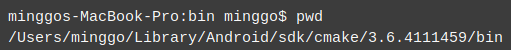

## F.A.Q Of Commonly Asked Technical Questions

### Windows
#### Re-target the Windows SDK
If you see these types of errors:

  

This is because the template project was created in an older version of Visual Studio. To fix:

  * **Right** click on **every project**
  * select **Retarget Projects**
  * click **Ok**. 
  * Next, **rebuild** the project.

If you create a new project in the future you will need to repeat these steps.

### XCode
#### XCode PNG Compression issue
It is possible that your PNG images contain incorrect color profiles. You can
convert color profiles using __ImageMagick__ and the following
command:

   ```sh
   find . -type f -name "*.png" -exec convert {} \;
   ```

### Android
#### generateJsonModelDebug FAILED
To solve this issue, please import the project into __Android Studio__, click
`Build/Refresh Linked C++ Projects`.

#### Android Studio uses the __ninja__ build system
__Android Studio__, itself, uses __ninja__ to build native codes. There is __ninja__ binary under __Cmake__ folder. If __Android Studio__ cannot find __ninja__ on __Windows__, it is the __Android Studio__ issue. You should set an environment variable that specifies the path to __ninja__:

  

[__ninja binaries__](https://github.com/ninja-build/ninja/releases) are available as is [__ninja documentation__](https://ninja-build.org/).

### Linux
#### FMod issues
Some users report issues with __libfmod__. If you encounter issues, please reference this post: [Error while building for linux: libfmod.so.6](https://discuss.cocos2d-x.org/t/error-while-building-for-linux-libfmod-so-6/26553/31?u=doyoque)

#### CMake PIE
It may be necessary to add the following line to __CMakeLists.txt__ if a __can not be used when making a PIE object;__ compiler is thrown:
```sh
set(CMAKE_CXX_FLAGS "${CMAKE_CXX_FLAGS} -no-pie -fexceptions -std=c++11 -Wno-deprecated-declarations -Wno-reorder")
```

