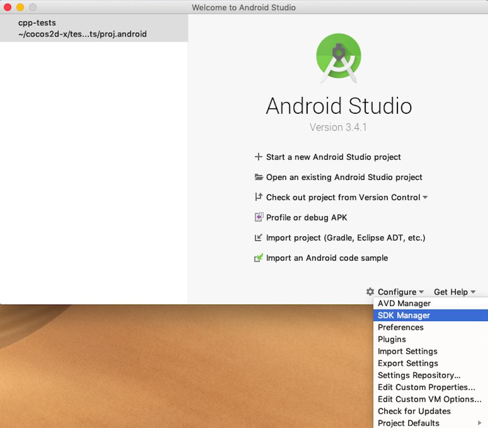
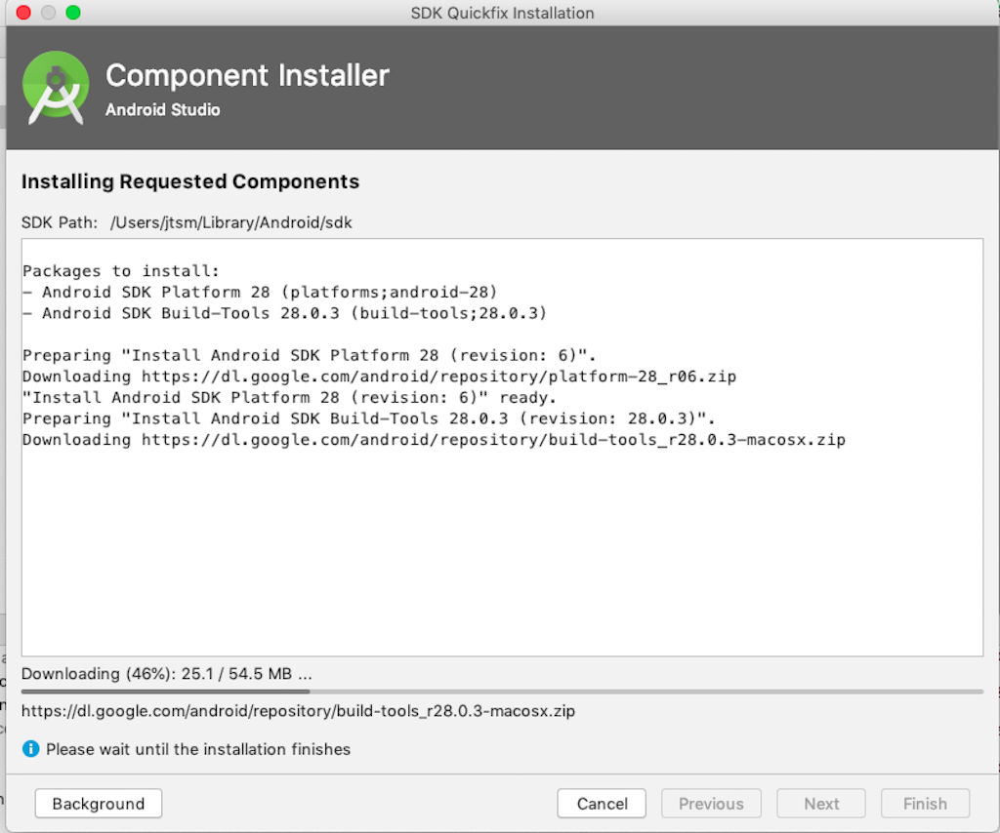
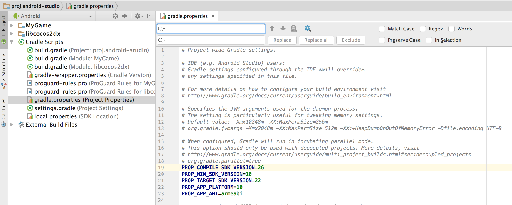

# Android Studio Installation and Setup

## Prerequisites
* A supported environment. See **[Installation Prerequisites](prerequisites.md)**

* Android Studio 2.3.3 or Studio 3.0 [https://developer.android.com/studio/index.html](https://developer.android.com/studio/index.html)

## Setup
* unzip the __Android Studio Bundle__

* launch __Android Studio__. This may take quite some time as additional downloads and setup steps are completed. These steps are necessary for Studio to run properly.

* after the previous step is complete, it is necessary install the SDK and build tools. __SDK Manager__ is located in: __Tools__ --> __Android__ --> __SDK Manager__. It is also possible to access the __SDK Manager__ without opening a project by selecting it from the dialog box __Android Studio__  presents at startup:

    

  The __SDK Manager__ window looks like this:

    

  Make sure to install the platforms and tools that your project requires.

    

    

## Compiling `cpp-tests`
`cpp-tests` is a project you can run to get familiar with how to code using Cocos2d-x. To run this project with __Android Studio__:
* import the `cpp-tests` project from __cocos2d-x root/tests/cpp-tests/proj.android__ in __Android Studio__. __Android Studio__ will do everything required. You can run `cpp-tests` by clicking on the __Play__ button.

    

  > note: __Android Studio__ is going to download many components. It may even throw errors that you just *click to fix*. These errors may include: __gradle__ version updates, installing missing build tools, agreeing to license agreements, etc.

  

## Starting a new project
Starting a new project requires a few steps:
* first, use `cocos new ...` to create your project. See the **[Cocos Command-line tool](../editors_and_tools/cocosCLTool.md)** for additional help.
* next, launch __Android Studio__.
* next, you must specify what version of the Android SDK you are using. You can do this by modifying __gradle.properties__

    

## Debugging c++
Starting with __cocos2d-x v3.15__, you can use __Android Studio 2.3+__ to debug c++ code by setting breakpoints where you wish.

  

## Build for release mode
There are a few required steps to build in release mode:

* change __Build Variant__ to __release__
* set signing information in __gradle.properties__
* for __lua projects__, if you want to encrypt lua codes, you should set encrypt information in __gradle.properties__ too

    

    

## Installing new SDK versions and build tools
* use the built in __SDK Manager__ to install the __SDK versions__ and __build tools__ that you are targetting.

    

    

    

  Note: It is important to note that __Android Studio__ uses a location to install __SDK versions__ and __build tools__ that is not the same as if you were doing command-line development. Double check that you have everything you need installed from inside __Android Studio__.

## Troubleshooting
Please see this [F.A.Q](../faq/android.md) for troubleshooting help.