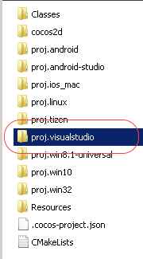

# Android with Visual Studio

### Deprecated Document. Cocos2d-x V3.15 or less is the last supported version.

## Environment Requirements
* A Supported OS. See **[Installation Prerequisites](A/index.html)**

* Visual Studio 2015 update 2+ (NOT Visual Studio Code!) [https://www.visualstudio.com/en-us/products/visual-studio-community-vs.aspx](https://www.visualstudio.com/en-us/products/visual-studio-community-vs.aspx)

## Prerequisites
* Download and install **Visual Studio 2015 update 2+**.

* Download and install **Python**. Ensure that it is available in your __$PATH__.

* Download **Cocos2d-x** and unzip it where you wish.

* From a command-line, change to the location you unzipped Cocos2d-x to and run:
    ```sh
    python setup.py
    ```

## Using Visual Studio with Cocos2d-x

Make sure that you are using __Cocos2d-x v3.12__.

### Creating a new project
* Read our document on the **[Cocos Command-line tool](../editors_and_tools/cocosCLTool/)**
  and create a new project.

* Download [proj.visualstudio](http://aka.ms/vscocosandroidsample)

* copy __proj.visualstudio.zip__ into your project's root directory and unzip it. It should
  fall inline with your other project directories. Example:

  

* By default __proj.visualstudio__ contains a project called __Cocos2d.sln__, open this
  __.sln__ file.

* Build and run!


### Integrating with an existing project

* Download [proj.visualstudio](https://msdnshared.blob.core.windows.net/media/2016/07/proj.visualstudio.zip)

* copy __proj.visualstudio.zip__ into your project's root directory and unzip it. It should
  fall inline with your other project directories. Example:

  

* By default __proj.visualstudio__ contains a project called __Cocos2d.sln__, feel free to
  re-name this to your project's name.

* Open the __.sln__ file.

* Add any source files and resources that are required to build your project. Change any
  necessary __build settings__ required by your project.

* Build and troubleshoot any integration needs.
