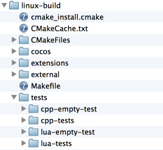

# Linux Installation and Setup

## Prerequisites
A supported environment. See **[Installation Prerequisites](prerequisites.md)**

## Ubuntu versions
We support Ubuntu 12.10+, however, newer versions of Ubuntu have changed and the steps to install **Cocos2d-x** and required dependencies are a bit different. This requires some manual effort and this doc will outline what is required.

## Dependencies that you need
**Cocos2d-x** requires a number of dependencies be installed on your system. Please perform the following steps:

#### Update operating system components

  ```sh
  sudo apt-get update
  sudo apt-get upgrade
  ```

#### Install Dependencies __(Ubuntu 16.x only)__

1. Install dependencies
```sh
  // Ubuntu 16.x
  sudo apt-get install python2 git curl g++ libgdk-pixbuf2.0-dev python-pip cmake libx11-dev libxmu-dev libglu1-mesa-dev libgl2ps-dev libxi-dev libzip-dev libpng-dev libcurl4-gnutls-dev libfontconfig1-dev libsqlite3-dev libglew-dev libssl-dev libgtk-3-dev libglfw3 libglfw3-dev xorg-dev
```

#### Install Dependencies __(Ubuntu 17.x only)__

1. Add a repo to `/etc/apt/sources.list`

  ```sh
  deb //cz.archive.ubuntu.com/ubuntu xenial main
  ```
2. Install Dependencies

  ```sh
  sudo apt-get install python2.7 git curl g++ libgdk-pixbuf2.0-dev python-pip cmake libx11-dev libxmu-dev libglu1-mesa-dev libgl2ps-dev libxi-dev libzip-dev libpng-dev libcurl4-gnutls-dev libfontconfig1-dev libsqlite3-dev libglew-dev libssl-dev libgtk-3-dev libglfw3 libglfw3-dev xorg-dev
  ```

#### Install Dependencies __(Ubuntu 18.x only)__

1. Install dependencies.

  ```sh
  sudo apt-get install python-minimal git curl g++ libgdk-pixbuf2.0-dev python-pip cmake libx11-dev libxmu-dev libglu1-mesa-dev libgl2ps-dev libxi-dev libzip-dev libpng-dev libcurl4-gnutls-dev libfontconfig1-dev libsqlite3-dev libglew-dev libssl-dev libgtk-3-dev libglfw3 libglfw3-dev xorg-dev
  ```
#### Install Dependencies __(Ubuntu 20.x only)__

1. Install dependencies.

  ```sh
  sudo apt-get install python2-minimal git curl g++ libgdk-pixbuf2.0-dev cmake libx11-dev libxmu-dev libglu1-mesa-dev libgl2ps-dev libxi-dev libzip-dev libpng-dev libcurl4-gnutls-dev libfontconfig1-dev libsqlite3-dev libglew-dev libssl-dev libgtk-3-dev libglfw3 libglfw3-dev xorg-dev
  ```
2. Finish Python.
  ```sh
  curl https://bootstrap.pypa.io/get-pip.py --output get-pip.py

  sudo python2 get-pip.py 
  ```  

## Setting up Cocos2d-x
You can get started with __Cocos2d-x__ by either downloading a self-contained __.zip__ from the [website](https://cocos2d-x.org/download) or by cloning our
[GitHub Repo](https://github.com/cocos2d/cocos2d-x). Pick what works for you. __There is no need to do both.__

### By downloading a .zip archive
Download Cocos2d-x and unzip it. (maybe: __~/__ or __~/Projects__ )

### Cloning from GitHub
Use the following commands to clone our GitHub repo and get your environment setup. If you are not familar with GitHub's workflow, [learn it](https://guides.github.com/activities/hello-world/) or download using the step above, __By downloading a .zip archive__.

#### Clone Repo and setup dependencies

```sh
// all linux versions
cd <to where you want to clone this repo>

git clone https://github.com/cocos2d/cocos2d-x.git

cd cocos2d-x-root #where your cocos2d-x directory is located.

git submodule update --init

git submodule update

// Ubuntu 16, 17
python download-deps.py

// Ubuntu 18, 20
python2 download-deps.py
```

## Make sure you have a working environment!
See __Prerequisites__ above. This means a working __Python__, __git__ and __curl__ along with the dependency list above.
  
## Building Cocos2d-x
* Run __cmake__ to generate __makefile__:

  ```sh
  cd cocos2d-x-root # where your cocos2d-x directory is located.
  mkdir -p build/linux-build
  cd build/linux-build
  cmake ../..
  ```

* When __cmake__ finishes, many files & folders will be generated in __coocs2dx_root/build/linux-build__

    

* Run __make__ to compile:

  ```sh
  make -j 4
  ```

  Everything will be generated in __cocos2dx_root/build/linux-build/bin/cpp-tests/__
  if compiled successfully.

* Run `cpp-tests`

  ```sh
  cd cocos2dx_root/build/linux-build/bin/cpp-tests/
  ./cpp-tests
  ```

## Starting a new project
Once everything above works, you can start a new project! To do this, read our document on the **[Cocos Command-line tool](../editors_and_tools/cocosCLTool.md)**.


## Troubleshooting
Please see this [F.A.Q](../faq/linux.md) for troubleshooting help. __Linux__ has a few __known issues.__
