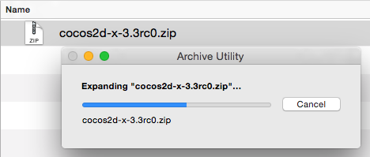

# macOS Installation and Setup

## Prerequisites
A supported environment. See **[Installation Prerequisites](prerequisites.md)**

## Setting up Cocos2d-x
You can get started with __Cocos2d-x__ by either downloading a self-contained
__.zip__ from the [website](https://cocos2d-x.org/download) or by cloning our
[GitHub Repo](https://github.com/cocos2d/cocos2d-x). Pick what works for you.
__There is no need to do both.__

### By downloading a .zip archive
* Download Cocos2d-x and unzip it. (maybe: __~/__ or __~/Projects__ )

    

    

### Cloning from GitHub
Use the following commands to clone our GitHub repo and get your environment setup. If you are not familar with GitHub's workflow, [learn it](https://guides.github.com/activities/hello-world/) or download
using the step above, __By downloading a .zip archive__.

```sh
cd <to where you want to clone this repo>

git clone git@github.com:cocos2d/cocos2d-x.git

cd cocos2d-x

git submodule update --init

./download-deps.py
```

## Build and Run
* In __<cocos2d-x root>/build__, open __cocos2d_tests.xcodeproj__
* Choose __cpp-tests Mac__ from targets drop-down box
* Click __run__ to compile and run __cpp-tests__

## Running on an iOS Device
In order to run on iOS Device an iOS Developer Program membership is needed.
You can purchase one from Apple: [https://developer.apple.com/programs/ios/](https://developer.apple.com/programs/ios/).
The steps to run on iOS device are the same as running in a simulator except you
select you device from the device list.

## Starting a new project
Once everything above works, you can start a new project! To do this, read our
document on the **[Cocos Command-line tool](../editors_and_tools/cocosCLTool.md)**.

## Troubleshooting
Please see this [F.A.Q](../faq/macos.md) for troubleshooting help.
