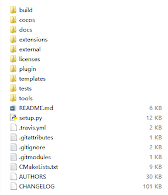

# Windows Phone 8 Installation and Setup

## Prerequisites
* A supported environment. See **[Installation Prerequisites](A/index.html)**

* Cocos2d-x v3.x [http://cocos2d-x.org/download](http://cocos2d-x.org/download)

* Register to be a Windows Phone Developer [http://msdn.microsoft.com/en-us/library/windowsphone/help/jj206719(v=vs.105](http://msdn.microsoft.com/en-us/library/windowsphone/help/jj206719(v=vs.105)

## Setting up Cocos2d-x
* Download Cocos2d-x and unzip it. (maybe: ~/)

    

* Make sure you have a working environment see __Prerequisites__ above. This means
a working __Python__, having run __<cocos2d-x root>/setup.py>__ and updated your
__$PATH__.

## Compile and run the `cpp-tests` project
* Open `cocos2d-wp8.vc2012.sln` in the `build` folder

    

* Right click the __cpp-tests__ project, and select __Set as StartUp Project__.

    

* Select __Emulator__ or a __Device__ to run the project on. If you select __Device__
you need to connect your phone device using usb. Compile and run the __TestCpp__
project.

    

## How to debug in project
* Right click __cpp-tests__, select __Properties__, in __Debug__, select __debug__
target.

    

* If you select __Managed Only__ in __UI Task__, it's to debug c# code in __cpp-tests__.
If you select __Native Only__, it's to debug c++ code in __cpp-testsComponent__.
If you select __Native Only__ and want to use __CCLog__ function, right click
__cpp-testsComponent__ and define __COCOS2D_DEBUG=1__ in __Preprocessor Definitions__.

    

## Starting a new project
Once everything above works, you can start a new project! To do this, read our
document on the **[Cocos Command-line tool](../editors_and_tools/cocosCLTool/)**.
