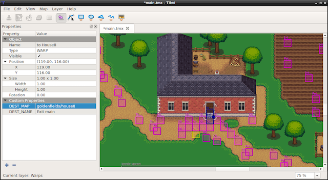

  <a href="#" class="btn" onclick="toggleLanguage()">中文</a>

## TileMap
__TileMaps__ are maps made up of __tiles__. Each _tile_ can have independent behavior.
__TileMaps__ are stored in an XML-based map format called `TMX`. `TMX` was originally
designed for tile-based maps but is also suitable for more generic game levels
due to its support for various object types. `TMX` objects are easy to create:


// reading in a tiled map.
auto map = TMXTiledMap::create("TileMap.tmx");
addChild(map, 0, 99); // with a tag of '99'


Tile-based maps can have many layers, determined by a
__z-order__. You can access a specific layer by it's name:


// how to get a specific layer
auto map = TMXTiledMap::create("TileMap.tmx");
auto layer = map->getLayer("Layer0");
auto tile = layer->getTileAt(Vec2(1, 63));


Each tile has a unique position and id. This makes it very easy to cherry pick
specific tiles. You can access any tile by its id:


// to obtain a specific tiles id
unsigned int gid = layer->getTileGIDAt(Vec2(0, 63));


Example tiled-map layouts:

How do you make a tiled-map? There are many tools that do this. [Tiled](http://mapeditor.org)
is a popular tool. It is actively developed and has a great user community. The
screen-shots above are actual __Tiled__ projects.
