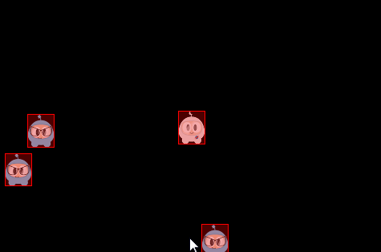

<div class="langs">
  <a href="#" class="btn" onclick="toggleLanguage()">中文</a>
</div>

# Physics
Your game is coming along nicely. You have `Sprite` objects, gameplay mechanics
and your coding efforts are paying off. You are starting to feel like your game
is playable. What do you do when you realize your game needs to simulate real
world situations? You know, __collision detection__, __gravity__, __elasticity__ and
__friction__. Yes, you guessed it! This chapter is on __physics__ and the use of a
__physics engine__. Let's explore the *when*, *wheres* and *whys* of using a
__physics engine__.

## Physics is scary, do I really need it? Please tell me no!
Please don't run away there are no physics monsters under your bed! Your needs
might be simple enough to not need to use a __physics engine__. Perhaps a combination
of using a `Node` objects __update()__ function, `Rect` objects and a combination
of the __containsPoint()__ or __intersectsRect()__ functions might be enough for
you? Example:


void update(float dt)
{
  auto p = touch->getLocation();
  auto rect = this->getBoundingBox();

  if(rect.containsPoint(p))
  {
      // do something, intersection
  }
}


This mechanism works for __very simple__ needs, but doesn't scale. What if you had
100 `Sprite` objects all continuously updating to check for intersections with
other objects? It could be done but the the CPU usage and __framerate__ would suffer
severely. Your game would be unplayable. A __physics engine__ solves these concerns
for us in a scalable and CPU friendly way. Even though this might look foreign,
let's take a look at a simple example and then nut and bolt the example,
terminology and best practice together.


// create a static PhysicsBody
auto physicsBody = PhysicsBody::createBox(Size(65.0f , 81.0f ), PhysicsMaterial(0.1f, 1.0f, 0.0f));
physicsBody->setDynamic(false);

// create a sprite
auto sprite = Sprite::create("whiteSprite.png");
sprite->setPosition(Vec2(400, 400));

// sprite will use physicsBody
sprite->addComponent(physicsBody);

//add contact event listener
auto contactListener = EventListenerPhysicsContact::create();
contactListener->onContactBegin = CC_CALLBACK_1(onContactBegin, this);
_eventDispatcher->addEventListenerWithSceneGraphPriority(contactListener, this);


Even though this example is simple, it looks complicated and scary. It really
isn't if we look closely. Here are the steps that are happening:
* A `PhysicsBody` object is created.
* A `Sprite` object is created.
* The `Sprite` object applies the properties of the `PhysicsBody` object.
* A listener is created to respond to an __onContactBegin()__ event.

Once we look step by step the concept starts to make sense. To better understand
all the details of a __physics engine__ you should understand the following terms
and concepts:

## Physics terminology and concepts
### Bodies
A `PhysicsBody` holds the physical properties of an object. These include __mass__,
__position__, __rotation__, __velocity__ and __damping__. `PhysicsBody` objects
are the backbone for shapes. A `PhysicsBody` does not have a shape until you attach
a shape to it.

###Material
Materials describe material attributes：

  >-density：It is used to compute the mass properties of the parent body.

  >-friction：It is used to make objects slide along each other realistically.

  >-restitution：It is used to make objects bounce. The restitution value is
 usually set to be between 0 and 1. 0 means no bouncing while 1 means perfect
 bouncing.

###Shapes
Shapes describe collision geometry. By attaching shapes to bodies, you define a
body’s shape. You can attach as many shapes to a single body as you need in order
to define a complex shape. Each shape relates to a `PhysicsMaterial` object and
contains the following attributes: __type__, __area__, __mass__, __moment__, __offset__ and
__tag__. Some of these you might not be familiar with:

  >-_type_：describes the categories of shapes, such as circle, box, polygon, etc.

  >-_area_: used to compute the mass properties of the body. The density and area
gives the mass.

  >-_mass_: the quantity of matter that a body contains, as measured by its
acceleration under a given force or by the force exerted on it by a gravitational
field.

  >-_moment_: determines the torque needed for a desired angular acceleration.

  >-_offset_: offset from the body’s center of gravity in body local coordinates.

  >-_tag_: used to identify the shape easily for developers.​ You probably remember
that you can assign all `Node` objects a tag for identification and easy access.

We describe the various __shapes__ as:
  >-`PhysicsShape`: Shapes implement the `PhysicsShape` base class.

  >-`PhysicsShapeCircle`: Circles are solid. You cannot make a hollow circle
 using the circle shape.

  >-`PhysicsShapePolygon`: Polygon shapes are solid convex polygons.

  >-`PhysicsShapeBox`: Box shape is one kind of convex polygon.

  >-`PhysicsShapeEdgeSegment`: A segment shape.

  >-`PhysicsShapeEdgePolygon`: Hollow polygon shapes. A edge-polygon shape consists
 of multiple segment shapes.

  >-`PhysicsShapeEdgeBox`：Hollow box shapes. A edge-box shape consists of four
 segment shapes.

  >-`PhysicsShapeEdgeChain`: The chain shape provides an efficient way to connect
 many edges together.

###Contacts/Joints
__Contacts__ and __joint__ objects describe how bodies are attached to each other.

###World
A __world__ container is what your physics bodies are added to and where they are
simulated. You add __bodies__, __shapes__ and __constraints__ to a world and then
update the world as a whole. The __world__ controls how all of these items interact
together. Much of the interaction with the physics API will be with a `PhysicsWorld`
object.

There is a lot to remember here, keep these terms handy to refer back to them as
needed.

##Physics World and Physics Body

###PhysicsWorld
A `PhysicsWorld` object is the core item used when simulating physics. Just like
the world we live in, a `PhysicsWorld` has a lot of things happening at once.
`PhysicsWorld` integrates deeply at the `Scene` level because of it's many facets.
Let's use a simple example that we can all relate to. Does your residence have a
kitchen? Think of this as your __physics world__! Now your world has `PhysicsBody`
objects, like food, knives, appliances! These bodies interact with each other
inside the world. These objects touch and also react to those touches. Example:
use a knife to cut food and put it in an appliance. Does the knife cut
the food? Maybe. Maybe not. Perhaps it isn't the correct type of knife for the
job.

You can create a `Scene` that contains a `PhysicsWorld` just by calling the function
`initWithPhysics()` in your `Scene`. Your `init()` function should have:


if( !Scene::initWithPhysics() )
{

}


Every `PhysicsWorld` has properties associated with it:
 >-gravity: Global gravity applied to the world. Defaults to Vec2(0.0f, -98.0f).

 >-speed: Set the speed of physics world, speed is the rate at which the simulation
 executes. Defaults to 1.0.

 >-updateRate: set the update rate of physics world, update rate is the value of
 EngineUpdateTimes/PhysicsWorldUpdateTimes.

 >-substeps: set the number of substeps in an update of the physics world.

The process of updating a `PhysicsWorld` is called __stepping__. By default, the
`PhysicsWorld` __updates through time__ automatically. This is called __auto stepping__.
It automatically happens for you, each frame. You can disable __auto steping__ of
the `PhysicsWorld` by setting __setAutoStep(false)__. If you do this, you would __step__
the `PhysicsWorld` manually by setting __step(time)__. __Substeps__ are used
to step the `PhysicsWorld` forward multiple times using a more precise time
increment than a single frame. This allows for finer grained control of the
__stepping__ process including more fluid movements.

###PhysicsBody
`PhysicsBody` objects have __position__ and __velocity__. You can apply __forces__,
__movement__, __damping__ and __impulses__ (as well as more) to `PhysicsBody` objects.
`PhysicsBody` can be __static__ or __dynamic__. A __static__ body does not move under
simulation and behaves as if it has infinite __mass__. A __dynamic__ body is fully
simulated. They can be moved manually by the user, but normally they move according
to forces. A dynamic body can collide with all body types. `Node` provides
__setPhysicsBody()__ to associate a `PhysicsBody` to a `Node` object.

Lets create a static and 5 dynamic `PhysicsBody` objects that are a box shape:


auto physicsBody = PhysicsBody::createBox(Size(65.0f, 81.0f),
						PhysicsMaterial(0.1f, 1.0f, 0.0f));
physicsBody->setDynamic(false);

//create a sprite
auto sprite = Sprite::create("whiteSprite.png");
sprite->setPosition(s_centre);
addChild(sprite);

//apply physicsBody to the sprite
sprite->addComponent(physicsBody);

//add five dynamic bodies
for (int i = 0; i < 5; ++i)
{
    physicsBody = PhysicsBody::createBox(Size(65.0f, 81.0f),
    				PhysicsMaterial(0.1f, 1.0f, 0.0f));

    //set the body isn't affected by the physics world's gravitational force
    physicsBody->setGravityEnable(false);

    //set initial velocity of physicsBody
    physicsBody->setVelocity(Vec2(cocos2d::random(-500,500),
    			cocos2d::random(-500,500)));
    physicsBody->setTag(DRAG_BODYS_TAG);

    sprite = Sprite::create("blueSprite.png");
    sprite->setPosition(Vec2(s_centre.x + cocos2d::random(-300,300),
    			s_centre.y + cocos2d::random(-300,300)));
    sprite->addComponent(physicsBody);

    addChild(sprite);
}


The result is a stationary `PhysicsBody` with 5 additional `PhysicsBody` objects
colliding around it.


##Collision
Have you ever been in a car accident? What did you collide with? Just like with
cars, `PhysicBody` objects can come in contact. __Collisions__ are what happens when
`PhysicBody` objects come in contact with each other. When a __collision__ takes
place it can be ignored or it can trigger events to be fired.

###Filtering Collisions
Collision filtering allows you to enable or prevent collisions between shapes.
This __physics engine__ supports collision filtering using __category and group bitmasks__.

There are 32 supported collision categories. For each shape you can specify which
category it belongs to. You can also specify what other categories this shape can
collide with. This is done with masking bits. For example:


auto sprite1 = addSpriteAtPosition(Vec2(s_centre.x - 150,s_centre.y));
sprite1->getPhysicsBody()->setCategoryBitmask(0x02);    // 0010
sprite1->getPhysicsBody()->setCollisionBitmask(0x01);   // 0001

sprite1 = addSpriteAtPosition(Vec2(s_centre.x - 150,s_centre.y + 100));
sprite1->getPhysicsBody()->setCategoryBitmask(0x02);    // 0010
sprite1->getPhysicsBody()->setCollisionBitmask(0x01);   // 0001

auto sprite2 = addSpriteAtPosition(Vec2(s_centre.x + 150,s_centre.y),1);
sprite2->getPhysicsBody()->setCategoryBitmask(0x01);    // 0001
sprite2->getPhysicsBody()->setCollisionBitmask(0x02);   // 0010

auto sprite3 = addSpriteAtPosition(Vec2(s_centre.x + 150,s_centre.y + 100),2);
sprite3->getPhysicsBody()->setCategoryBitmask(0x03);    // 0011
sprite3->getPhysicsBody()->setCollisionBitmask(0x03);   // 0011
```
You can check for collisions by checking and comparing _category_ and _collision_
bitmasks like:
```cpp
if ((shapeA->getCategoryBitmask() & shapeB->getCollisionBitmask()) == 0
   || (shapeB->getCategoryBitmask() & shapeA->getCollisionBitmask()) == 0)
{
   // shapes can't collide
   ret = false;
}



Collision groups let you specify an integral group index. You can have all shapes
with the same group index always collide (positive index) or never collide (negative
index and zero index). Collisions between shapes of different group indices are
filtered according the category and mask bits. In other words, group filtering has
higher precedence than category filtering.

###Contacts/Joints
Recall from the terminology above that __joints__ are how contact points are connected
to each other. Yes, you can think of it just like __joints__ on your own body.
Each joint type has a definition that derives from `PhysicsJoint`. All joints are
connected between two different bodies. One body may be static. You can prevent the
attached bodies from colliding with each other by __joint->setCollisionEnable(false)__.
Many joint definitions require that you provide some geometric data. Often a joint
will be defined by anchor points. The rest of the joint definition data depends
on the joint type.

  >-PhysicsJointFixed: A fixed joint fuses the two bodies together at a reference
 point. Fixed joints are useful for creating complex shapes that can be broken
 apart later.

 >-PhysicsJointLimit: A limit joint imposes a maximum distance between the two
 bodies, as if they were connected by a rope.

 >-PhysicsJointPin: A pin joint allows the two bodies to independently rotate
 around the anchor point as if pinned together.

 >-PhysicsJointDistance: Set the fixed distance with two bodies

 >-PhysicsJointSpring: Connecting two physics bodies together with a spring

 >-PhysicsJointGroove: Attach body a to a line, and attach body b to a dot

 >-PhysicsJointRotarySpring: Likes a spring joint, but works with rotary

 >-PhysicsJointRotaryLimit: Likes a limit joint, but works with rotary

 >-PhysicsJointRatchet: Works like a socket wrench

 >-PhysicsJointGear: Keeps the angular velocity ratio of a pair of bodies constant

 >-PhysicsJointMotor: Keeps the relative angular velocity of a pair of bodies
 constant


###Collision detection
Contacts are objects created by the __physics engine__ to manage the collision
between two shapes. __Contact__ objects are not created by the user, they are
created automatically. There are a few terms associated with contacts.

 >-contact point: A contact point is a point where two shapes touch.

 >-contact normal: A contact normal is a unit vector that points from one shape
 to another.

You can get the `PhysicsShape` from a __contact__. From those you can get the bodies.


bool onContactBegin(PhysicsContact& contact)
{
    auto bodyA = contact.getShapeA()->getBody();
    auto bodyB = contact.getShapeB()->getBody();
    return true;
}


You can get access to __contacts__ by implementing a __contact listener__. The __contact
listener__ supports several events: __begin__, __pre-solve__, __post-solve__ and __separate__.

  >-begin: Two shapes just started touching for the first time this step. Return
true from the callback to process the collision normally or false to cause physics
engine to ignore the collision entirely. If you return false, the _preSolve()_ and
_postSolve()_ callbacks will never be run, but you will still receive a separate
event when the shapes stop overlapping.

 >-pre-solve: Two shapes are touching during this step. Return false from the callback
 to make physics engine ignore the collision this step or true to process it normally.
 Additionally, you may override collision values using _setRestitution()_, _setFriction()_
 or _setSurfaceVelocity()_ to provide custom restitution, friction, or surface velocity
 values.

 >-post-solve: Two shapes are touching and their collision response has been
 processed.

 >-separate: Two shapes have just stopped touching for the first time this step.

You also can use `EventListenerPhysicsContactWithBodies`,
`EventListenerPhysicsContactWithShapes`, `EventListenerPhysicsContactWithGroup`
to listen for the event you're interested with bodies, shapes or groups. Besides this you
also need to set the physics contact related bitmask value, as the contact event
won't be received by default, even if you create the relative __EventListener__.

For example:


bool init()
{
    //create a static PhysicsBody
    auto sprite = addSpriteAtPosition(s_centre,1);
    sprite->setTag(10);
    sprite->getPhysicsBody()->setContactTestBitmask(0xFFFFFFFF);
    sprite->getPhysicsBody()->setDynamic(false);

    //adds contact event listener
    auto contactListener = EventListenerPhysicsContact::create();
    contactListener->onContactBegin = CC_CALLBACK_1(PhysicsDemoCollisionProcessing::onContactBegin, this);
    _eventDispatcher->addEventListenerWithSceneGraphPriority(contactListener, this);

    schedule(CC_SCHEDULE_SELECTOR(PhysicsDemoCollisionProcessing::tick), 0.3f);
    return true;

    return false;
}

void tick(float dt)
{
    auto sprite1 = addSpriteAtPosition(Vec2(s_centre.x + cocos2d::random(-300,300),
      s_centre.y + cocos2d::random(-300,300)));
    auto physicsBody = sprite1->getPhysicsBody();
    physicsBody->setVelocity(Vec2(cocos2d::random(-500,500),cocos2d::random(-500,500)));
    physicsBody->setContactTestBitmask(0xFFFFFFFF);
}

bool onContactBegin(PhysicsContact& contact)
{
    auto nodeA = contact.getShapeA()->getBody()->getNode();
    auto nodeB = contact.getShapeB()->getBody()->getNode();

    if (nodeA && nodeB)
    {
        if (nodeA->getTag() == 10)
        {
            nodeB->removeFromParentAndCleanup(true);
        }
        else if (nodeB->getTag() == 10)
        {
            nodeA->removeFromParentAndCleanup(true);
        }
    }

    //bodies can collide
    return true;
}





###Queries
Have you ever stood in one position and looked around? You see things __near__ to
you and __far__ from you. You can gauge how close things are to you. __Physics engines__
provide this same type of __spatial query__. `PhysicsWorld` objects currently support
__point queryies__, __ray casts__ and __rect queries__.

####Point Queries
When you touch something, say your desk, you can think of this as a __point query__.
They allow you to check if there are shapes within a certain distance of a point.
__Point queries__ are useful for things like __mouse picking__ and __simple sensors__.
You can also find the closest point on a shape to a given point or find the closest
shape to a point.

####Ray Cast
If you are looking around, some object within your sight is bound to catch your
attention. You have essentially performed a __ray cast__ here. You scanned until
you found something interesting to make you stop scanning. You can __ray cast__ at
a shape to get the point of first intersection. For example:


void tick(float dt)
{
    Vec2 d(300 * cosf(_angle), 300 * sinf(_angle));
    Vec2 point2 = s_centre + d;
    if (_drawNode)
    {
        removeChild(_drawNode);
    }
    _drawNode = DrawNode::create();

    Vec2 points[5];
    int num = 0;
    auto func = [&points, &num](PhysicsWorld& world,
        const PhysicsRayCastInfo& info, void* data)->bool
    {
        if (num < 5)
        {
            points[num++] = info.contact;
        }
        return true;
    };

    s_currScene->getPhysicsWorld()->rayCast(func, s_centre, point2, nullptr);

    _drawNode->drawSegment(s_centre, point2, 1, Color4F::RED);
    for (int i = 0; i < num; ++i)
    {
        _drawNode->drawDot(points[i], 3, Color4F(1.0f, 1.0f, 1.0f, 1.0f));
    }
    addChild(_drawNode);

    _angle += 1.5f * (float)M_PI / 180.0f;
}



####Rect Queries
__Rect queries__ provide a fast way to check roughly which shapes are in an area.
It is pretty easy to implement:


auto func = [](PhysicsWorld& world, PhysicsShape& shape, void* userData)->bool
{
    //Return true from the callback to continue rect queries
    return true;
}

scene->getPhysicsWorld()->queryRect(func, Rect(0,0,200,200), nullptr);


A few examples of using a __rect query__ while doing a *logo smash*:


#### Debugging Physics Body and Shapes
If you ever wish to have red boxes drawn around your __physics bodies__ to aid
in debugging, simple add these 2 lines to your core, where it makes sense to you.
Perhaps `AppDelegate` is a good place.


Director::getInstance()->getRunningScene()->getPhysics3DWorld()->setDebugDrawEnable(true);
Director::getInstance()->getRunningScene()->setPhysics3DDebugCamera(cameraObjecct);


#### Disabling Physics
Using the built-in __physics engine__ is a good idea. It is solid and advanced.
However, if you wish to use an alternative __physics engine__ you can. All you need
to do is disabling __CC_USE_PHYSICS__ in __base/ccConfig.h__.
