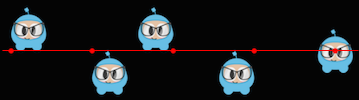

  <a href="#" class="btn" onclick="toggleLanguage()">中文</a>

# Sprites

## What are Sprites
A Sprite is a 2D image that can be animated or transformed by changing its
properties, including __rotation__, __position__, __scale__, __color__, etc.

## Creating Sprites
There are different ways to create Sprites depending upon what you need to
accomplish. You can create a `Sprite` from an image with various graphic formats
including: __PNG__, __JPEG__, __TIFF__, and others. Let's go through some create methods and
talk about each one.

### Creating a Sprite
A `Sprite` can be created by specifying an image file to use.


auto mySprite = Sprite::create("mysprite.png");

var mySprite = new cc.Sprite(res.mySprite_png);


The statement above creates a `Sprite` using the __mysprite.png__ image. The result
is that the created `Sprite` uses the whole image. `Sprite` has the same dimensions
of __mysprite.png__. If the image file is 200 x 200 the resulting `Sprite` is 200 x
200.

### Creating a Sprite with a Rect

In the previous example, the created `Sprite` has the same size as the original
image file. If you want to create a `Sprite` with only a certain portion of the
image file, you can do it by specifying a `Rect`.

`Rect` has 4 values: __origin x__, __origin y__, __width__ and __height__.


auto mySprite = Sprite::create("mysprite.png", Rect(0,0,40,40));

var mySprite = new cc.Sprite(res.mySprite_png, cc.rect(0,0,40,40));


`Rect` starts at the top left corner. This is the opposite of what you might be
used to when laying out screen position as it starts from the lower left corner.
Thus the resulting `Sprite` is only a portion of the image file. In this case the
`Sprite` dimension is 40 x 40 starting at the top left corner.

If you don't specify a `Rect`, Cocos2d-x will automatically use the full width
and height of the image file you specify. Take a look at the example below. If
we use an image with dimensions 200 x 200 the following 2 statements would have
the same result.


auto mySprite = Sprite::create("mysprite.png");

auto mySprite = Sprite::create("mysprite.png", Rect(0,0,200,200));


var mySprite = new cc.Sprite(res.mySprite_png);

var mySprite = new cc.Sprite(res.mySprite_png, cc.rect(0,0,200,200));


## Creating a Sprite from a Sprite Sheet
A __sprite sheet__ is a way to combine sprites into a single file. Using a
__sprite sheet__ helps achieve better performance by __batching__ the
__draw calls__. They can also save disk and video memory in cases where the
sprites can be packed on a sheet more efficiently (generally requires special tools).
You will read more about this in the Advanced Chapter, but it is but it is one of many
standard methods in the industry for increasing game performance.

When using a __sprite sheet__ it is first loaded, in its entirety, into the
`SpriteFrameCache`. `SpriteFrameCache` is a caching class that retains the `SpriteFrame`
objects added to it, for future quicker access. The `SpriteFrame` is loaded
once and retained in the `SpriteFrameCache`

Here is an example sprite sheet:

It doesn't look like much but let's take a closer look at what is happening:

As you can see the __sprite sheet__, at a minimum it reduces unneeded space and
consolidates all sprites into a single file.

Let's tie this all together!

### Loading a Sprite Sheet
Load your __sprite sheet__ into the `SpriteFrameCache`, probably in __AppDelegate__:


// load the Sprite Sheet
auto spritecache = SpriteFrameCache::getInstance();

// the .plist file can be generated with any of the tools mentioned below
spritecache->addSpriteFramesWithFile("sprites.plist");

// load the Sprite Sheet
var spritecache = cc.SpriteFrameCache;

// the .plist file can be generated with any of the tools mentioned below
spritecache.addSpriteFramesWithFile(res.sprites_plist);


Now that we have a __sprite sheet__ loaded into `SpriteFrameCache` we can create
`Sprite` objects by utilizing it.

### Creating a Sprite from SpriteFrameCache
This creates a `Sprite` by pulling it from the `SpriteFrameCache`.


// Our .plist file has names for each of the sprites in it.  We'll grab
// the sprite named, "mysprite" from the sprite sheet:
auto mysprite = Sprite::createWithSpriteFrameName("mysprite.png");

// Our .plist file has names for each of the sprites in it.  We'll grab
// the sprite named, "Blue_Front1" from the sprite sheet:
var mysprite = cc.Sprite.createWithSpriteFrameName(res.mySprite_png);


### Creating a Sprite from a SpriteFrame
Another way to create the same `Sprite` is by fetching the `SpriteFrame` from the
`SpriteFrameCache`, and then creating the `Sprite` with the `SpriteFrame`. Example:


// this is equivalent to the previous example,
// but it is created by retrieving the SpriteFrame from the cache.
auto newspriteFrame = SpriteFrameCache::getInstance()->getSpriteFrameByName("Blue_Front1.png");
auto newSprite = Sprite::createWithSpriteFrame(newspriteFrame);


// this is equivalent to the previous example,
// but it is created by retrieving the SpriteFrame from the cache.
var newspriteFrame = cc.SpriteFrameCache.getSpriteFrameByName(res.sprites_plist);
var newSprite = cc.Sprite.createWithSpriteFrame(newspriteFrame);



### Tools for creating Sprite Sheets
Creating a __sprite sheet__ manually is a tedious process. Fortunately there are
tools that can generate them automatically. These tools can provide even more
ways to adjust your __sprite sheet__ for maximum optimization!

Here are a few tools:

* [Cocos Studio](http://www.Cocos2d-x.org/wiki/CocoStudio)
* [ShoeBox](http://renderhjs.net/shoebox/)
* [Texture Packer](https://www.codeandweb.com/texturepacker)
* [Zwoptex](https://www.zwopple.com/zwoptex/)
* [Sprite Sheet Packer](http://amakaseev.github.io/sprite-sheet-packer/)

## Sprite Manipulation
After creating a `Sprite` you will have access to a variety of properties it
has that can be manipulated.

Given:


auto mySprite = Sprite::create("mysprite.png");

var mySprite = new Sprite(res.mysprite_png);


### Anchor Point and Position
__Anchor Point__ is a point that you set as a way to specify what part of
the `Sprite` will be used when setting its position. __Anchor Point__ affects
only properties that can be transformed. This includes __scale__, __rotation__,
__skew__. This excludes __color__ and __opacity__. The __anchor point__ uses a
bottom left coordinate system. This means that when specifying X and Y coordinate
values you need to make sure to start at the bottom left hand corner to do your
calculations. By default, all `Node` objects have a default __anchor point__ of
is __(0.5, 0.5)__.

Setting the __anchor point__ is easy:


// DEFAULT anchor point for all Sprites
mySprite->setAnchorPoint(0.5, 0.5);

// bottom left
mySprite->setAnchorPoint(0, 0);

// top left
mySprite->setAnchorPoint(0, 1);

// bottom right
mySprite->setAnchorPoint(1, 0);

// top right
mySprite->setAnchorPoint(1, 1);

// DEFAULT anchor point for all Sprites
mySprite.setAnchorPoint(cc._p(0.5, 0.5));

// bottom left
mySprite.setAnchorPoint(cc._p(0, 0));

// top left
mySprite.setAnchorPoint(cc._p(0, 1));

// bottom right
mySprite.setAnchorPoint(cc._p(1, 0));

// top right
mySprite.setAnchorPoint(cc._p(1, 1));


To represent this visually:

### Sprite properties effected by anchor point
Using __anchor point__ effects only properties that can be transformed. This includes
__scale__, __rotation__, __skew__.

#### Position
A __sprite's__ position is affected by its __anchor point__ as it is this point
that is used as a starting point for positioning. Let's visually look at how this
happens. Notice the colored line and where the _sprite's_ position is in relation
to it. Notice, as we change the __anchor point__ values, the _sprite's_ position
changes. It is important to note that all it took was changing the __anchor point__
value. We did not use a `setPosition()` statement to achieve this:

There are more ways to set position than just __anchor point__. `Sprite` objects
can also be set using the `setPosition()` method.


// position a sprite to a specific position of x = 100, y = 200.
mySprite->setPosition(Vec2(100, 200));

mySprite.setPosition(cc._p(100, 200));


#### Rotation
Changes the __sprite's__ rotation, by a positive or negative number of degrees.
A positive value rotates the `Sprite` object clockwise, while a negative value
rotates the `Sprite` object counter-clockwise. The default value is __0__.


// rotate sprite by +20 degrees
mySprite->setRotation(20.0f);

// rotate sprite by -20 degrees
mySprite->setRotation(-20.0f);

// rotate sprite by +60 degrees
mySprite->setRotation(60.0f);

// rotate sprite by -60 degrees
mySprite->setRotation(-60.0f);

// rotate sprite by +20 degrees
mySprite.setRotation(cc._p(20.0));

// rotate sprite by -20 degrees
mySprite.setRotation(cc._p(-20.0));

// rotate sprite by +60 degrees
mySprite.setRotation(cc._p(60.0));

// rotate sprite by -60 degrees
mySprite.setRotation(cc._p(-60.0));


#### Scale
Changes the __sprite's__ scale, either by x, y or uniformly for both x and y.
The default value is 1.0 for both x and y.


// increases X and Y size by 2.0 uniformly
mySprite->setScale(2.0);

// increases just X scale by 2.0
mySprite->setScaleX(2.0);

// increases just Y scale by 2.0
mySprite->setScaleY(2.0);

// increases X and Y size by 2.0 uniformly
mySprite.setScale(cc._p(2.0));

// increases just X scale by 2.0
mySprite.setScaleX(cc._p(2.0));

// increases just Y scale by 2.0
mySprite.setScaleY(cc._p(2.0));


#### Skew
Changes the __sprite's__ skew, either by x, y or uniformly for both x and y.
The default value is 0,0 for both x and y.


// adjusts the X skew by 20.0
mySprite->setSkewX(20.0f);

// adjusts the Y skew by 20.0
mySprite->setSkewY(20.0f);

// adjusts the X skew by 20.0
mySprite.setSkewX(cc._p(20.0));

// adjusts the Y skew by 20.0
mySprite.setSkewY(cc._p(20.0));


### Sprite properties not affected by anchor point
There are a few properties of `Sprite` objects that are not affected by
__anchor point__. Why? Because they only change superficial qualities like __color__
and __opacity__.

#### Color
Changes the _sprite's_ color. This is done by passing in a `Color3B` object.
`Color3B` objects are __RGB__ values. We haven't encountered `Color3B` yet but
it is simply an object that defines an __RGB color__. An __RGB color__ is a 3 byte
value from 0 - 255. Cocos2d-x also provides pre-defined colors that you can pick
from. Using these will be a bit faster since they are pre-defined. A few examples:
`Color3B::White` and `Color3B::Red`.


// set the color by passing in a pre-defined Color3B object.
mySprite->setColor(Color3B::WHITE);

// Set the color by passing in a Color3B object.
mySprite->setColor(Color3B(255, 255, 255)); // Same as Color3B::WHITE

// set the color by passing in a pre-defined Color3B object.
mySprite.setColor(cc.color.WHITE);

// Set the color by passing in a Color3B object.
mySprite.setColor(cc.color(255, 255, 255)); // Same as Color3B::WHITE


#### Opacity
Changes the _sprite's_ opacity by the specified value. An opaque object is not
transparent at all. This property expects a value from 0 to 255, where 255 means
fully opaque and 0 means fully transparent. Think: __zero opacity means invisible__,
and you'll always understand how this works. The default value is 255 (fully opaque).


// Set the opacity to 30, which makes this sprite 11.7% opaque.
// (30 divided by 256 equals 0.1171875...)
mySprite->setOpacity(30);

// Set the opacity to 30, which makes this sprite 11.7% opaque.
// (30 divided by 256 equals 0.1171875...)
mySprite.setOpacity(30);


## Polygon Sprite
A __Polygon Sprite__ is also a `Sprite`, that is used to display a 2d image.
However, unlike a normal `Sprite` object, which is a rectangle made of just 2
triangles, `PolygonSprite` objects are made of a series of triangles.

#### Why use a Polygon Sprite?
Simple, __performance__!

There is a lot of technical jargon that we can toss around here about __pixel fill rate__
but the take home lesson is that a `PolygonSprite` draws based upon the shape of
your `Sprite`, not a simple rectangle around the largest width and height. This
saves a lot of unnecessary drawing. Consider this example:

Notice the difference between the left and right versions?

On the left, a typical `Sprite` drawn in rectangular fashion by the use of 2
triangles.

On the right, a `PolygonSprite` drawn with many smaller triangles.

Whether or not this trade-off is worth it for purely performance reasons depends
on a number of factors (sprite shape/detail, size, quantity drawn on screen, etc.),
but in general, *vertices are cheaper than pixels* on modern GPUs.

<!--Now more and more GPUs were tailor designed to do 3d graphics, which can handle loads of vertices, but limited in Pixel Fill-Rate. But by representing almost always "None-rectangular" 2d images with a rectangular quad, GPU wastes precious bandwidth drawing totally transparent part of the sprite.

Take the above Grossini example, the left side is a normal Sprite, the right side is the same image but with 18 triangles and 20 vertices. Because the triangles were such a "tight fit", the 18 triangles counts only 4089 pixels surface area compared to the quad version which is 10285 pixels, that is 60% pixels saved!

Here is a performance test.The test keep on adding dynamic sprite to the screen until it reach down to 40 fps, the numbers are how many SpritePolygon or Sprite it can run stably at 40PS.

| Devices        | Sprite  | Polygon Sprite| Promotion|
| -------------- |:-------:| :------------:| :-------:|
| iPhone 6 plus  | 259     | 566           | 118.53%  |
| Samsung 9100   | 365     | 526           | 44.1%    |
| rMBP late 2013 | 471     | 1150          | 144.16%  |
-->
#### AutoPolygon
`AutoPolygon` is a helper class. It's purpose is to process an image into a 2d
polygon mesh at runtime.

There are functions for each step in the process, from tracing all the points,
to triangulation. The result, can be then passed to a `Sprite` objects __create__
function to create a `PolygonSprite`. Example:


// Generate polygon info automatically.
auto pinfo = AutoPolygon::generatePolygon("filename.png");

// Create a sprite with polygon info.
auto sprite = Sprite::create(pinfo);

// Generate polygon info automatically.
var pinfo = cc.autopolygon.generatePolygon(res.mysprite_png);

// Create a sprite with polygon info.
var sprite = new cc.Sprite(pinfo);

