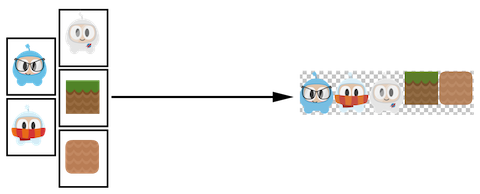

div class="langs">
  <a href="#" class="btn" onclick="toggleLanguage()">中文</a>

## Creating a Sprite from a Sprite Sheet
A __sprite sheet__ is a way to combine sprites into a single file. Using a
__sprite sheet__ helps achieve better performance by __batching__ the
__draw calls__. They can also save disk and video memory in cases where the
sprites can be packed on a sheet more efficiently (generally requires special tools).
You will read more about this in the Advanced Chapter, but it is but it is one of many
standard methods in the industry for increasing game performance.

When using a __sprite sheet__ it is first loaded, in its entirety, into the
`SpriteFrameCache`. `SpriteFrameCache` is a caching class that retains the `SpriteFrame`
objects added to it, for future quicker access. The `SpriteFrame` is loaded
once and retained in the `SpriteFrameCache`

Here is an example sprite sheet:

It doesn't look like much but let's take a closer look at what is happening:

As you can see the __sprite sheet__, at a minimum it reduces unneeded space and
consolidates all sprites into a single file.

Let's tie this all together!

### Loading a Sprite Sheet
Load your __sprite sheet__ into the `SpriteFrameCache`, probably in __AppDelegate__:


// load the Sprite Sheet
auto spritecache = SpriteFrameCache::getInstance();

// the .plist file can be generated with any of the tools mentioned below
spritecache->addSpriteFramesWithFile("sprites.plist");
<!--
// load the Sprite Sheet
var spritecache = cc.SpriteFrameCache;

// the .plist file can be generated with any of the tools mentioned below
spritecache.addSpriteFramesWithFile(res.sprites_plist);-->


Now that we have a __sprite sheet__ loaded into `SpriteFrameCache` we can create
`Sprite` objects by utilizing it.

### Tools for creating Sprite Sheets
Creating a __sprite sheet__ manually is a tedious process. Fortunately there are
tools that can generate them automatically. These tools can provide even more
ways to adjust your __sprite sheet__ for maximum optimization!

Here are a few tools:

* [Cocos Studio](http://www.Cocos2d-x.org/wiki/CocoStudio)
* [ShoeBox](http://renderhjs.net/shoebox/)
* [Texture Packer](https://www.codeandweb.com/texturepacker)
* [Zwoptex](https://www.zwopple.com/zwoptex/)
* [Sprite Sheet Packer](http://amakaseev.github.io/sprite-sheet-packer/)
