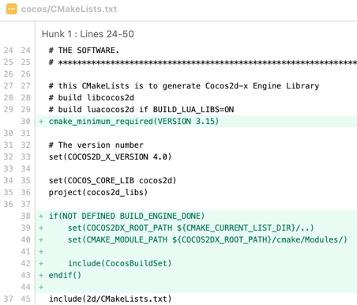
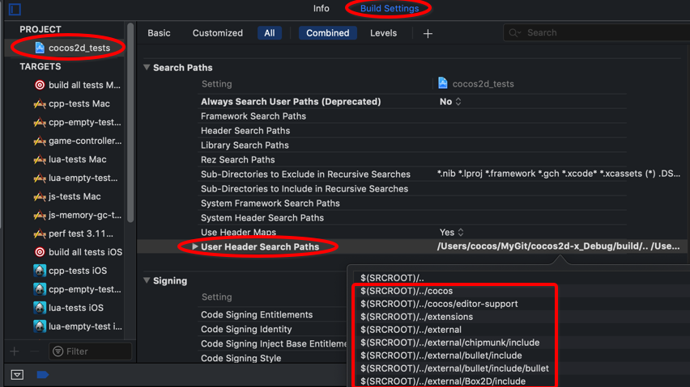
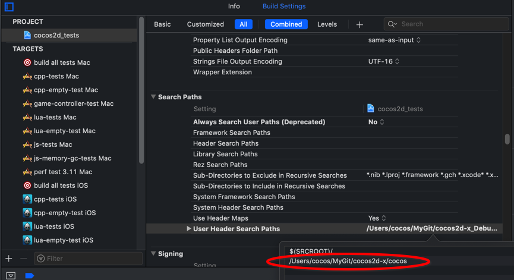
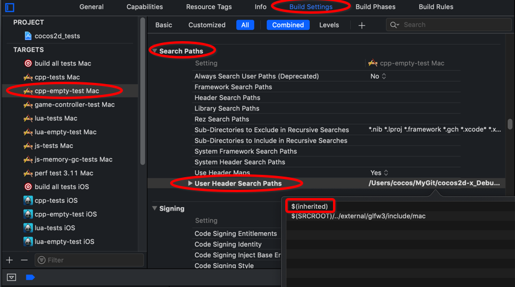
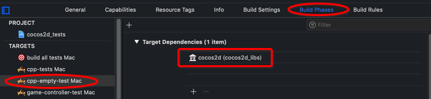
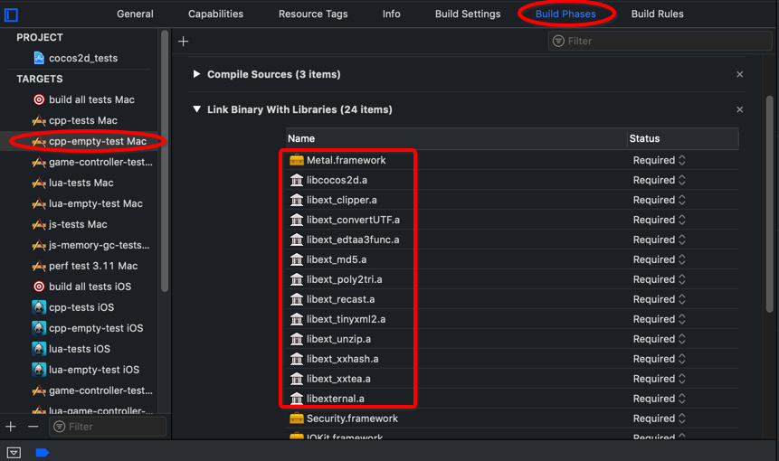

# Overview

There are mainly two scenarios needs for you to go on this workaround.

- Scenario 1

  Imagine you already have your own project with a v3 engine embedded, and you want to upgrade v3 engine to new v4, please go to [v3 -> v4](#v3---v4).

- Scenario 2

  Imagine that you want to start a new game with v4 engine from scratch, i.e. use `cocos new` to create a template project. Besides, you may need cocoapods to manage some dependency for certain reason, please go to [Using cmake and cocoapods](#using-cmake-and-cocoapods).

# Step by Step

## v3 -> v4

Suppose you are using `v3.17.2_path/cocos2d-x/build/cocos2d_tests.xcodeproj` and want to replace v3 engine with v4 engine.

1. fetch and pull latest [v4](https://github.com/cocos2d/cocos2d-x/tree/v4) branch.

2. [use cmake to generate project](https://github.com/cocos2d/cocos2d-x/blob/v4/cmake/README.md#generate-macos-project).

3. find the v4 engine project at `cocos2d-x/build/engine/cocos/core/`

   If you want to explicitly specify a build directory, you needs some extra steps shown as bellow

   - Modify v4 cocos2d_libs CMakeLists.txt.

     navigate to path `your_v4_path/cocos2d-x/cocos/`, open `CMakeLists.txt`, sets the minimum required version of cmake, set the `COCOS2DX_ROOT_PATH `and include `CocosBuildSet `module as pictures shows.

     

     ```cmake
     cmake_minimum_required(VERSION 3.15)
     
     ...
     
     if(NOT DEFINED BUILD_ENGINE_DONE)
         set(COCOS2DX_ROOT_PATH ${CMAKE_CURRENT_LIST_DIR}/..)
         set(CMAKE_MODULE_PATH ${COCOS2DX_ROOT_PATH}/cmake/Modules/)
     
         include(CocosBuildSet)
     endif()
     ```

   - Explicitly specify a build directory.
     under folder `your_v4_path/cocos2d-x/cocos/`, execute command `cmake -B newPath/build_V4_Engine -GXcode`, whers `-B <path-to-build>` explicitly specify a build directory.

   - Now the v4 engine project is located at `newPath/build_V4_Engine`.

4. open the v3 game test project, namely `cocos2d_tests.xcodeproj`, remove the reference to v3 game engine projcet(`cocos2d_libs.xcodeproj`), then drag the v4 engine project to your game project.

5. select project `cocos2d_tests` in the **PROJECT** group, then go to **Build Settings** —> **Search Paths** —> **User Header Search Paths**

   

   Expand the **User Header Search Paths** section, double click the **Debug** or **Release**. 

   In the appeared window, delete original v3 engine header search paths and set to currently v4 engine search paths 

   ```c
   your_v4_path/cocos2d-x/cocos
   ```

   

   then you can simply add `$(inherited)` to **User Header Search Paths** of your target(`cpp-empty-test Mac`) in the **TARGETS** group to  inherit from the project settings .

   

6. select your target in the **TARGETS** group, then got **Build Settings** —> **Linking** —> **Other Linker Flags**

   Expand the **Other Linker Flags** section, double click the **Debug** or **Release**. 

   In the appeared window, set the v4 needed libraries.

   ```c
   //for you reference, following external library is target for iOS
   your_v4_path/cocos2d-x/external/Box2D/prebuilt/ios/libbox2d.a
   your_v4_path/cocos2d-x/external/jpeg/prebuilt/ios/libjpeg.a
   your_v4_path/cocos2d-x/external/freetype2/prebuilt/ios/libfreetype.a
   your_v4_path/cocos2d-x/external/webp/prebuilt/ios/libwebp.a
   your_v4_path/cocos2d-x/external/bullet/prebuilt/ios/libLinearMath.a
   your_v4_path/cocos2d-x/external/bullet/prebuilt/ios/libBulletDynamics.a
   your_v4_path/cocos2d-x/external/bullet/prebuilt/ios/libBulletCollision.a
   your_v4_path/cocos2d-x/external/bullet/prebuilt/ios/libLinearMath.a
   your_v4_path/cocos2d-x/external/bullet/prebuilt/ios/libBulletMultiThreaded.a
   your_v4_path/cocos2d-x/external/bullet/prebuilt/ios/libMiniCL.a
   your_v4_path/cocos2d-x/external/websockets/prebuilt/ios/libwebsockets.a
   your_v4_path/cocos2d-x/external/uv/prebuilt/ios/libuv_a.a
   your_v4_path/cocos2d-x/external/openssl/prebuilt/ios/libssl.a
   your_v4_path/cocos2d-x/external/glsl-optimizer/prebuilt/ios/libmesa.a
   your_v4_path/cocos2d-x/external/glsl-optimizer/prebuilt/ios/libglsl_optimizer.a
   your_v4_path/cocos2d-x/external/glsl-optimizer/prebuilt/ios/libglcpp-library.a
   your_v4_path/cocos2d-x/external/png/prebuilt/ios/libpng.a
   your_v4_path/cocos2d-x/external/curl/prebuilt/ios/libcurl.a
   your_v4_path/cocos2d-x/external/openssl/prebuilt/ios/libcrypto.a
   your_v4_path/cocos2d-x/external/glfw3/prebuilt/ios/libglfw3.a
   your_v4_path/cocos2d-x/external/chipmunk/prebuilt/ios/libchipmunk.a
   ```

7. select your target in the **TARGETS** group, goto **Build Phases**

   - expand the **Target Dependecies** section, click the "+" button. In the appeared window, find the **cocos2d** item itn the list and click the Add button.

     

   - expand the **Link Binary With Libraries** section, click the "+" button. In the appeared window, 
     - add the **libcocos2d.a** 
     - add external libraries(library name start with "libext")
     - add **Metal.framework**
     
     

8. compile and run.

##  Using cmake and cocoapods

1. fetch and pull latest [v4](https://github.com/cocos2d/cocos2d-x/tree/v4) branch.

2. [use cmake to generate project](https://github.com/cocos2d/cocos2d-x/blob/v4/cmake/README.md#generate-macos-project).

3. open new generated project, Select your target in the **TARGETS** group, go to **Build Settings** tab

   - add `$(inherited)` to **Other Linker Flags** field in the **Linking** section if no exist. 
   - add `$(inherited)` to **Header Search Paths** and **Library Search Paths** fields in the **Search Paths** if no exist.
   - Add `$(inherited)` to **Preprocessor Macros** filed in the **Apple Clang - Preprocessing** section if no exist.

4. skip this if you have already install the [CocoaPods]([https://cocoapods.org](https://cocoapods.org/).

5. create a default Podfile

   ```cmake
   pod init
   ```

6.  manage your dependencies in the [Podfile](https://guides.cocoapods.org/using/the-podfile.html).

7. [install the pods](https://guides.cocoapods.org/using/pod-install-vs-update.html).

   ```cmake
   pod install
   ```

8. open the `.xcworkspace` and compile it, you will get the following error message, `error: ../gamePods/Pods/Target Support Files/Pods-gamePods/Pods-gamePods.debug.xcconfig: unable to open file (in target "gamePods" in project "gamePods") (in target 'gamePods')`

   To fix it, click **Pods** folder in your game project, and in the right panel you will see its location, click the folder icon, then select the correct path of **Pods** in the appeared window(Pods path is locate at the same directory as `.xcworkspace`).

9. Compile again, got the new error message, `error: The sandbox is not in sync with the Podfile.lock. Run 'pod install' or update your CocoaPods installation.`

   To fix it, modify the *.xcconfig* file to move **PODS_PODFILE_DIR_PATH** and **PODS_ROOT** from last two lines to first two lines, and set the values to 

   ```cmake
   PODS_PODFILE_DIR_PATH = ${SRCROOT}/"path_of_Pods"
   PODS_ROOT = ${SRCROOT}/"path_of_Pods"/Pods
   ```

   "path_of_Pods" specifies the path of your Pods folder. Generally it's your build directory.

10. Recompile. 

    Untill now, it can compile successfully.

