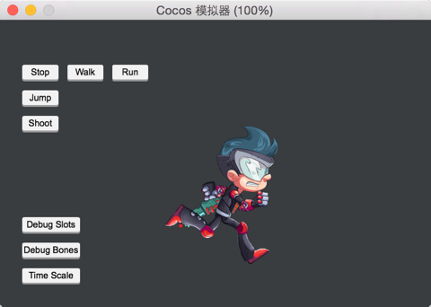
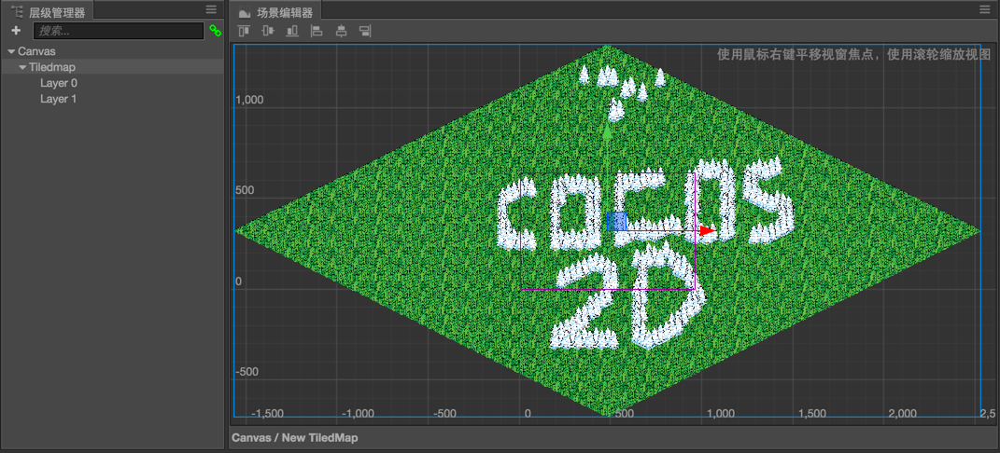
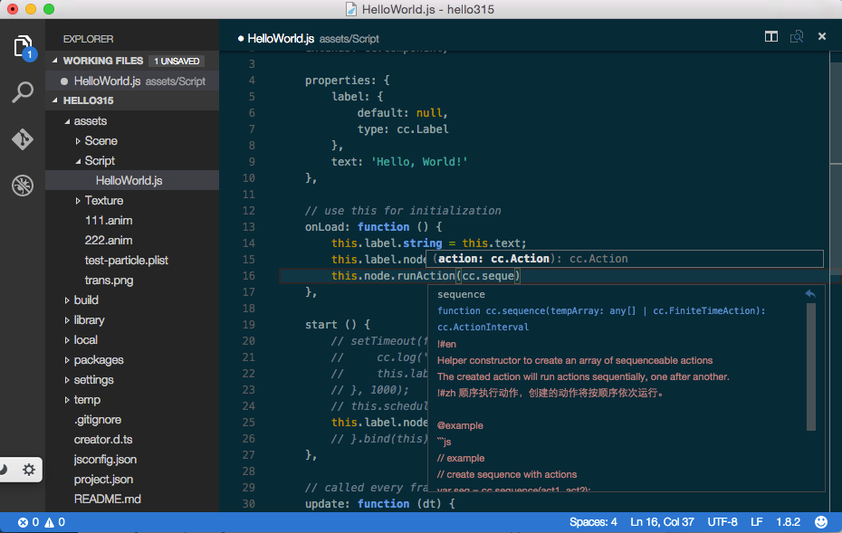
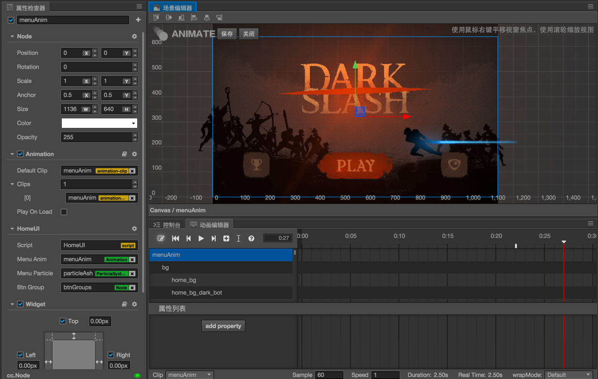

# Cocos Creator 1.0 officially released!

We are excited to release version 1.0 of Cocos Creator. Cocos Creator is a new, unified, development tool that handles every step in the game development process.

v1.0 brings:
- A better coding environment
- A reliable native development and publishing workflow
- New UI elements: EditBox and Grid Layout
- Spine skeleton animation and Tiled Map support

## New UI Element: Grid Layout and EditBox
As a developer you may need to implement a user login interface, an inventory/backpack interface or some sort of table view. This major update brings home the Grid Layout and EditBox UI element. These UI elements empowers users to create any kind of UI they like.

 

A [demo project](https://github.com/cocos-creator/demo-ui/archive/master.zip) highlights some new UI features.

## Spine Skeleton Animation and Tiled Map
Cocos Creator now supports skeleton animation created and exported with [Spine](http://zh.esotericsoftware.com/), including complete runtime API.

 

 

TMX ([Tiled Map Editor](http://www.mapeditor.org)) is also now supported. It is as simple to use as creating a
TiledMap component and draging your TMX file onto it. After the tilemap is created, each tiled layer will be created as seperate node, so you can insert your actors between those layers.

(Create a new project with __Example Collection__ project template, and you can quickly preview and learn how to use Spine animation and tilemaps.)

## New Coding Environment and JSB Debug Workflow

Cocos Creator works with [Visual Studio Code](http://code.visualstudio.com) now and it's the recommended tool to code your game. Visual Studio Code is a cross-platform, lightweight IDE which has great support for JavaScript and excellent performance. Also it shares the same application framework as Cocos Creator, so we decide to use Visual Studio Code as our recommended IDE and soon to be default.

 

In 1.0 version, users still need to download VS Code manually and install related extension through Cocos Creator's Developer menu. We are working on the integration of VS Code into Cocos Creator.

With our extension, you can debug your script on JSB platforms with VS Code now. Please check [this](http://discuss.cocos2d-x.org/t/use-vscode-to-debug-cocos2d-x-jsb-programs/27588) guide for more information.

## Extending The Editor
Starting in v1.0, developers can now create plugins to extend the Editors functionality. This means you can:

- Develop plugins that incorporate directly into the editor.
- Plugins can be menu items to run its functionality.
- Communicate between Node.js process and HTML page process. One plugin can register many menu items.
- Build your package's interface with standard HTML.

Developers can create extensions capable of providing most of what VS Code/Atom/Sublime do. Including text processing, file system I/O and importing any third-party JavaScript package you want.

## Other Highlights

- The Timeline editor workflow has been revamped. Animation editing mode is now isolated so users will not accidentally change Node properties or Node tree structures outside of animation root node. A lot of useful shortcuts and editing operations are added as well.
- Prefab editing mode is similar to Animation editing mode. You can double click on a prefab asset to quickly edit it in the scene view.
- You can choose to preview your game using the Simulator or Browser from a dropdown menu next to 'Preview' button
- Added coding examples to most of the common API
- Sprite component now includes 'Filled' and 'Tilled' render mode.
- Sprite component now supports render without trim, Sprite node size can also be set with 'Size Mode' property.
- Sprite and ParticleSystem supports blend func.
- Added component context menu to Properties panel. You can reset component properties, remove component, copy and paste component from one node to another and moves component up and down on a node.
- Added align nodes buttons to Scene view.
- Build panel workflow revamped. Added screen orientation, engine template, Android keystore, sourcemap setting. Also you can cancel build and compile process now.
- Add cc.loader.loadRes API for dynamic asset loading.

Please read 1.0 release notes for more information.

## More Demo Projects
The most important source of examples is the __Example Collection__ project template. There are also many demos to show a complete game:

- __[Dark Slash](https://github.com/cocos-creator/tutorial-dark-slash/archive/master.zip)__ basic game loop demo. Special thanks to Veewo Games for authorizing us to use original 'Dark Slash' game resources to make this tutorial. 

 

- [UI Demos](https://github.com/cocos-creator/demo-ui/archive/master.zip) including multi-resolution supporting menu interface with cool transition animations, a backpack generated by data and prefab and a Clash Royale style navigation menu showcase. 
- [Blackjack](https://github.com/cocos-creator/tutorial-blackjack/archive/master.zip) demo, collaboratively developed with Tencent Games. 
- [Flappy Bird](https://github.com/cocos-creator/tutorial-duang-sheep/archive/master.zip) clone featuring a sheep. 
- [Star Catcher](https://github.com/cocos-creator/tutorial-first-game/archive/master.zip) demo game, in user manual we have a quick start tutorial showing how to build this game step by step.

We will keep on adding more demos and complete games as well as improving the existing ones!
