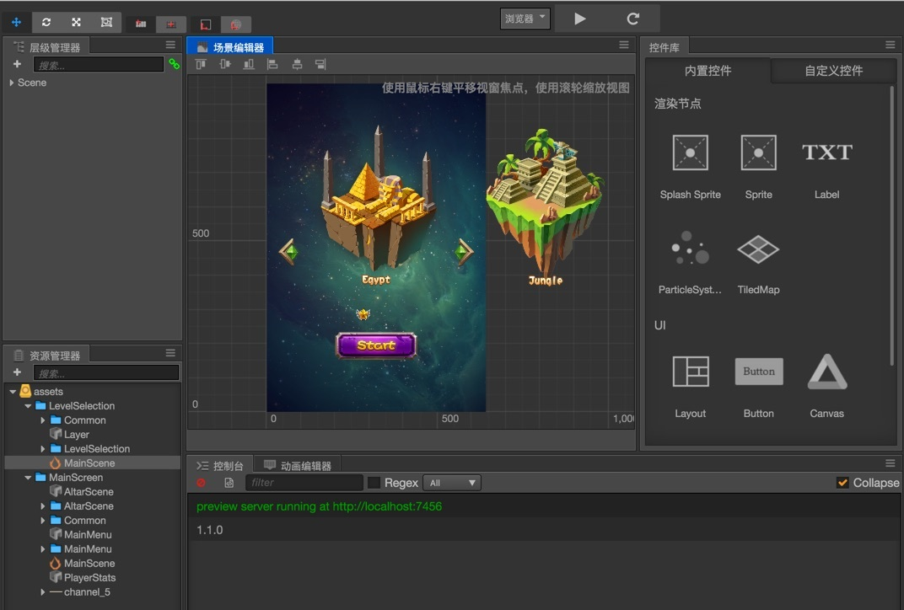
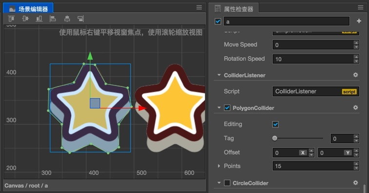
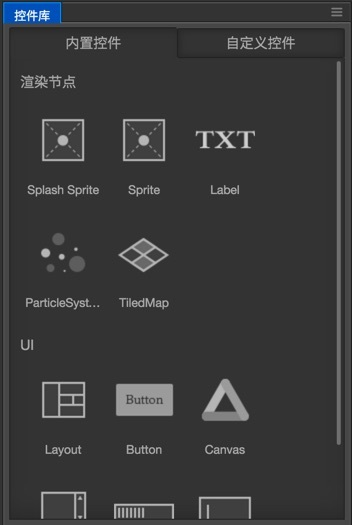
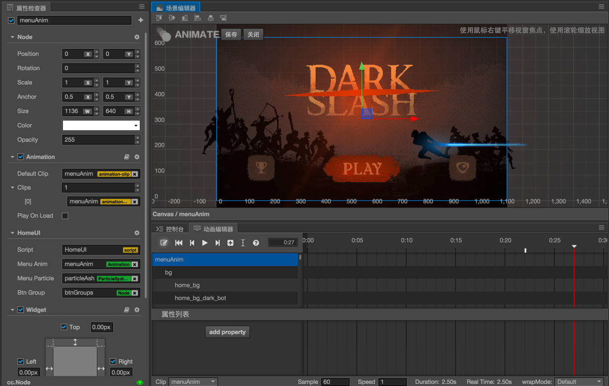

# Cocos Creator 1.1.2 released!

We are excited to release version 1.1.2 of Cocos Creator. Cocos Creator is a new, unified, development tool that handles every step in the game development process.

##v1.1.2 Changelog:

### Editor

- [Editor] Build to Web platform will merge asset JSON files now. The requests to download asset will drop by 50% in general. Currently an asset shared among multiple scenes will be merged additively. (If assetA and assetB both referenced by sceneC and sceneD, assetA and assetB will be merged into one JSON)
- [Editor] Disable 'Preview' button when there're compilation error for user script. Once all errors are resolved the error log will be cleared in console.
- [Editor] Removed Squirrel.Windows installer framework, with the new installer you can specify installation location and configure check update frequency.
- [Editor] Fixed spriteFrame atlas replacement tool can cause reference error when replacing spriteFrame in multiple scenes.
- [Scene] Fixed multi-select some nodes and press arrow keys to move them may get the distance wrong issue.
- [Component] The `Add component` menu in Properties panel now sorted alphabetically.
- [Importer] When import Cocos Studio or Cocos Builder project, buttons without text will not create Label nodes.
- [Importer] Fixed import Cocos Studio older version may cause animation data lost issue.
- [Importer] Fixed imported Cocos Studio / Cocos Builder project wrong value of lineHeight for Bitmap Font component issue.
- [Build] Fixed build native failed may cause process to freeze issue.
- [Build] Fixed preview with Chrome browser may cause `Failed to parse SourceMap` error issue.
- [Build] Fixed building an empty project will cause: `Build Failed: Error: TypeError: next is not a function` issue.
- [Prefab] Add a main menu item `Node Presets-> Convert to Ordinary Node` to break break the link of a node to prefab asset.
- [Prefab] Fixed in prefab editing mode click 'save' button may not work issue.
- [Animation] Fixed setting node opacity at the last frame event callback of an animation may fail issue.
- [Animation] Fixed deleting animation event may fail issue.
- [Assets] Fixed atlas and TTF assets may get reimported when open project issue.
- [Assets] Fixed sprite not rendered correctly when referenced spriteFrame asset moved issue.
- [Assets] Fixed texture asset thumbnail not updated when texture content changed issue.
- [Assets] Fixed an error that can cause editor to freeze when importing 10000+ assets for new project issue.
- [Assets] Fixed assets may not be imported correctly when moved assets after close editor issue.
- [Assets] Add a warning dialog when user moved assets without updating the corresponding meta files.
- [Assets] Add a replace asset confirmation dialog when dragging assets with the same names from file system to editor's Assets panel.

### Engine

- [Render] Fixed an issue that when setting parent node's opacity to 0 while setting child node's active to false may cause child node to not render when reactivated.
- [Engine] Fixed simulator cannot send `http` request on macOS 10.11 issue.
- [Engine] Fixed VS Code debug native fail on Mac issue.
- [Engine] Fixed `cc.follow` action result in wrong coordinates issue.
- [Engine] Add an error message when assign a boolean type value to `cc.Label.string`.
- [Engine] Fixed `cc.game.addPersistRootNode` API may not work correctly in native platforms issue.
- [Engine] Fixed screen flicker when switching scenes.
- [Engine] Fixed script initialization may fail issue when re-enter a scene.
- [Engine] Fixed when loading a Prefab asset in scene may cause infinite asset request issue.
- [Engine] If game is running on Android OS with virtual buttons, the virtual button will be hidden when game launches.
- [Engine] Fixed `cc.repeat` action will count wrongly when repeat times is above 6.
- [JSB] Fixed `cc.follow` may cause error in JSB native platforms.
- [JSB] Fixed `scheduler.isScheduled()` not implemented in JSB issue.
- [JSB] Fixed `_errorHandler wasn't found` error reported in console with no valid reason issue.
- [JSB] Fixed `setMargin` API not implemented in JSB for `LabelOutline` issue.
- [Audio] Fixed audio asset takes very long to load on iOS browser issue.
- [Audio] Fixed `rewind` API not working for `AudioSource` component issue.

### Component

- [Label] Fixed when overflow set to `Shrink` font size and label text flow not calculated correctly issue.
- [Label] For BitmapFont label, When total character width smaller than Label node's width, character wrap mode will be enabled.
- [Label] Fixed system font overflow not calculated correctly issue.
- [ScrollView] Fixed button in ScrollView may stay in hover state issue.
- [ScrollView] Fixed register `touchend` `touchcancel` event on ScrollView node may not trigger correctly issue.
- [ScrollView] Disable ScrollView node will stop scrolling now.
- [EditBox] Add `all lowercase` format, fixed using TTF font asset on Android system issue.
- [EditBox] Fixed calling `setVisible` will pop keyboard issue.
- [EditBox] Fixed on mobile browser EditBox need to be clicked twice to pop keyboard issue.
- [EditBox] Fixed EditBox not clickable in ScrollView issue.
- [Layout] Fixed change child node's `active` property will not get correct bounding box size in `None` mode issue.
- [Layout] Fixed issue when add a child node to Layout and then remove will not remove event listeners correctly.
- [Button] Fixed switching `interactable` property for Button will not update normal and disable state spriteFrame issue.
- [Collider] Fixed disabling collider will not clear debug draw issue.
- [MotionStreak] Improved MotionStreak compatibility for Android browser.
- [Tilemap] Fixed TiledMap may render with seams in WebGL platform issue.
- [Tilemap] Fixed `SGTiledLayer` has inconsistent API between Web and Native implementation issue.
- [Tilemap] Fixed issue that when `tmx` file is not at the same location of texture file the Tilemap may not rendered correctly issue.
- [Spine] Fixed `getCurrent()` may cause infinite loop in JSB native platform issue. Please use `spine.getCurrent()` to fetch current playing track.
- [Mask] Fixed masked node can still receive touch event issue.
- [Mask] Fixed disabled Mask component can still block child node from touch event issue.

Downloads: 
- __[Creator for Mac](http://cocos2d-x.org/filedown/CocosCreator_v1.1.2_mac)__ 
- __[Creator for Windows](http://cocos2d-x.org/filedown/CocosCreator_v1.1.2_win)__

Resources: 
- __[Read the documentation](http://cocos2d-x.org/docs/editors_and_tools/creator/index.html)__
- __[YouTube](https://www.youtube.com/watch?v=_UTy7IkGxMU)__

## Full Release Notes from v1.1
### Import Project from Cocos Studio / Cocos Builder

As the newest member of Cocos engine family, it's very important to have data compatibility with scene building tools like Cocos Studio and Cocos Builder. In the new release users can use the 'Import project...' menu item from main menu to import ccs and ccb project file.

Assets that can be imported including: Scene, Layer, Node, Texture, Scene Timeline, Particle and Audio. Due to the big difference between object oriented and component scripting system, the source code won't be imported.

 

### Collider Component System

Physics and collision are key elements of action games. We have received tons of feedback asking for physics engine support. In v1.1 we added Collider Component system so that you can easily use Cocos Creator to develop action based games!

 

First, once we attach a Collider component to a node, we can specify shape, size and position of the collider. For certain shape of colliders you can also edit control points freely to create any shape you like.

We also add a 'Group' property for Node, by setting group collision rules we can control wether a node should collide with other nodes from a certain group.

You can register a callback function on a component attached to the same node. So that when collision happens, the callback function is called with arguments including the other collider and the collider itself. Then you can write any logic code to handle the collision to perform the desire behavior.

Since 3rd party physics engines are generally large and most games will only use small portion of it. We didn't include any physics engine in the release.

### Engine Customization Workflow

Engine customization is always one of the highlight feature of Cocos engine family. Cocos Creator v1.1 contains full engine customization worfklow. There are two layers of engine customization: JavaScript and C++. If you work on Web project you only need JavaScript engine, if you work on cross-platform or one of the native platform you'll need to customize C++ engine as well.

The JavaScript and C++ engines are now available on Github, forks and pull requests are welcome!

- JavaScript Engine: https://github.com/cocos-creator/engine
- C++ Engine: https://github.com/cocos-creator/cocos2d-x-lite

### Refined Assets Loading API

We simplified and optimized assets loading API, now you can use `cc.loader.loadRes` to load any assets with consistent url format. And you should not including asset file extension in the url. Instead, you can pass a second argument to specify the type of asset you want to load.

We also add `cc.loader.loadResAll` that supports inputing a folder url and load all assets in that folder.

For dynamic scene loading, this release also includes `cc.director.preloadScene` to handle all the scene assets preloading.

### Node Library

 

In this new panel you can drag and drop node and UI elements to the Scene or Node Tree to easily create them. User can also drag prefab assets from Assets panel to Node Library to create 'shortcut' of frequently used prefabs.

### Breaking Changes

- [Atlas] `cc.SpriteAtlas.getSpriteFrame` argument changed, now you should pass spriteFrame name without file extension, such as `atlas.getSpriteFrame(‘sheep_run_0’)`.
- [Engine] `cc.loader.loadRes` arguments changed, you should not specify file extension in the url.
- [Engine] `cc.Font` asset type has been changed from RawAsset to Asset, so in component property declaration the type of font asset should be declared as `type: cc.Font` (or cc.BitmapFont / cc.TTFFont)
- [Editor] editor window layout data format changed, if you open a project with Creator v1.1 and then use Creator v1.0 to open it a layout error will occur. You can use main menu's 'Layout->Default' to fix it.

## Full Changelog

### Editor

- [Scene] Fixed when undo with `Ctrl/Cmd+Z` node size may not get recovered issue.
- [NodeLibrary] Fixed user custom nodes cannot be saved issue.
- [Editor] Fixed an simulator crash issue if Cocos Builder imported project has particle data with missing texture
- [Editor] Remove data that's using default value in exported JSON file to reduce release package size.
- [Editor] Fixed an issue that cause Editor log file cannot be accessed.
- [Editor] Add `auto refresh` option to enable or disable refresh on preview device when recompiling scripts or saving scene.
- [Editor] Fixed renaming Atlas assets may cause texture asset reference error issue.
- [Editor] Fixed publish to web platform may have broken bitmap font asset reference issue.
- [Editor] Fixed an issue that when importing Tmx assets on Windows, the raw asset reference may be invalid.
- [Prefab] Fixed after double click prefab to enter edit mode, click close without any modification will cause save prompt to pop issue.
- [Animation] Fixed changing current editing animation clip name will cause error.
- [Animation] Fixed an issue that cannot drag spriteFrames to spriteFrame property track.

### Component

- [Component] When add more than one component that may affect node's size, there'll be clear error message.
- [Component] Make sure there are correct error message when CCClass property default value is inconsistent with property type.
- [Label] Bitmap Font component now has original font size displayed in Properties panel.
- [Label] Fixed when Label using system font update string content the node size will not be updated correctly issue.
- [Label] Fixed Label using TTF font may cause font resource to be loaded twice in Web browser issue.
- [Label] Fixed when Label content size changed the event not fired correctly issue.
- [Canvas] Fixed setting opacity property has no effect for Canvas node if there's an EditBox component in Canvas's children.
- [Layout] Fixed deactivate children node will not trigger size recalculate for Layout container resize mode.
- [Layout] Refactored Layout and Widget calculation to increase performance.
- [ScrollView] Fixed when content is a Layout component with `ResizeMode` set to `Container`, the scrollToXXX apis will not take effect in current frame issue.
- [ScrollView] Fixed in JSB use Label as content may not be able to scroll issue.
- [MotionStreak] Now the trail will be rendered according to anchor point, also fixed `setDirtyFlag` error on Android, add a property to set trail color.
- [Audio] Fixed AudioSource will not stop playing when switching scene.

### Engine

- [Engine] Add a new class cc.NodePool to replace cc.pool. The new NodePool will be fully compatible with the new event system, so you can get a node from the pool and register/deregister any event you like.
- [Engine] Add VideoPlayer component, currently only supports Web, iOS and Android.
- [Engine] Fixed an issue that `update` may execute before `start`.
- [Engine] Fixed an issue that using `this.node.active = false` in `onLoad` function will not disable rendering issue.
- [Engine] Fixed an issue that `update` will not execute after disable and enable component multiple times.
- [Engine] Fixed `cc.Animation.removeClip` api will stop current playing animation if the first argument is not defaultClip and the second argument is false
- [Engine] Fixed dt (delta time) in `update` function may not be real time between this and previous frame issue.
- [Engine] Reworked `cc.loader.loadRes` api, now url should not specify file extension. The second arugment is to specify a type for the resource. Add a new api `cc.loader.loadResAll` to load all assets in a given folder.
- [Engine] Add `cc.director.preloadScene` api for preload a scene and all its assets. The old `cc.director.runScene` will be deprecated
- [Engine] Fixed `cc.tintTo` has inconsistent arguments between web and JSB
- [Engine] Fixed unschedule the same callback function twice will terminate all other scheduler issue.
- [Engine] Fixed accessing builtin component in `onLoad` may not get component instance issue.
- [Engine] Fixed calling `addComponent` in `onLoad` will result in the added component's `onLoad` not execute immediately issue.
- [Engine] Fixed calling `loadScene` in `onLoad` function will cause error issue.
- [Engine] Add a feature to force orientation according to Publish setting even if the platform does not allow it (there're some browser that will lock the orientation)
- [Engine] In preferences panel you can set JavaScript and C++ engine path to the clone from github, to easily integrate custom engine workflow.
- [Engine] Fixed using `setSiblingIndex` to change node order may cause touch event handling in wrong order.
- [Engine] Add protection for important global variable so they cannot be overwrite.
- [JSB] Fixed cc.pSub return value type is not Vec2 issue.
- [JSB] Fixed cc.callFunc callback function argument not consistent between JSB and Web issue.
- [JSB] Fixed error when calling `event.stopPropagation` in JSB
- [JSB] Fixed auto-binding for jsb.EventListenerAssetsManager
- [JSB] Fixed a crush issue that onTouchBegan function in eventListener cause when not return true.

## Demo Projects
The most important source of examples is the __Example Collection__ project template. There are also many demos to show a complete game:

- __[Dark Slash](https://github.com/cocos-creator/tutorial-dark-slash/archive/master.zip)__ basic game loop demo. Special thanks to Veewo Games for authorizing us to use original 'Dark Slash' game resources to make this tutorial. 

 

- [UI Demos](https://github.com/cocos-creator/demo-ui/archive/master.zip) including multi-resolution supporting menu interface with cool transition animations, a backpack generated by data and prefab and a Clash Royale style navigation menu showcase. 
- [Blackjack](https://github.com/cocos-creator/tutorial-blackjack/archive/master.zip) demo, collaboratively developed with Tencent Games. 
- [Flappy Bird](https://github.com/cocos-creator/tutorial-duang-sheep/archive/master.zip) clone featuring a sheep. 
- [Star Catcher](https://github.com/cocos-creator/tutorial-first-game/archive/master.zip) demo game, in user manual we have a quick start tutorial showing how to build this game step by step.

We will keep on adding more demos and complete games as well as improving the existing ones!
