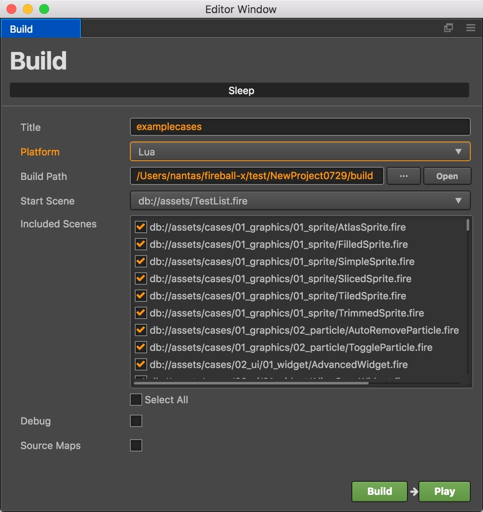
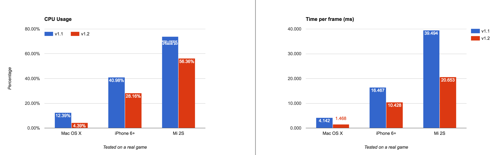
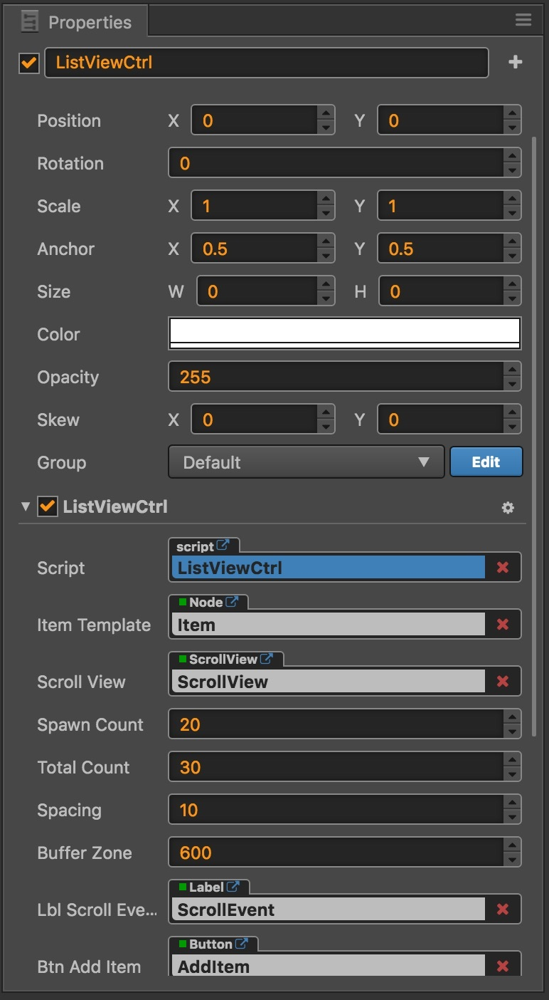
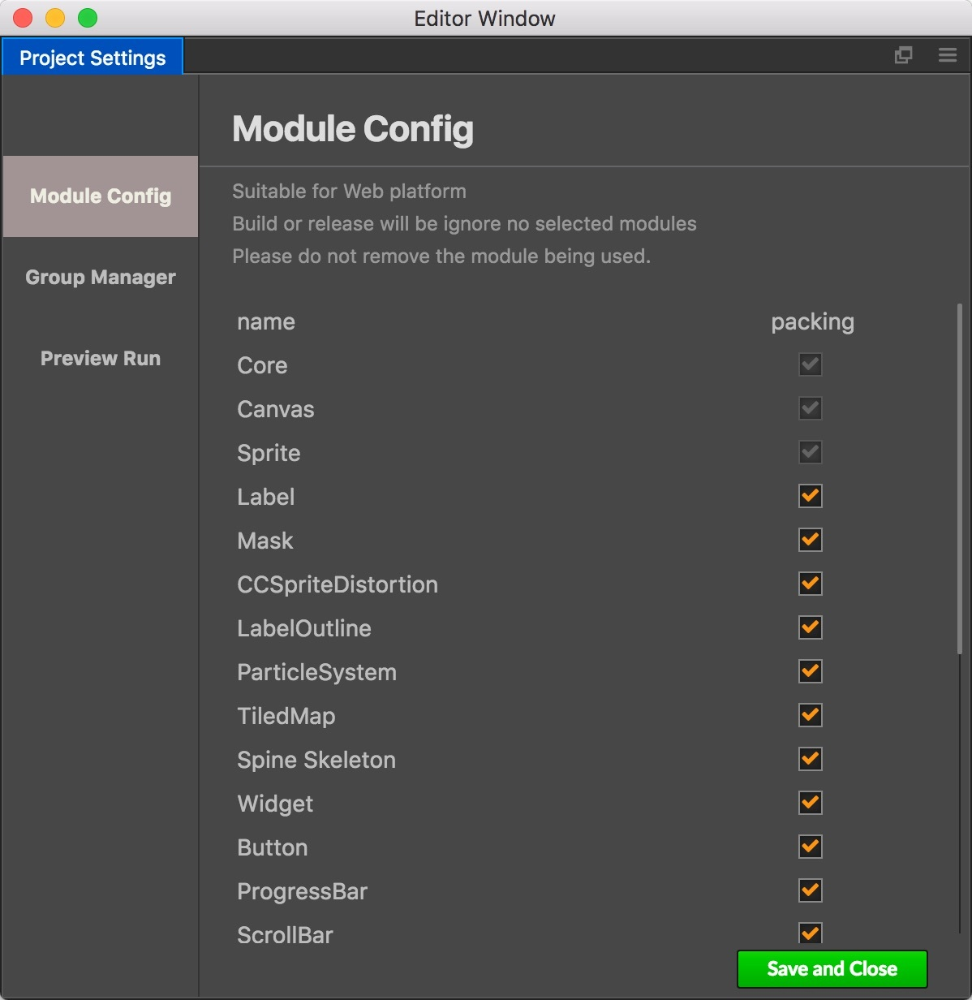

# Cocos Creator 1.2 released!

We are thrilled to release v1.2 version which focuses on performance improvements covering both Web and JSB platforms. Developers who started a game with v1.0 now can get a free performance boost!

## 1.2 Main Features

- Build to Lua Engine
- WebGL auto batching and culling
- Canvas rendering with dirty region optimization
- Graphics drawing system
- Refactored Properties panel supporting customized elements
- Modular JavaScript Engine
- AnySDK support

## Build to Lua Engine

After two months of development and collaboration between the creator of Cocos2d-x Lua engine, Yulei Liao, and Cocos Creator team, finally we are able to build scene and UI to be used in Cocos2d-x Lua engine now!

 

The current Creator to Lua workflow:

- Make and edit scene and UI in Creator, you can also manage project assets in it.

- In Build panel, choose `Lua` as the target platform.

- Convert built files to lua files with the convert tool.

- Next just use the standard cocos2d-x Lua engine workflow to add game scripts and then use Cocos Console for compiling and running.

We will keep updating Lua support for Creator. Next steps includes making the convert tool a plugin for Creator and generate standard Cocos2d-x Lua project, also we will add component system for Lua that you can bind data for your components in Creator editor.

## Rendering Optimization for Web and JSB

 

In Cocos2d-x 3.11 and 3.12 we added WebGL auto batching and culling that can increase performance drastically. Now in Cocos Creator v1.2 we have includes all the WebGL optimization. If you have your images packed in atlas properly you'll see performance boost that at least 5 times better than last released version. The auto culling feature make sure that only sprites and labels you can see generates render commands, this will help supporting large scene and tilemap for your game.

For Android browsers that doesn't support WebGL, the newly added dirty region optimization specifically for Canvas Rendering mode also brings 2 times of performance boost. You can also disable this optimization for Canvas rendering with API if your scene consists of moving elements mainly.

## Graphics Drawing System

From Creator v0.7 to v1.1, the beloved `cc.DrawNode` API were always absent. In v1.2 let's welcome `cc.Graphics`, a superior, fully upgraded version of graphic drawing API system. Besides covering all of `cc.DrawNode's` functionality, `cc.Graphics` supports SVG vector format including static and animated graphics. You can get tens of thousands shared vector graphics from internet to spice up your game (be sure to check their license)! It's also great for procedure graphic fans, let's get started now!

 

## Customizable Properties Panel for Components

We refactored Properties panel, that would probably be the first thing you notice when launching v1.2 for the first time since the panel looks way different now. Besides the looking, developers get the performance boost and more importantly, the ability to write custom property elements for your components. You can easily make visual property control like Widget component and make your designers very happy.

 

## Modular JavaScript Engine

We added a new tab **Module Config** for Project Settings panel in v1.2, that you can customize what engine module should be included in JavaScript build. For now you can effectively reduce engine library size by 1/3 if you don't need many modules. Later we will further slicing engine up to make built engine even more tiny.

 

## AnySDK Support

We have include AnySDK C++ library in v1.2 native build. You don't need to do anything before you can call its API in your script to generate base package.

In the near future we will release an __AnySDK__ plugin for Creator that you can finish the whole SDK workflow with fully graphical interface without leaving Cocos Creator.

## Full Changelog

### Major Changes

- [Build] Added **Lua** build target for **Build** panel
- [Engine] Added WebGL auto batching and culling optimization
- [Engine] Added dirty region optimization for Web Canvas rendering mode
- [Engine] Added AnySDK library to native build
- [Editor] Added **Async load assets** option to scene asset's property, check this one will make the scene run right after finish loading scripts and node tree, and rest assets such as textures and audios will be loading on the go.
- [Engine] Added cc.Graphics graphic drawing API
- [Preview] Added Eruda mobile debugging library for web preview, you can open the debug panel by clicking the gear icon.
- [Webview] Added webview component

### Editor

- [Editor] Added **Module Config** tab in **Project Settings** panel that can customize which modules go into build.
- [Editor] Refactored **Properties** panel that enables customizing property elements for user defined components.
- [Assets] Fixed display error of folder with `..` in its name in **Assets** panel.
- [Assets] Fixed when updating atlas assets, the spriteFrame under atlas texture may not be updated correctly issue.
- [Prefab] Fixed error when exiting from prefab editing mode to a scene with EditBox.
- [Prefab] Fixed the issue that when dragging an element from **Node Library** to a prefab will cause the prefab to turn into normal node.
- [Animation] Fixed deleting AnimationClip when editing it will cause display error issue.
- [Animation] Fixed editing animation property of a Widget component may get wrong result issue.
- [Animation] Added animation 添加了动画回调事件，包括 play, stop, pause, resume, lastframe，finished
- [Animation] Fixed **Play On Load** animation will still play despite Animation component is disabled issue.
- [Menu] **Select All** in **Edit** menu now can select all nodes or assets in **Node Tree** and **Assets** correctly.
- [Scene] Fixed swiching on and off Particle in scene will make editor run slow issue.
- [Scene] Fixed when undoing node's activation state will not update node tree and scene view correctly issue.
- [Console] Refactored **Console** panel to make it capable of displaying unlimited amount of messages.
- [Console] Fixed **Console** panel in Windows cannot show Chinese character correctly issue.

### Engine

- [Engine] Fixed Android rendering issue, performance should be improved.
- [Engine] Fixed child node not updating its opacity correctly when detached from a parent node.
- [Engine] Fixed some dependent assets cannot be loaded when loading multiple prefab at the same.
- [Render] Improved dynamic font rendering quality for WebGL
- [Render] Fixed glitches in rendering animation or updates on latest Chrome browser issue.
- [Render] Use libPNG library on iOS platform to fix transparent images getting dark issue.
- [JSB] Fixed `bezierTo` action will not update node position correctly issue.
- [JSB] Fixed `scheduleOnce` callback will be called multiple times issue.
- [JSB] Fixed `cc.game.EVENT_SHOW` and `cc.game.EVENT_HIDE` not working in JSB.
- [Action] Fixed on Web platforms `cc.hide`, `cc.show`, `cc.toggleVisibility` not working issue.

### 组件

- [TiledMap] Optimized tilemap rendering for WebGL with unlimited tile count.
- [TiledMap] Fixed moving tilemap assets will cause reference lost issue.
- [TiledMap] Fixed `TiledLayer.setTileGID` API doesn't support float value input issue.
- [TiledMap] Fixed hex based map not rendered correctly issue.
- [TiledMap] Fixed `TiledLayer` not able to change opacity issue.
- [Button] Fixed setting `node.active=false` in `onTouchEnd` callback, it will not reset to normal texture when node reactivated issue.
- [Label] Fixed changing TTF font in runtime will cause error on native platform issue.
- [ScrollView] Auto hide ScrollBar and reset content position when Scrollview content size is smaller than Scrollview size
- [ScrollView] Added `stopAutoScroll` API to manually stop scrolling.
- [ScrollView] Fixed `Touch.startPoint` not convert to view coordinates that cause click events in ScrollView not working
- [Collider] Now can track dynamic change of `node.group` correctly.
- [EditBox] Fixed EditBox component will trigger `TextChanged` when enabled issue.
- [EditBox] Fixed Label in EditBox has inconsistent behavior between native and web platform
- [EditBox] More types of pop-up keyboard are supported on Web browsers.
- [EditBox] Fixed third party IME will block input field on iOS issue.
- [EditBox] Added `editingReturn` event to differ hitting 'enter key' or clicked outside of pop-up keyboard.
- [Component] Fixed copy and paste Component will not add dependent component first issue.
- [Component] Sort user defined components in **Add Component** button menu.

### Misc

- [Build] Missing reference to assets and scripts will generate console warning when building project and saving scene.
- [Build] Added IPC message `editor:build-start` when building starts
- [Build] Do not pack assets JSON for native platform build.
- [Build] Added **Android Studio** checkbox for Android building, only works for **default** template and needs Android SDK 22 for compilation.
- [Build] Fixed Creator app has space in its name will cause building native with **binary** template issue.

##Downloads: 
- __[Creator for Mac](http://cocos2d-x.org/filedown/CocosCreator_v1.2.0_mac)__ 
- __[Creator for Windows](http://cocos2d-x.org/filedown/CocosCreator_v1.2.0_win)__

##Resources: 
- __[Read the documentation](http://cocos2d-x.org/docs/editors_and_tools/creator/index.html)__
- __[YouTube](https://www.youtube.com/watch?v=_UTy7IkGxMU)__

## Demo Projects
The most important source of examples is the __Example Collection__ project template. There are also many demos to show a complete game:

- __[Dark Slash](https://github.com/cocos-creator/tutorial-dark-slash/archive/master.zip)__ basic game loop demo. Special thanks to Veewo Games for authorizing us to use original 'Dark Slash' game resources to make this tutorial. 

 

- [UI Demos](https://github.com/cocos-creator/demo-ui/archive/master.zip) including multi-resolution supporting menu interface with cool transition animations, a backpack generated by data and prefab and a Clash Royale style navigation menu showcase. 
- [Blackjack](https://github.com/cocos-creator/tutorial-blackjack/archive/master.zip) demo, collaboratively developed with Tencent Games. 
- [Flappy Bird](https://github.com/cocos-creator/tutorial-duang-sheep/archive/master.zip) clone featuring a sheep. 
- [Star Catcher](https://github.com/cocos-creator/tutorial-first-game/archive/master.zip) demo game, in user manual we have a quick start tutorial showing how to build this game step by step.

We will keep on adding more demos and complete games as well as improving the existing ones!
