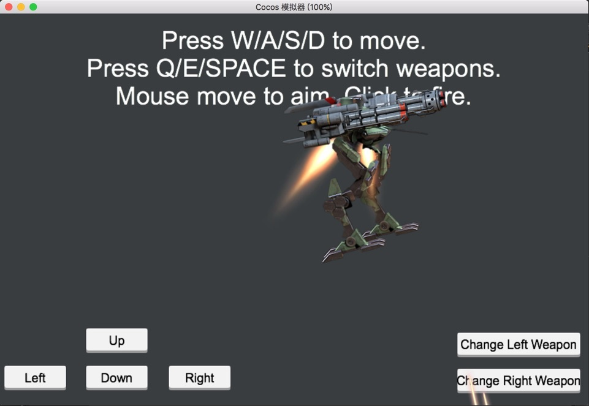
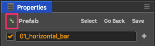
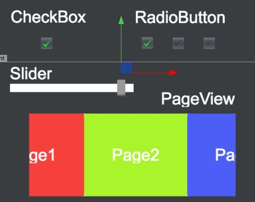

# Cocos Creator 1.3.1 released!

We are excited to release version 1.3.1 of Cocos Creator. Cocos Creator is a new, unified, development tool that handles every step in the game development process.

This version offers an incredible performance increase for both Web and native platforms. There are 6 major features and numerous small changes in this version that will help Creator meet the needs of more and more types of projects! The following is the highlight of this update:

- Rich text support
- Dragon Bones skeleton animation support
- Prefab automatic synchronization
- Automatically packaging textures to Atlas
- Added UI controls: PageView, Toggle, ToggleGroup, Slider
- New AudioEngine

## Important upgrade instructions

- The Windows version now uses use a 64-bit architecture, there is no longer support for 32-bit Windows systems. The advantage is that the editor can deal with a large number of image resources and improve the efficiency by at least 5 times, but also to support the emerging image format Webp.

## Highlight Features

### Rich text support

With RichText in place, finally you can have a decent chat channel or battle log in your game! The new RichText component can automatically generate different styles of text based on the BBCode tags in the string. Currently supported tags include size, color, b, i, u, img and on, which are used to customize the font size, font color , Bold, Italic, Underline, Image, and Click events. With the help of rich text, you can easily use a small amount of UI elements with a specific string format of the incoming data to display a rich styles of text.

## Dragon Bones skeleton animation support

Responding to the call of users, we have added Dragon Bones ( a very popular skeleton animation editing tool) support in this version. DragonBones component and Spine component works similar. You just need to create a node with DragonBones component, and drag exported DragonBones animation data and image data into the component then it's ready to be played in your scene. You can also customize the properties of the component such as default animation, playback speed and cycle times easily in editor.

## Prefab automatic synchronization

The design of Prefab asset from the beginning is to allow users reuse the resources and elements in the project. But in previous version of Creator once a prefab is dragged into the scene, it will not be automatically synchronized when the prefab asset is updated. This behavior is corrected in the upcoming 1.3 version. When you create a Prefab asset, you can manually choose whether to auto update the Prefab instances in scene.

The figure above shows that the instances in the scene are automatically synchronized.

The figure above shows the default state when you create a new prefab, the instance of the Prefab does not automatically synchronize asset changes, which is the old behavior as previous version.

The addition of this little feature will make it easier to maintain a static scene, such as a main menu scene consists of multiple UI menu, each menu can be made Prefab and maintained by a specific person. The maintainer of a prefab can modify their prefab and save changes, other team members will see the updates in the scene as long as they get the prefab assets update. And the scene asset will not be changed at all during the process. This will greatly improving the efficiency of multiple collaborator working on the same scene!

## Add UI controls: PageView, Toggle, ToggleGroup, Slider

To make our UI library even stronger, we add four new UI controls in this version: PageView, Toggle, ToggleGroup and Slider. These new family members will be used in a project importing process from Cocos Studio. Once we make sure there're no compatibility issues we will be able to import any Cocos Studio project into Creator.

With the addition of RichText and more UI controls, we can finally ensure that users can use Cocos Creator to achieve any desired 2D UI interface. Along side the multi-resolution adaptive UI system and highly integrated base renderer component Sprite and Label all since v1.0, Cocos Creator will give developer an great edge in the development of games with heavy UI content.

## New AudioEngine

Refactored New AudioEngine is still called cc.audioEngine, but the internal implementation has been revamped, to solve the following problems:

- Optimization of the preload process, once the load is completed you can immediately start to play the audio.
- Added API to access to audio duration, and current playback position
- Adds a callback method after the audio has finished playing
- Optimize the audio playback on the Web platform, large-size audio will automatically switch to the Audio module to load, save memory overhead

After the refactory of the audio engine, there is no longer difference between music and effect playback implementation. Although we kept the old API and behavior, you can use the same interface for both types of audio.

## Other important changes

- Build projects with CLI command
- Add ability to specify cross-project shared asset library with `--mount` CLI option
- Refactor the JS-binding API to improve stability, binding API are now consistent with cocos2d-x 3.13.
- Optimize resource caching and loading mechanism
- Refactored cc.Loader to support independent load queues and better progress information. Solved issue to repeated load an asset when there are circular dependencies. Solved issue that may cause callback to fire synchronously.
- Upgrade spine runtime library, support 3.x version of the spine, fix the image mixed mode display problem, support triangle rendering commands

Downloads: 
- __[Creator for Mac](http://cocos2d-x.org/filedown/CocosCreator_v1.3.1_mac)__ 
- __[Creator for Windows](http://cocos2d-x.org/filedown/CocosCreator_v1.3.1_win)__

Resources: 
- __[Read the documentation](http://cocos2d-x.org/docs/editors_and_tools/creator/index.html)__
- __[API Reference](http://cocos2d-x.org/docs/api-ref/creator/v1.3/)__
- __[YouTube](https://www.youtube.com/watch?v=_UTy7IkGxMU)__

## Demo Projects
The most important source of examples is the __Example Collection__ project template. There are also many demos to show a complete game:

- __[Dark Slash](https://github.com/cocos-creator/tutorial-dark-slash/archive/master.zip)__ basic game loop demo. Special thanks to Veewo Games for authorizing us to use original 'Dark Slash' game resources to make this tutorial. 

 

- [UI Demos](https://github.com/cocos-creator/demo-ui/archive/master.zip) including multi-resolution supporting menu interface with cool transition animations, a backpack generated by data and prefab and a Clash Royale style navigation menu showcase. 
- [Blackjack](https://github.com/cocos-creator/tutorial-blackjack/archive/master.zip) demo, collaboratively developed with Tencent Games. 
- [Flappy Bird](https://github.com/cocos-creator/tutorial-duang-sheep/archive/master.zip) clone featuring a sheep. 
- [Star Catcher](https://github.com/cocos-creator/tutorial-first-game/archive/master.zip) demo game, in user manual we have a quick start tutorial showing how to build this game step by step.

We will keep on adding more demos and complete games as well as improving the existing ones!

##v1.3.0 and v1.3.1 Full Changelog:
### Editor

- [Doc] Creator manual document has been open-sourced, the English version of the document is still lack of content updates compare to the Chinese version. Please join us for corrections, completion and translation at https://github.com/cocos-creator/creator-docs
- [Installer] Windows installation package has added Visual Studio 2015 installation options
- [Build] Add Android API Level selection menu to build panel, all available API Levels will be listed according to SDK directory the user specified. The resulting project will have all related API Level settings updated automatically.
- [Build] Add command and option to build projects using the CLI.
- [Build] Add Android Studio support for the binary template
- [Build] Fixes the problem that the screens orientation setting in the build panel do not take effect when the game is launched the first time on Web platform
- [Build] The keystore password for the android platform is now displayed in a masked password format
- [Build] Fixed in the Mac system when the project has large amount of assets, there may be `too many open files` error reported problem
- [Build] Fixed build error when plugin scripts are in the `resources` directory.
- [Build] Fixed generated application name not correct when building Android Studio project issue.
- [Build] When the engine path has space, the building process will give proper error message now.
- [Build] Build to iOS platform projects now adds Xcode 8 support
- [Assets] Add the function of automatic Atlas packaging, you need to create a `AutoAtlas` asset in the folder that stores seperated SpriteFrame assets. During building process the contents in the folder will be packed into an Atlas.
- [Assets] Added a thumbnail icon display for the SpriteFrame resource in Atlas
- [Assets] Optimized SpriteFrame asset in Atlas thumbnail icon generation logic, to solve process stuck problem when there are too many SpriteFrame assets indexed at the same time.
- [Assets] Fixed the problem of repeatedly triggering compile operations when importing a large amount of scripts
- [Assets] Add uuid search function to Assets panel, enter `u: xxxxx` to search assets with uuid
- [Assets] In Assets panel, add a right-click menu `Find Usages` to filter the tree with only assets (scene, prefab and clip) that referenced the item clicked on.
- [Assets] Provide more explicit description for importing custom asset errors
- [Properties] Fixed a problem where the tooltip does not display on the array and object properties
- [Properties] Fixed an error that cause reset node operation not taking effect.
- [Properties] Fixed an issue where the error message and reset button were not displayed correctly when the attribute type and the bound data were not matched.
- [Console] `clear` button will not clear compiler error now.
- [Editor] Fixed a problem with Creator crashing on some Windows 10 system
- [Editor] Fixed an issue that compile error messages may stay in console panel even when compile error is gone
- [Editor] Fixed an issue where the undo command does not trigger a scene change when restoring a null-valued property
- [Editor] Fixes the initial scene settings in the Project Settings panel does not take effect when running simulator
- [Editor] Fixed undo / redo operation on windows may randomly failed issue.
- [Editor] If plugin script contains ES6 syntax, add an error when building.
- [Editor] Added the command line argument `--mount` to specify the external resource path. (You can use multiple --mount parameters to mount multiple paths, parameter values can be absolute path or relative to the relative path of the project). You can also use parameter `--writable` to specify whether allow saving the external resource changes.
- [Editor] Use a new graphic processing library, to solve the problem process crash when importing oversized texture (8192x8192), and enhanced the image processing speed
- [Editor] Fixed a bug that caused the build to fail when all the pictures in the project went into the AutoAtlas
- [Editor] Fixed an issue where changes made to Sliced Sprite can not be previewed immediately in editor.
- [Editor] Fixed a problem when closing a window by `Cmd / Ctrl + Q` would cause an error
- [Editor] Adds the option to choose whether a plugin script should be packed into the build on the native or Web platform.
- [Scene] Fixed an issue when saving a scene would cause the node's fold state to be reset in the Node Tree panel.
- [Scene] Fixed a problem that after continuing to preview the particles for a while and then panning the scene view will cause the editor to work very slow.
- [Prefab] Fixes various auto-sync Prefab display problems
- [Prefab] Fixes nested auto-sync prefab will cause the scene unable to open issue.
- [Dashboard] fixes when cancel the operation of `open other projects' will pop up error message issue.
- [Node Tree] Fixes the problem of newly created node doesn't display highlight selection correctly.
- [Node Library] Add newly added UI elements since v1.2

### Engine
- [Engine] `cc.loader.release` will now correctly remove the cache and its asset dependencies (such as texture, audio), while supporting the release of an assets array. Also add `removeItem` to remove only the cache and `getDependsRecursively` to get its own list of dependent assets (including itself).
- [Engine] Fix the problem that on native platform 'setSiblingIndex' API may not work
- [Engine] Fixed a bug in the mobile web platform that a forced landscape screen orientation might fail when first entering or switching scenes
- [Engine] Fixed `isScheduled` in the Web platform always return false issue
- [Engine] Fixed `cc.loader.onProgress` not callback correctly when sub-queue updates
- [Engine] Fixed an issue where the acceleration parameters obtained by the Android platform might be the opposite of the actual one
- [Engine] Fixed EventDispatcher binding error on native platform that can lead to random crash
- [Engine] Limit the maximum number of concurrent downloader threads on all platforms, avoiding errors when loading too many resources at the same time
- [Engine] Fixed a bug where the grayscale shader was not working
- [Engine] Removed the warning of `No need to release non-cached asset` when loading the json asset with loadRes
- [Engine] Fixed an issue where it was possible to send multiple requests to the web platform after merging the asset json
- [Engine] systemEvent will now inherit EventTarget, and support to use cc.systemEvent.on / once / off to register or unregister system events. The needs to use the eventListener to monitor the keyboard and accelerometer events can now use `on/off` to register and unregister.
- [Engine] Refactored cc.Loader to support independent load queues and better progress information. Solved issue to repeated load an asset when there are circular dependencies. Solved issue that may cause callback to fire synchronously.
- [Engine] Loader provides a separate load task for each context, to solve the run-time JSON object can not be automatically released problem.
- [Engine] Fixed an issue where the game was unable to respond to a click event while running the game on the Wechat desktop client
- [Engine] Add touch-point timeout settings to solve the issue that in WeChat x5 core when slide your finger out of the screen multiple times will not trigger the touchcancel event, and cause the following touch interation failed. If you need to keep a stationary touch point for a long time, please manually modify the timeout setting `TOUCH_TIMEOUT`.
- [JSB] refactor the JS-binding API to improve stability, binding API are now consistent with cocos2d-x 3.13.
- [Audio] Upgrade sound engine to New AudioEngine, solve some of the sound compatibility issues in the previous versions
- [Audio] Use cc.Loader to manage Audio memory, allowing the loader to completely release the Audio resource
- [Audio] Fixed an issue where the AudioSource component will continue to play after switching scenes
- [Action] fixes `cc.flipX` in the native platform will cause a crash

### Components and modules

- [DB] Adds the dragonBones component to support skeleton animation in DragonBones format
- [Component] Add Slider component
- [Component] Add the Toggle and ToggleGroup control components
- [RichText] Added support for RichText components, using bbcode format tags, currently supports color, font size, bold, italic, image and click events
- [PageView] Add PageView component
- [TiledMap] Added support for ObjectGroup display
- [TiledMap] Fixes the problem of undoing the deletion of a Tiledmap node will cause scene render incorrectly.
- [TiledMap] Fixes a problem that using the tsx file in your tmx file may encounter render error issue.
- [TiledMap] Fixes an error when you try to initialize the same TiledMap component with a different map resource
- [TiledMap] Fixes the problem of seams between moving tiles in native engines
- [TiledMap] Fixed a bug where the TiledLayer's setTileGID interface might have generated an error when passing insufficient parameters
- [TiledMap] Fixes tile nodes acquired by cc.TiledLayer.getTileAt (), calling setVisible (false) in the canvas rendering mode reports error issue.
- [Spine] Added 'premultipliedAlpha` to the Skeleton component to process the premultiplied image, which needs to be turned off when the transparent area of the image appears opaque. This option needs to be enabled when the translucent area of the image is darken.
- [Spine] Upgrade spine runtime library, support 3.x version of the spine, fix the image premultiply mode display problem, support triangle rendering commands
- [Button] Add Scale Transition, add button to resize button size to target node size
- [Button] When the button interactable is set to false, if you do not set the corresponding disable state, will automatically use grayed out normal state sprite for disabled state.
- [ScrollView] Change the mouse wheel operation of the desktop platform to more in line with the Windows operating system scrolling direction.
- [Graphics] Fixed the problem of resetting the size of its own node when the user added the GGraphics component
- [Graphics] Fixed a get / set warning for undefined properties
- [Graphics] Fixes the need to call clear in the canvas twice to clear the contents of the painting
- [Animation] Fixed an issue where the call to play was invalid in an animation event callback
- [Animation] Fixes issue that playing animation from a specified frame, the animation events in previous frames will also be triggered.
- [Collider] Fixed an issue where the node group property modified in onCollisionEnter could not be updated correctly
- [Collider] Fixed an issue when new Circle Collider component was added to a node will cause error
- [Widget] Fix CCWidgetManager will report error for `_widget` if the Scrollview size changes
- [Widget] Fixed a bug in the Properties panel that the `top` and` bottom` checkboxes disappears
- [EditBox] Fixes an issue that EditBox does not work properly on macOS 10.12 Sierra
- [EditBox] Fixes a bug that instantiating this component in a prefab and then setting placeholder will cause error
- [EditBox] Add setFocus, stayOnTop property, when stayOnTop is true, you can set tabIndex to control the Tab key focus behavior. When you use the EditBox in Wechat's iframe, you need to set the stayOnTop property to true
- [EditBox] modifies the behavior of the maxLength attribute. When set to 0, it disables user input. When set to -1, it does not limit the maximum length of the input character
- [Label] Fixes issue that when string is set empty with Resize Height overflow mode will cause line wrap not work anymore.
- [Label] Fixes adding Label component when the node is in non-activated state will cause debounce function report error issue.
- [Label] Fixes the problem that the LabelOutline component has a wrong color when used with a TTF font
- [VideoPlayer] Add the `META_LOADED`,` CLICKED` and `READY_TO_PLAY` events. Now toggle visible pauses the video and disable video playing if the video control is not visible. At the same time, unified web and jsb video behaviors.
- [Component] Add a lifecycle callback, resetInEditor, which is called only the first time a component is added (this method will not be called if the scene is reloaded). In addition, this method will be called in the component menu after the reset call.
- [Component] Add parameters for cc.Component.EventHandler, currently only allowed to pass in a string parameter
