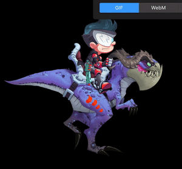
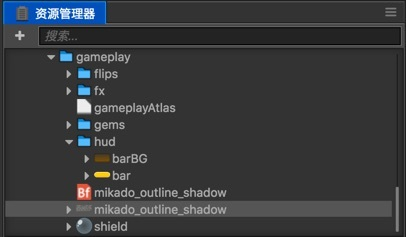

# Cocos Creator 1.4.0 released!

We are excited to release version 1.4.0 of Cocos Creator. Cocos Creator is a new, unified, development tool that handles every step in the game development process.

## Highlights
The most concerning issues and improvements from the community have been addressed, including: 

- Node instantiation performance enhancement
- Spine and DragonBones animation supports mesh rendering
- UI label enhancement, including LabelAtlas support, bitmap font batch rendering (batch with other sprites!), rich text strokes, etc.
- Extension store is online, more editor extension interface is supported
- Include a lot of hot update issue fix and interface improvements
- Add third party library to handle audio soft decoding on android, to improve compatibility and performance
- Added VS Code debugging web platform workflow support

# Major Highlights

## Performance optimization

Node instantiation is an essential operation in game development. Even if there are mechanics such as node pool to help reducing instantiation by looping the nodes, the efficiency of instantiation is also related to the waiting time when the scene is loaded and initialized.

In 1.4, we optimized the instantiation operation by precompiling the CCClass constructor to speed up the creation of Class; In the native platform we achieve more than 80% performance improvement, in other platforms the improvement is also more than 50%. In addition to the huge performance gains that can be enjoyed during runtime, this optimization also dramatically increases the speed of opening complex scenes in the editor.

Also for the Web platform, we also merged the cocos2d-x 3.14 version of the important optimization, including:

- Reduce the depth of the call stack
- Reduce the call stack depth of onEnter / onExit / cleanup
- Reduce the memory usage of the ActionManager / Scheduler / EventManager
- Reduce the use of Color memory
- Optimize RenderCmd and SGNode construct performance
- Reduce the updateProjectionUniform call
- Optimize Vertex data calculation performance

## Spine and DragonBones support mesh rendering

Using mesh rendering to enhance the animation has become increasingly common in Skeleton animations. In 1.4 version we upgrade Spine and DragonBones runtime library to the latest, now in the WebGL rendering mode and the native platform can display mesh perfectly.

It should be noted that since Spine and DragonBones are upgraded to the latest version of the runtime, the exported animation data also need to match the latest version of the Spine and DragonBones software. Canvas rendering mode does not support mesh.

## UI label display enhancement, performance improvement

UI has a major performance improvement in that bitmap fonts can now participate in batch rendering with other bitmap font and sprites! The principle of bmfont batch rendering is the same as that of Sprite, which is to share the same texture and do not have something with different texture renders in between.

Now it's dreams come true to have only one draw call to draw the entire backpack UI. All you need is to put the bitmap font texture and other UI texture into a single Atlas, then in the WebGL and native environment Will be automatically batch rendering.

In the above figure we use the editor's own auto atlas function, the folder contains Sprite texture and bitmap font texture, once you build the project you can see the effect of batch rendering.

In addition, UI enhancements also include:

- LabelAtlas supports as a new type of font asset, drag it directly to the Label component's `font` property will render the asset.
- Greatly improved the stability of EditBox, fixed a number of platform compatibility issues.
- Add stroke function to RichText using the `<outline>` tag
- Support choosing targeting object for Widget

## Extension store, new editor extension development workflow and API

Extension store is now online and can be accessed from within Cocos Creator editor. The first bunch of extensions are hand made by your loyal friends at Cocos development team. To be able to browse and download extension user will need to login with their Cocos developer account when editor launches.

With the release of 1.4 version, we also added two important editor extension system workflow:

- You can include runtime components and assets in the extension package, which will be automatically loaded into the project database, allowing users to share control elements and other assets across multiple projects.
- The extension can call the engine interface to access nodes, components, and other runtime scripts in the scene

These two new workflows make it easier for extensions to automate the management of scenes and assets and enhance the usability of editor extension systems in common game projects. Extension store is also open to developers who wish to publish their own packages.

In the future version, we will continue to improve the editor extension system interface.

## Hot update issues fix, interface improvement

1.4 version is the first version of hot update system rework. In this stage we fixed main bugs and improve the hot update system interface to let developer customize their own behavior, the specific changes include:

- (important) To completely isolate the temporary update folder and the local cache folder, to avoid the former failure of the latter, in the confirmation of the new version of the update is completed when the temporary update folder will be merged into the local cache folder (will not delete the old Of the local cache file)
- (important) Binding Downloader file task interface (does not support data task)
- (important) Compressed file decompression logic before the fileSuccess before the guarantee decompression is successful to be the correct file update
- use the size field in the manifest to collect file size data, faster access to accurate byte-level progress
- Fix Android breakpoint support and some special circumstances update bugs
- API that supports the comparison between manifest: setVersionCompareHandle
- Support after the download file check callback: setVerifyCallback
- Support for setting the maximum number of concurrent files when setting up setMaxConcurrentTask
- Protect the correct preservation of tempManifest, so that the progress of information can be stored correctly
- After delaying the file request to the folder creation logic, make sure the path is normal
- Read App Package internal manifest forced to clear search path, to avoid reading to the cache manifest

Follow-up we will combine the editor to further improve the hot update workflow, including the provision of plug-ins automatically generate manifest files, and support through the editor to define the resource package, multiple manifests can be selected updates, etc., so stay tuned.

## increase audio soft decoding on Android to improve compatibility

As the audio decoding program and some Andrews chip is not compatible, in order to solve some of the Android system audio playback crash, we added two software decoding third-party library respectively, corresponding to mp3 and ogg format. The use of software decoding while improving the efficiency of playing the above format audio.

## VS Code debug web version of the game

VS Code is Creator's preferred code editing tool, but before the debug version of the game can only use the built-in Chrome DevTools tool, debugging can not be real-time changes to the source code, the other browser debugging is also easy to take up too much resources to cause the card pause.

In the 1.4 version we added the VS Code debugging workflow, through the menu a key to configure debugging parameters, and improve the compiler script after the sourcemap generation logic to reduce errors. Now you can through VS Code on the web version of the game to conduct a complete debugging workflow!
Downloads: 
- __[Creator for Mac](http://cocos2d-x.org/filedown/CocosCreator_v1.4.0_mac)__ 
- __[Creator for Windows](http://cocos2d-x.org/filedown/CocosCreator_v1.4.0_win)__

Resources: 
- __[Read the documentation](http://cocos2d-x.org/docs/editors_and_tools/creator/index.html)__
- __[API Reference](http://cocos2d-x.org/docs/api-ref/creator/v1.3/)__
- __[YouTube](https://www.youtube.com/watch?v=_UTy7IkGxMU)__

## Demo Projects
The most important source of examples is the __Example Collection__ project template. There are also many demos to show a complete game:

- __[Dark Slash](https://github.com/cocos-creator/tutorial-dark-slash/archive/master.zip)__ basic game loop demo. Special thanks to Veewo Games for authorizing us to use original 'Dark Slash' game resources to make this tutorial. 

 

- [UI Demos](https://github.com/cocos-creator/demo-ui/archive/master.zip) including multi-resolution supporting menu interface with cool transition animations, a backpack generated by data and prefab and a Clash Royale style navigation menu showcase. 
- [Blackjack](https://github.com/cocos-creator/tutorial-blackjack/archive/master.zip) demo, collaboratively developed with Tencent Games. 
- [Flappy Bird](https://github.com/cocos-creator/tutorial-duang-sheep/archive/master.zip) clone featuring a sheep. 
- [Star Catcher](https://github.com/cocos-creator/tutorial-first-game/archive/master.zip) demo game, in user manual we have a quick start tutorial showing how to build this game step by step.

We will keep on adding more demos and complete games as well as improving the existing ones!

##v1.4.0 full changelog:
- [AutoAtlas] Now the SpriteFrames in auto atlas will have consistent UUID
- [Preferences] Added the option 'Auto Trim' for SpriteFrame assets importing, so you can disable it and use all textures untrimmed.
- [Engine] Optimizes the deserialization operation when the scene loads
- [Extension] Adds the Editor.Scene.callSceneScript interface for calling the component script and accessing the scene node in package script
- [Assets] Saving scene, animation and prefab assets in the editor will automatically trigger a backup for these assets to project's `temp/BackupAssets` directory, and through the right-click menu in the Explorer you can restore the backup version
- [Widget] Adds `target` property, you can specify an indirect parent node (which can be the parent node of the parent node) as align target.
- [Spine] Fixes the problem that the scene can not be opened when Spine data validation fails
- [Extension] plugin can declare a `runtime-scripts` folder in which resources and script content can be accessed by the project
- [Editor] Added a pop-up dialog when using a custom engine version that is not compatible with the current editor
- [Scene] Optimize the scene panel task execution mechanism, to avoid simultaneous running multiple tasks causing conflict and possibility of data loss.
- [Builder] Added specify version of Visual Studio options for windows platform building. 
- [Engine] Optimization of instantiate performance to improve the runtime efficiency of creating nodes and speed to open scene in editor 
- [Engine] Allows `cc.loader.getRes` and `releaseRes` to pass in type arguments
- [Engine] Rename `cc.loader.loadResAll` to `loadResDir`, explicitly passing in the parameter is a folder url, increase the releaseResDir interface to release the entire folder of resources
- [Editor] Updates the Node Library UI control icons
- [Builder] Fix built Android Studio project has different icon than other platforms
- [Engine] Fix Simulator will load non-native plugin script issues
- [Preview] Adds a frame-by-frame button to the Web Platform Preview interface
- [Editor] Fix deleting a component from a scene and deleting the corresponding script from the project will still report an error
- [Widget] Add the `updateAlignment` API for manual refresh alignment
- [Prefab] Fix Revert Prefab, Button's clickEvent target will become the missing state of the problem
- [Debug] Now you can use VS Code to debug the web version of your project, you need to install the VS Code Debugger for Chrome extension and execute the Creator main menu `VSCode Workflow -> Add Chrome Debug Setting`
- [Mask] New `Image_Stencil` mode, you can set a SpriteFrame to block or clip the child nodes
- [Animation] Fixed the problem of mouse lock when dragging to modify the keyframe position
- [Builder] Fix issue that when use command line to build, if the current working directory is in the project, will report error
- [Editor] Fixed an issue where the editor could not be started on a Windows platform with locale setting other than English or Chinese
- [Preview] Fixes the problem of switching the current scene within the editor will not update previewing scene.
- [Scene] scene-script in extension packages can now load modules via `window.require` and can use `this` correctly to invoke member methods in the scene script
- [Component] Fixed `cc.Class` property default attribute set as a constructor, the editor will be prompted to modify the global variable problem
- [Builder] Fixes the problem of possibly using the wrong version of python when building a native project
- [Builder] Build iOS and Android platform When you choose AnySDK, you can directly enter the AnySDK configuration parameters in the configuration panel
- [Builder] Add `--compile` command line parameters to support the use of command-line compilation of native projects
- [Preferences] in the General panel of Preferences add option to automatically set newly created prefab to 'auto sync'
- [DragonBones] Added support for mesh rendering
- [Editor] Fixed importing texture with non-ASCII character in path may result in error issue.
- [Engine] Fixes the problem of compiling the AudioDecoder on the iOS platform
- [Engine] Fixed an issue where SystemEvent could not be re-registered after switching scenes
- [Engine] Fixed screen flicker issue on Xiaomi note and other models when running web game on x5 kernel browsers
- [Build] Fixed sourcemap error when building release version
- [Scene] Fixed gizmo unable to respond to drag issue after dragging UI elements from the Node Library to the scene editor
- [Properties] Optimized the slider control of the step size setting, when type is integer set precision = 0
- [ProjectSetting] Fixed a problem that the project settings data could not be saved
- [Animation] Fixed Animation editor will pop up clip selection drop menu on wrong position issue.
- [Preview] Fixed Chinese comments and log will not display correctly when debugging on Chrome 
- [Builder] Fixed using binary template to build android project may result in compilation failure issue.
- [Builder] Add rendering mode option (WebGL, Canvas) for building on web platform
- [RichText] Fixed using custom font on native platform will not display properly issue
- [Engine] BitmapFont files can now be preloaded and auto released properly by scene asset setting.
- [AutoAtlas] Support auto excluding textures that not referenced by any scene or prefab in current folder
- [Editor] Fixed UMD script imported as a plug-in will cause error when loaded in editor
- [Builder] When building release version, the compile js to jsc process will output log correctly to the native log file
- [Engine] Prevents texture binding errors when loading resources using https
- [Engine] Fixed the issue that loading a prefab with loadRes, If the asset is not finished loading, in the next engine update `getRes` will get the wrong prefab 
- [Engine] Fixed missing callback when the `cc.loader.load` request fails 
- [Engine] Fixed the problem of loading the same JSON resource repeatedly while loading Prefab 
- [Engine] `cc.loader._cache` now use asset url for indexing, for non-raw asset, if cannot find url in AssetLibrary then use uuid as the index 
- [Editor] Fixed "Step Value" setting in preference fail to take effect 
- [Engine] Separate logs and error messages in the engine scripts to an external file, release build will not include the log and error messages anymore, user need to manually go to the prompt url in message to find information.
- [Engine] Avoid texture binding error under https protocol
- [Spine] Upgrade Spine's JS runtime to version 3.x and support Mesh display
- [Label] Support batch rendering BMfont and other sprites as long as their textures are under the same AutoAtlas configuration folder.
- [Engine] Fixes a black border problem that may occur around an image when use Canvas rendering with dirty region optimization on.
- [Engine] Reduces the size of the engine core package by about 80k by stripping the error log information from the release version, and by reducing the editor-specific code
- [DragonBones] Fixed blendMode not correct when play an animation more than one time issue.
- [Editor] Switch off Chromium Kernel GPU blacklist, try to fix WebGL compatibility issues on some GPU that emerged after implementing newer version of Electron.
- [Loader] Fixed `cc.loader.loadRes` Loaded atlas will cause all spriteFrame references return the same instance issue
- [Animation] Fix Animation Editor In many cases it is not possible to save animations correctly issue
- [Widget] Fixed when the node scale is 0, the width will become infinite error
- [PageView] Fix PageView When dragging to the last page, if you continue to drag over the threshold it will scroll to the first page issue
- [Editor] Fixed an error in the editor when creating an asset with 'txt' file extension
- [Builder] The build process now displays more detailed log information
- [Builder] Add an option when build to Web platform to merge all assets' JSON to initial scene, will significantly decrease requests count when the game is launched.
- [Editor] Fixed a bug where the Properties view will quickly switch over and the selections will not be emptied after switching layouts
- [Label] Added a new font asset type LabelAtlas, it works similar to the LabelAtlas in cocos2d-x engine API
- [Editor] Add specific reference location information for missing asset with uuid error report
- [Prefab] Fixed an issue where two nodes were associated with the same asset uuid when replicating a child node in Prefab
- [Simulator] Simulator menu add option to set whether to display FPS
- [Sourcemap] Fixed problems with sourcemap when using Chrome to debug scripts
- [Animation] Fixed when exit animation edit mode, a save confirm dialog will pop up twice issue.
- [DragonBones] Fixed DragonBones component event listener missing after modifying the armatureName attribute issue
- [Editor] Fixed when compiling takes long it's likely to show  "worker timed out` error
- [Spine] Fixes an error when using the `SGSkeleton.getBoundingBox` method
- [Editor] Detailed script reference location information is now provided when the component script is lost in the scene
- [Builder] Fix in Xcode set to release will cause compiler error
- [Engine] Update the glfw library used when building Mac desktop applications, to fix Canvas component set both Fit Height and Fit Width to true will not get the correct display issue
- [Engine] Fixed an issue where the `EVENT_GAME_INITED` event fires the engine was not initialized, causing the call to` cc.loader.loadRes` to fail
- [Spine] Fix the problem that the event mechanism does not work properly after upgrading Spine runtime
- [Spine] Fix an issue where the event listener registered by the Spine component after replacing the skeletonData property is lost
- [Engine] Fix JSB environment XMLHttpRequest does not correctly return error to JS callback, only prompts problem at native level
- [Scene] Fixed the issue saving a scene will get 'Error: Path must be a string. Received null' error
- [Label] Fixed when overflow is set to SHRINK, switch the scene with script will lead to infinite loop issue
- [Component] If CCClass subclass method and the parent class properties have name conflicts, a correct error will be reported
- [Prefab] After renaming the Prefab asset, the instantiated node name will now change as well
- [Prefab] Nesting prefabs will cause a warning to pop up that only the top-level prefab will be saved, and if any of the nodes in Prefab are selected, the name of the prefab will be displayed in the header of the Properties panel.
- [Doc] Improve document navigation, add collapsible left navigation, add manual search, add some of the API documentation needed for editor extensions
- [Store] Add Extension Store, access via main menu 'Packages/Extension Store', you need to log in with your Cocos developer account to use.
- [DragonBones] Fixed display error when re-entering a scene containing DragonBones component if the `auto release` option is checked. 
- [Toggle] Fix Toggle component does not send a callback to Component.EventHandler when calling check and uncheck functions
- [RichText] Add stroke support via the tag `<outline color = xxx width = xxx>`, the outline tag also supports the click event
- [Spine] Upgrade Spine runtime in C ++ engine to 3.5.35, in consistent with JS engine
- [Assets] Fix `asset-db: query-assets` given an error during build-time
- [DragonBones] Fixed `timeScale` property of the component does not take effect in native platform
- [ScrollView] Fixed when ScrollBar size is not consistent with scrollview will display wrong size issue.
- [Loader] Fixed under some circumstances Raw asset type is not correctly set up issue, also for url with parameter, the resource id should be the original url, should not modify the raw string
- [Assets] The renderer process of AssetDB module adds the interface `createOrSave` to create the asset if the asset path does not exist, otherwise update the asset.
- [ProjectSettings] Add the Canvas default resolution and fit screen policy settings in the project settings
- [CodeEditor] Fixed in the built-in code editor press `Ctrl + Z`, the main window will also receive the keyboard event issue
- [Graphics] Fixed native painting curve may lead to the crash issue
- [Properties] Fixed clicking on component header option button (gear icon) will also collapse component issue.
- [DragonBones] Fixed `dragonBones.CCSlot` logic error that may cause sprite animation failed to display issue.
- [Engine] Fixed `cc.instantiate` will brought in t1 global variable issue.
- [Engine] Fixed Action not correctly referenced in new memory model that may cause action object destroyed during garbage collection.
- [AnySDK] Added built-in AnySDK client 
- [Engine] in the native platform to use the new software audio decoder library to solve some of the crash issue on cpu's when decoding mp3 and ogg audio 
- [Engine] Fixed a large number of problems in AssetManagerEx hot update process 
- [Engine] Fixed sprite rotate to a certain angle with bounding box outside of viewport will cause the sprite to be culled issue.
- [Engine] Fixed Meizu system browser can not launch game with WebGL mode problem 
- [Engine] Fixed nested masks with `invert` option can cause display errors 
- [TiledMap] Fixed an issue where the order of nodes in the map might be lost when reopening the scene 
- [Preference] Add "Remove" button to the external script editor selection menu 
- [Build] Fixed in build panel checking APP ABI does not take effect issue
- [Preference] Fixed when custom C++ engine path does not contains a valid simulator folder user cannot re-select 'use builtin engine' option issue.

- [Engine] Merge cocos2d-x v3.14 web version optimization, including:
  - Reduced call stack depth of `visit`
  - Reduce the call stack depth of `onEnter` / `onExit` / `cleanup`
  - Lower the memory usage of the `ActionManager` / `Scheduler` / `EventManager`
  - Reduce the use of Color memory
  - Optimize RenderCmd and SGNode construction performance
  - Reduces the call to `updateProjectionUniform`
  - Optimize Vertex data calculation performance
- [Engine] fixes a number of hot update issues, including:
  - (important) to completely isolate the temporary update folder and local cache folder to avoid contamination of the latter when update failure occurs. It will only be merged into the local cache folder (does not remove the old Of the local cache file) when new version of the update is completed.
  - (important) binding Downloader file task interface (does not support data task)
  - (important) decompression logic of the compressed file moved before the `fileSuccess`, to ensure the successful decompression for correct file update
  - Use the `size` field in the manifest to collect the file size data and get the accurate byte-level progress faster
  - Fix Android continue from breakpoint support and some other bug fixes in some special cases
  - APIs that support comparison between manifests: `setVersionCompareHandle`
  - Support the verification callback of downloaded file with: `setVerifyCallback`
  - `setMaxConcurrentTask` to support setting maximum number of concurrent files when updating
  - Ensure that `tempManifest` is saved correctly so that progress information can be stored correctly
  - Delaying file request to after the creation of folder before , to ensure that the path is always valid
  - When reading the App Package internal manifest, force clearing search path to avoid reading the cached manifest
- [Engine] Fixed an issue where the mp4 video file could be loaded as an audio clip error
- [Engine] Fixed an error when destroying nodes with Missing Script components
- [Prefab] Fixed problems with prefab that does not auto-refresh at runtime to trigger resource loading
- [Loader] Fixed `cc.loader._getReferenceKey` error interface, to prevent the error that can not automatically release assets
- [Loader] Fixed the problem of duplicate entry in `LoadingItem.dependKeys`
- [Preview] Fixes the problem that the scene name is wrong when the scene is recompiled
- [Editor] Fixed an issue that the script file imported as a plugin does not support spaces in path
- [Animation] Fixed an issue cause animation save failed after modifying the animation asset
- [Spine] Fixed an event where `setStartListener` could only listen to track 0
- [EditBox] Fixed a problem where the text entered in landscape mode can not be displayed
- [Label] Fixed bug BMFont cause error when scene delay loading is enabled
- [Label] Fixed the issue that different BMFont on native platform may use the same texture in some cases
- [Label] Fixed when change opacity property on system font and TTF will re-generated texture issue to improve performance
- [Label] Fixed the use of dynamic loading system fonts to set ttf, font size will change issue
- [Audio] Fixed an issue where the sound volume on the iOS platform could cause audio to be uncontrolled
- [Audio] Fixed an issue where the number of requests could increase as audio asset load
- [ParticleSystem] Fixed when a particle is loaded more than once, a warning of asset has been cleared will be reported.
- [Spine] Fixed when animation has finished playing, the render will not stay as the last frame issue. 
- [VideoPlayer] Fixed a crash issue that may occur when you play online video on your native platform
- [Spine] Fixed an issue where SkeletonBatch could access illegal memory causing crash 
- [Editor] Add sourcemap to coffeescript compiling, fix error when creating new coffeescript asset 
- [Editor] Fixed a problem where login information could not be promptly re-logged after expiration 
- [EditBox] Fix the problem that the placeholder text can not be displayed on the web page 
- [Engine] Fixed an issue where cc.Color was rendered incorrectly when set to red 
- [Assets] Fixed an issue where the editor displayed an error while holding down the Shift to multi-select asset 
- [ParticleSystem] Fixed a problem with a particle component that does not automatically load the .png file of the particle asset after loading 
- [Properties] add support for the `cc.Rect` type 
- [Build] Fixed issue that close the build window and then re-open during build process will cause error 
- [Assets] Fixes an issue that does not trigger automatic compilation when starting a project with externally modified scripts 
- [ProjectSetting] Adds the option to set the simulator resolution for project
- [Spine] spine event callback parameter trackIndex changes to trackEntry object. The spine event mechanism is changed in version 3.5, for more information: http://zh.esotericsoftware.com/spine-api-reference#AnimationStateListener1
- [Spine] Add the `findAnimation` interface
- [Action] Fixed a problem where the node transformation could not be updated correctly when calling Action
- [Engine] Fixed a problem where Prefab might fail to load
- [Engine] Fixed a problem with a callback error caused by a callback error when loading audio in dom mode
- [ProjectSetting] Fixed a bug where the Preview Run tab page not display correctly, fixed engine module setup could not be saved issue.
- [JSB] Fixed some of the conversion function may be passed into the null pointer to cause a crash problem
- [Animation] Fixed a problem where the parent node and the child node have animated components and clips, and the child node does not display the clip correctly.
- [Animation] Fixed a bug when click on the blue line between nodes will cause a subsequent click event
- [Console] When compiling fails, a more detailed error message is displayed that includes the error column
- [Engine] `color.fromHEX` interface supports incoming rgb data
