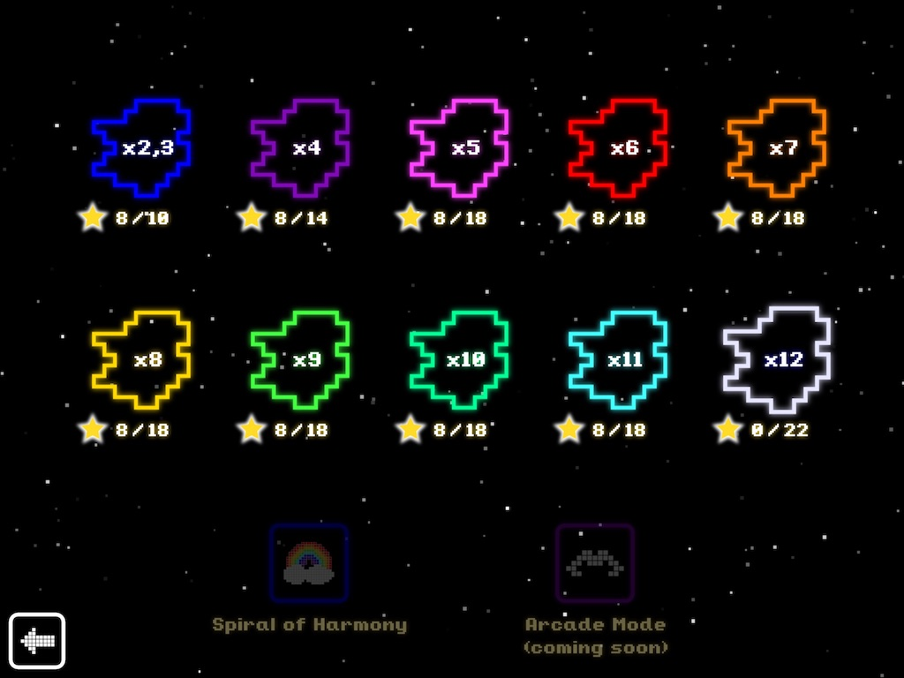
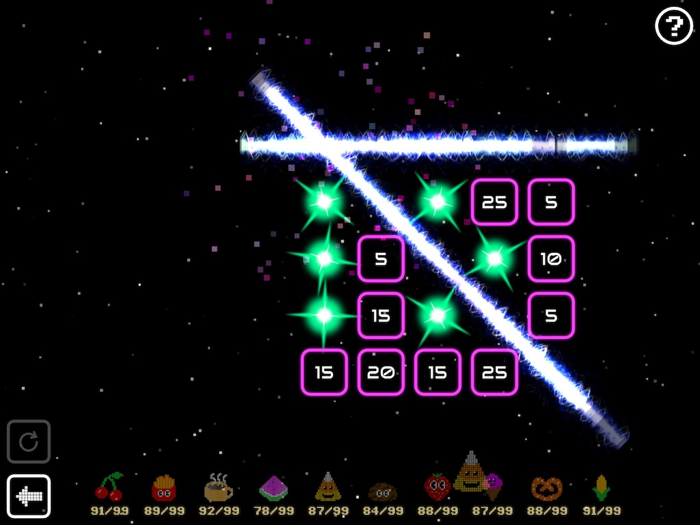
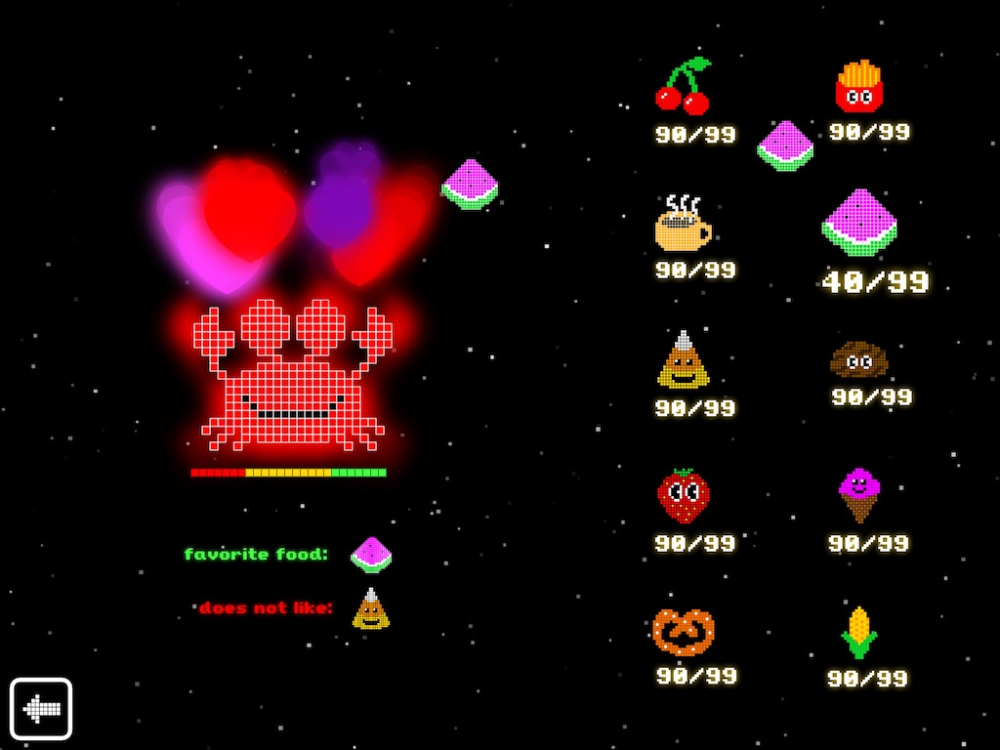
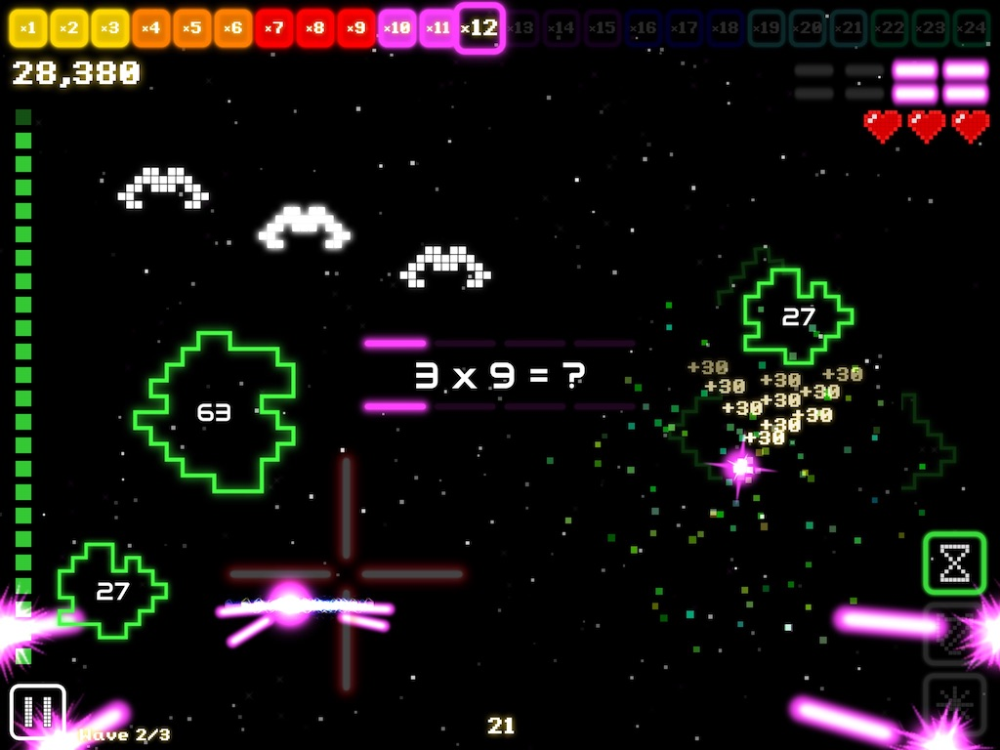
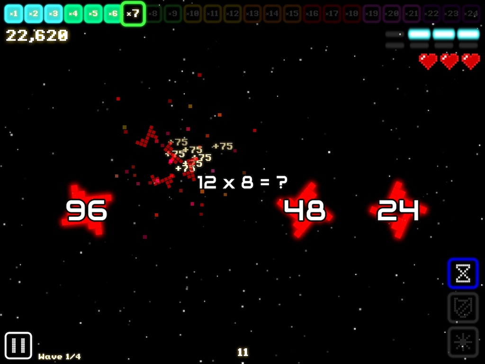

# Developer Interview with the team behind Space Pig Math

### Tell everyone a bit about yourself and team.
The __team__ is just me :)

I'm a veteran game developer (20+ years), and I'm also a dad.  I've worked on all different kinds of projects, from tiny mobile, to giant AAA (current job).  I made this game as a passion-project on the side.  I love the overlap of code + design + art, and I've never quite gotten enough of that overlap in any paid role at a company.  I've always wanted to make my own game, and my current employer permits side projects, so I jumped at the chance. 

If you're reading this, you know making games is hard.  Making a game on your own, is very hard.  Making a game on your own, on the side (with full-time job and family), is nearly impossible.

I persisted because I was truly motivated by a love of what I do, and a desire to make something that kids would LOVE, and that would have genuine educational value.

### Tell everyone where you came up with the idea for this game. What were your inspirations?
As noted above, I've always wanted to make my own game.

I learned to program first on a Commodore Vic20, in BASIC, and in those days, almost all you could do with home computers is program them!  The second you turned it on, you were in a BASIC environment.  So I started learning to program so I could make games - creating something on-screen that was interactive was utterly fascinating to me.  

For me, programming at it's best is like playing with Lego.  Cocos2dx it turns out, is a very enjoyable level for me at which to work; you guys are like the ones who are "manufacturing the Lego blocks" :)  At the same time, getting to do this in C++ is the perfect language, as I can dive as deep in as I want to, or need to, to squeeze out the best performance.

I've had many ideas for many games that I've wanted to make, for ages and ages.  I would routinely jot these down, filling multiple Google docs worth :)

I realized some time ago that if I ever want to see any of them come to light, I had to PICK ONE!

Even though there are already many times tables games and apps out there, I chose to do this because:

  - I saw a need for something better - something that would both do a better job of helping kids build their own understanding of what times tables are, and be genuinely fun and compelling, so they'd actually want to play it!

  - As noted above, I love code, art, and design and I love the fulfillment of getting to do all three.  Those things have to be aligned in any game, for it to be great, and it's easiest for this alignment to happen if all the design discussions, and art reviews, and code architecture discussions, are happening in your head! LOL!  At the same time, this was an enormous challenge, because literally nothing gets done if you don't do it.

  - I had to choose something with a small enough scope that it was actually possible for me to do on the side, alone.

  - My employer (Activision) allows side projects.  You fill out a conflict-of-interest form, and they review it - in my case they determined that an educational app on tablets for kids to practice their times tables would not impact Call of Duty too heavily :)

I know a lot of inspiration came from my childhood - both arcade, and the first generation of home consoles.  The one we had was the Intellivision, and my favourite game was Astrosmash.  Anyone who's played Astrosmash, and tries Space Pig Math, will see that inspiration (and the tributes).  Also, I loved the classic arcade games - I was never very good at them, and didn't even get to play all that often.  Sometimes my mom would give me a few quarters when we were at the mall, and there was an Asteroids or a Pac-Man machine outside K-Mart, and I'd try and play, and each game would last less than 60 seconds (total) - and I'd be really bummed out - but I still loved the aesthetic - both visual and audio - and I loved the idea of how much fun these could be, if I was actually good at them... LOL!

I also look to my family for inspiration - my son is an enormous inspiration on me, and was a HUGE help in making this game.  Making the game on the side took so long that he basically grew into the primary target demographic (elementary aged school kids learning their times tables), and we had dozens of useful design discussions, where I could bounce ideas off him, or get his feedback on a piece of art, or some other idea for the game.  He also inspired some of the art itself, including the characters; he'd often mock up ideas for me in a simple art program on the iPad called Pixel Art.

### What version of cocos2d-x or Cocos Creator did you use?
The game shipped with cocos2d-x v3.17.  I did not use Cocos Creator.  I actually enjoyed laying out the UI "in code", and Cocos Creator was also too new when it was still early days of the project.

### How did you decide to use Cocos products instead of Unity, Unreal Engine or SDL?
I knew I wanted a tablet game, both iOS and Android.  I seriously considered Unity for a while, but ultimately it just seemed so bloated for my needs.  I would also much rather work in C++ than C#.  Never considered Unreal or SDL (though I think I would look at Unreal now, for a 3D game).

In some early prototypes, I spent some time with cocos2d, and started learning Objective-C.  But I wanted to focus on the game, not also on the quirks of a new language (plus I wanted something cross-platform).  I also tried out the javascript version of cocos2dx, but quickly hit performance limitations - I put a few thousand sprites on screen and moved them around via a time delta and a velocity; every frame: get position, calculate delta, add to position, set new position - worked ok, except, every few seconds I got a giant hiccup in frametime because the getPosition call was creating an object and returning that back to me -- all the garbage would accumulate and get cleaned up about every 5 seconds.

Finally I was like, this is nuts.  I've been using C++ for 20 years.  This engine has a C++ interface.  By far the best choice! :)

### What features did the engine offer you that made development easy? What do you wish the engine did better?
I honestly loved using Cocos2dx!

Best parts, off the top of my head:
  - Director, Scene, Layer, Sprite organization -- just made so much sense.  This engine has the highest ratio I've ever encountered of: ( how_you_actually_do_something / what_seems_like_the_obvious_best_way_to_do_it );

  - every time I grabbed a new version I was newly amazed at how easily I was up and running on different platforms.  Side note, that is HUGELY important:

  I developed 99.9% of this iPad game on a Windows PC, working with a 1024x768 window in Visual Studio. (shh.... don't tell Apple that! LOL)

  - one thing I will need to put a little more care into for my next project: I could probably setup my repos better - I currently have multiple bitbucket repos that have to be independently synced on the target machine - i.e. separate repos for the shared code, art resources, source art, and project files for different platforms.  Also, I probably should switch to using the engine straight from github.  As is, on a new machine, I can't just sync my repos, I also have to independently install cocos2dx, which is not a great.

  - oh, other thing, next project I'm using Perforce :)  git doesn't is a poor choice for binary assets.

  - the other absolutely amazing things about this engine: glview->setDesignResolutionSize !!
  This is what allowed me to always work in the 1024x768 window, but get this on regular and HD iPads simultaneously.
  I had two different exported art folders: "regular" SD, and HD at twice the size, and I'd set the resources search path based on what kind of device I was on (just basing the choice off the screen width).

  > Note/disclaimer: I still have to get Android working; I chose iPad first, because then I only had to worry about 2 different resolutions (iPad Pro didn't exist when I started... LOL).

  - this was also great: UserDefault::getInstance()->getDataForKey
  Doing this on the side, every minute you have to work is precious.  The fact that I had an API that abstracted away how to do a save file for a give platform was just fantastic.  Note to devs: this saves out plain XML - I would NOT recommend you save out your game state as that.  I don't know how accessible the file is on an actual device, but just in case, my "xml" has a single key, the value of which is the raw bytes from an in-game struct, with all the bits flipped :)

Complaints are few:
  - I had to hack something in the particle systems, so that created-but-not-in-use emitters would not waste much CPU resource.
  - there were few quirks around Actions that took a while to figure out - that being said I made heavy use of the action system once I got used to it!
  - bug with button animation after version upgrade - still surprised no one else seemed to have an issue with this - again, good to have the source code

### What tools did you use besides the engine?
Visual Studio 2012 Professional.  I'm still on 2012 because I had to purchase my own license for a previous job, and, I am a bit embarrassed to admit this, but my PC is still on Windows 8!

Windows 10 came out while I was working on this, and I know it's a far better operating system - but... I made the disciplined decision to stick with Windows 8, because, like I said above, every minute is precious; I currently had a stable, working environment.  I could take a few hours away from development time, and update to Windows 10, and then, if all went perfectly well, I would still have a stable working environment - so at the time, it was simply not worth the hours and the risk.

Xcode - whatever version I was continuously required to update to.  Current one is 10.1. All also used Instruments a bit for debugging and profiling.

### What 3rd party libraries did you need to use? 
fmod.org for sound engine.

### Did you create the art yourself? What tools?
Yes, I created all the art.  The primary tools were:

Inkscape (https://inkscape.org/) and Paint.NET (https://www.getpaint.net/download.html)

These are both free, and I can't say thank you enough to everyone who contributed to them!  Also, as mentioned, sometimes I (or my son)  prototyped ideas in very simple pixel drawing programs, like Pixel Art on the iPad.

Inkscape is vector-based, while Paint.NET is a bitmap editor.

Another important point I can't stress enough: your choice of art style will DRASTICALLY impact the scope of your game.  

My game is pure 2D; the majority of the limited set of sprites are white with some translucency - they are coloured procedurally in code, depending on the context.  For the characters, I constrained them to a "fat pixel" look - each one is constructed from a very small grid - approximately 30 by 30 units a side.  I could quickly prototype the look I wanted in Paint.NET, or Pixel Art, or a piece of graph paper, and then in Inkscape, construct the art for the game, where each "pixel" was actually a small square with rounded corners, snapped to a grid.

Part of the look I wanted to have was a neon glow, so I learnt how to create things with a nice glow effect in Inkscape very early on.

Another way to get the most bang for your buck is judicious use of particle systems.  One sprite can go a long way like this.

What to spend time on when developing a game is always a balancing act.  People will often say to just rough things out with placeholder art and don't polish early, but I found that in some cases you actually do want to polish early - the most basic thing I wanted a player to enjoy doing while they played was blasting the asteroids, so I wanted to make sure this felt very satisfying.  Core to this was the particle system for the explosions, so I iterated on this quite a bit early on - it has been basically the same for the entire development!  The only late change was to scale it up more as you increase your score multiplier in a level.
I remember watching a youtube video of the classic arcade game Defender, thinking "I like those explosions" :)

Another large piece of work to make the explosions satisfying: each different piece of asteroid art has two custom fragments for when it is blasted apart - these were constructed by actually slicing each sprite in two, and saving out the pieces as separate sprites.  I ended up doing many tests of this and creating a ton of art that didn't make it into the final game; so you can see, even with my extremely limited art needs, this could so easily swallow so much time.

### Did you create the music yourself? What tools?
The music is the only thing I hired someone to do.

I spent countless hours scouring freesound.org and soundcloud.  I got many useful sound fx, especially from freesound, and often modified and combined them further, using Audacity.  I also recorded fx from my electric guitar, running through a Line6 Pod, recorded on my PC with Reaper; those were fun experiments, but I don't think any of the results are currently used in the game :P

On soundcloud I found multiple artists I liked, and contacted a few, and chose to work with Erik Peabody from Viking Guitar: http://www.vikingguitar.com/
We had some great phone discussions, and iterated on ideas quite a bit.  I absolutely love what we came up with, especially the main menu music.  I had to listen to that about a thousand times in a row while making the game trailer, and I never got sick of it!

### Will you continue to make games in the future?
Absolutely!

### Do you use SDKBox? If so, what plugins are you currently using?
I did.  I'm using the "In-App Purchase" and "Reviews and Ratings" plugins.

I appreciated the convenience of SDKBOX, but I did not like the lack of source code, and support was not amazing.  I ran into a problem early on where my refresh() call triggered the onProductRequestSuccess callback, but I wasn't actually successfully getting the information from Apple's servers.  This was because some tax forms on the Apple side were still outstanding.  I don't think this case should trigger a success callback.  Also, like I said, source code to step into would have been really good.  My forum question was answered (very briefly) a few days after I figured out the problem on my own.

Also, when I was setting things up, it was never made clear what the relationship was between SDKBOX modules and the capabilities that had to be enabled in Xcode.  After a few days, my question on the forums got one short reply, but this whole situation was never explained very well.

### Lastly, any advice for those also making games on how to get to a release point?
Firstly, there is no magic trick, no shortcut, no hack.
It takes continuous effort.  It takes DISCIPLINE.
You are chipping away, bit by bit, at a huge task.

As a starting point, you have to have a burning desire to create your game.
You have to be extremely committed.

Also, there's somewhat of a dichotomy that you have to accept:
As noted above, if you're reading this, you know that making games is hard.  Doing it alone, on the side, is nearly impossible.  However, you almost have to put this knowledge aside, and just DO IT ANYWAY!  You have to both believe you can do the impossible, and be firmly grounded in reality.  And you really have to believe it.  And you have to be committed.  I'm repeating those on purpose, because your commitment will be challenged, many times, in many ways.

Another thing: DON'T SETTLE.
i.e. don't compromise your vision.  Don't ship something that you know deep down is not good enough, or is not what you wanted.  Another dichotomy here: that doesn't mean it's done when you ship v1.0.  I have a TODO list pages and pages long, of improvements and updates to make to Space Pig Math, but I realized, if I was ever going to ship at all, I had to be very judicious in deciding what are the most important things that MUST be in v1.0.  I'm sure you've heard the term minimum viable product - I'm not a big fan, to be honest.  I feel like people emphasize the minimum part, and don't focus enough on the viable.  Space Pig Math v1.0 was going to be a complete, compelling, fun experience.

At a practical level, there are two main issues:

  * finding the time

  * using that time efficiently

#### Finding the time:

You have to figure what works for you, and the other people in your life.  If you are single, you likely have a lot more flexibility with your time.  If you have a family, other people are much more directly impacted by your choice of how you spend your time.  I'm not saying this would be a cake walk if you're single - you have other stresses and factors to deal with; I'm just describing my experience.

I have a family - thus, this was a constant balancing act.  Sometimes I worked late at night; more often, very early in the morning.  A lot of weekends were spent balancing spending time with family and friends vs. working on my game. If my wife was working on the weekend, which she often had to, then it would be a balance between what errands have to be run, playing with my son, and getting work done.  Also, I've lost count of how many "vacations" I've spent working on my game from dawn to dusk.  Looking at a graph of the check-in activity in my source repo, you'd see some pretty distinct spikes.  During a regular work-week (if it wasn't a crunch time at work) I could plan ahead with the family, and pick days where I could carve out an hour or so on regular weeknights.  This became a lot more common as I got closer to ship.  Overall, it was a lot of sacrifice on everyone's part.  One of the many books I read during this process was "The One Thing", by Gary Keller and Jay Papasan. In the book the authors talk about "counterbalance" - you focus and work crazy-hard on something, but to balance that, you make the time with your loved ones really count.  You appreciate it and cherish it, and you try not to let work interfere when you're doing that.

Another point: this is a marathon, not a sprint.  You can't tell your family, "just pretend I'm not here for a few months, and then I'll be done, and everything will be great".  You've gotta find a solution that will work when the time is measured in years.    

#### Using the time:

In two words: Prioritize Ruthlessly.
There are always dozens of things you could choose to work on.  You have to be very disciplined in choosing what is really the most important thing you need to do to move things forward.  What do you need to test, or prove to yourself, or answer?  At the same time, there is a balance to achieve here - you need to find things to keep you energized, and sometimes you just have to do something fun, or satisfying, even if it's not complex, or "urgent".  For example, I often loved getting some UI element to look just right, or tweaking a font size, or adjusting the amount of glow on something, or just finding and mixing the perfect sound fx.

Also, don't use the excuse that you have to have a big block of time to get anything done, otherwise you don't even start.  You have to find a way to make even 30 minutes productive.  If there's some huge looming task, break it down.  For a new feature or game mode, stub in the thing you'd click on in a debug menu, and create the skeleton of the new screen.  Get it working.  Add a back button.  Now you've got the flow in and out of the new screen.  You're one step further than you were, and next time you sit down to work, you'll move it even further.

I can't emphasize enough how important your TODO list is.  Maybe it's utterly obvious, but having a document (or multiple folders of documents) in which you record your ideas and tasks is paramount.  I recommend digital over paper, because you will shuffle priorities around and reorganize constantly.  I didn't use any fancy project or bug tracking software - just Google docs.  For a 1-person project, this was fine -- I suspect things might breakdown quickly for a team :P

One other point re. time: some of the hardest times working on the game were when I was NOT able to work on it.  These are some of the challenges I refer to - you have to keep that fire burning, even when you can't sit down and work on it like you want to.  There are all sorts of little snippets of "downtime" in your day: having a shower, brushing your teeth, stuck in rush hour, whatever - this is great time to mull over design decisions, and let ideas percolate, and then when you can, you jot a note down in your TODO list, so that when you actually have those precious minutes to work, you know exactly what you're going to do.

Interesting aside: it seemed that the harder I worked on my side-project, the better I did in my "day job".  I suspect this is likely due to the constant practice in prioritizing and executing on the most important things.

Another tidbit: do everything you can to make your environment conducive to your productivity.  A family friend who loved woodworking made me a standing desk out of an old shipping crate - this was a wonderful gift!  It was bad for me physically to sit too long; so now I switch frequently between sitting and standing.  I also make sure there's lots of fresh air when I'm working, even if that means wearing a hoodie the whole time.  I also often listen to white noise, or just something else in the background, to block out other sounds that might be distracting.  I have a few extremely short playlists, that I'll listen to on infinite loop - for example, while writing this, I've been listening to Judas Priest: Heavy Duty & Defenders of the Faith, for a few hours :) Another favourite playlist is one song: Orion, by Metallica. 

------------------------------
#### Space Pig Math - very brief development history:

This game took 6 years to develop.

I started tinkering around with ideas in 2013.  Most of 2013 and 2014 were full of too many interruptions (life will do that), but by the end of 2015 I got very, very focussed.  At the same time, I don't want to sound too dismissive of the first few years - some of the most important experiments and prototypes were done in those years.  Among the most important developments: choosing Cocos2d-x (using C++) as the engine (discussed above), settling on the game name, and creating the signature look of Space Pig.  I actually had a simple prototype of shooting asteroids with answers to times-tables questions on them, running on iPad, about one month into prototyping (i.e. February 2013) while learning Objective-C.

Jumping ahead to December 8th, 2015, a book I had ordered on Amazon arrived: "Think and Grow Rich", by Napoleon Hill.  This book was core to the achievement of shipping this game.  It's a classic text, published in 1937. It is only superficially about making money. It's more about aligning your mind, and your subconscious, and your whole life, with whatever it is you want to achieve. Some of the language is dated, but the content is sound.

As per instructions in the book, I wrote down my goal (with a Sharpie!) in a journal, with a target date - I would ship the game by December 8th, 2016 - one year to the date from when I got my book; seemed poetic :) An aside: my goal actually took several pages in the journal, because I went into detail about what exactly I was going to deliver, including that:

"Kids will enjoy playing it, and will want to keep playing it because they're having so much fun.  They will choose to play it.  They'll be getting better at their times tables without even noticing it.

They'll love it and rave about it because it's so compelling, and parents and teachers will love it and rave about it because of the positive impact they see it has."

I read my goal daily; as a matter of fact I said it out loud in the car every day on my way to work.  One great thing about this age of bluetooth technology - you can talk out loud to yourself all you want and no one will think you're crazy! ;)

Well... I did not ship the game on December 8th, 2016.

BUT... on December 9th, 2016, I had my first TestFlight build ready to upload and shared with some trusted friends.

Another aside: like I've said, there's a constant dichotomy to doing this, and I had to frequently put aside my "experience" as a game developer, the part of my brain telling me this is impossible, and just do it anyways.  BUT, at the same time, I had to be completely honest with myself, and stay grounded in reality, based on my knowledge and experience.  You can't lie to yourself.  You have to make a plan you believe in, deep down.  

And I found that this plan takes some iteration :)

Like I said above, you gotta be truly committed.

So, I revised my plan, with my new experience and knowledge, and the feedback from my trusted advisors, and their kids, and set a new target date, for a year later (by the time I was drafting the new goal, it was early 2017, so the target was early 2018).

I knew deep down the game, as-is, wasn't good enough.  The feedback from friends just confirmed it.

Initially, it seemed like the main thing that was missing was a sense of progression.  So, I worked even harder, and completely revamped the game, and had another build ready to share in early 2018.

Again, my friends were amazed at what I had accomplished, but also, it still wasn't good enough.  And I knew it. 

I pounded my head against the wall for what seemed like ages, trying to figure out what was missing.  I understood and acknowledged that what I was trying to solve was a very hard problem - make a math game that kids want to play!

All the details of the design iterations that happened would take a document longer than this entire interview - so that has to wait until another time - but the following is an important insight.  There wasn't a single moment where this happened, but over the course of several weeks, I realized something.  Imagine the following four categories of activities:

  1. an activity that requires no thinking, and no skill; eg. simple match-three game.

  2. an activity that requires some thinking, but no skill; eg. puzzle game, with no time pressure.

  3. an activity that requires no thinking, but some skill; eg. simple arcade games.

  4. an activity that requires both thinking, and skill: the current version of Space Pig Math!

No wonder kids didn't play for long!  For a kid learning their times tables, my game was constant mental effort and stress!

I had to find a way to provide an enjoyable cadence of activity, that included all four of the above categories.  I also didn't want any of the categories to be "filler" or "throwaway".  I thought: even a category 1 activity could serve the goal of teaching kids their times tables in a fun way.  That ended up being the mode where you just drag your finger over squares in a grid, filling them in up in a satisfying manner, then blasting them away in an even more satisfying manner, all the while, constructing a physical understanding of what the particular times table looks like.

So with my new-found understanding, I rewrote my goal, and revamped my game again, and by early 2019 I had another TestFlight build, this time being tested by a wider group, including my son's grade 4 class :)

The feedback was great.  More importantly I knew deep down that it was finally where it needed to be.  It was still very important to have people test it.  Working on something like this, you are very close to it, and some of the most basic things, that you would never think are an issue, are.  There were some basic screen-to-screen navigation issues that I absolutely never thought were a problem, until I watched a friend's video of his daughters playing the game (probably the most valuable feedback I received in the whole project).  Luckily the fix was quick and easy.

Like I mentioned earlier, there was a constant prioritization process going on, and at this point, that included what would and would not be in v1.0 build.  As difficult as it was, I had to be very disciplined about it, and kept moving things "below the line", if they could wait until an update.

On March 8, 2019, the status of my game was "Ready for Sale", world-wide, on the App Store.

I am now in a whole new world of learning how to market and promote it.  A good topic for another time :)

In addition to "Think and Grow Rich", there were a number of other books and sources of inspiration, a few of which I have to mention here:

  * a little book called "The Greatest Salesman In The World", by Og Mandino.  I still listen to a little bit of the audiobook every morning while driving to work - a habit I expect to continue for the rest of my life.

  * "Extreme Ownership - How Navy Seals Lead and Win", by Jocko Willink and Leif Babin, along with the podcast of one of the authors: jockopodcast. Jocko's mantra is: "Discipline Equals Freedom". He posts a picture of his watch on twitter everyday, at 4:30am (or earlier), when he gets up to work out. Countless mornings on my days off, I'd also be up nearly that early - this discipline was fundamental in shipping the game.

  * "The One Thing", by Gary Keller and Jay Papasan.  One of the best quotes I've ever read is on the inside cover:  "If you chase two rabbits... you will not catch either one." -Russian Proverb

  * "The War of Art", by Steven Pressfield - just read it!

  * the movie "La La Land".  I found the story of the filmmaker's passion behind the creation of the movie at least as inspiring as the fictional main characters.  Also, while I will forever regard Metallica and AC/DC as the greatest music ever created, there is something about this soundtrack that has me completely enthralled, to this day.

This list could go on and on, and get even more eclectic... :) See the in-game credits for more details.

To end, I'd just like to share a recent review on the App Store.  Sometimes it's still hard for me to believe I've shipped, and like I said, I still have a long way to go in promotion, but feedback like this really warms my heart:

 > 04/25/2019
 > This game is special! 
 > My students LOVE this game, and the more I play it, the more I do also. It is a very well designed math app, with multiple games-within-the-game. Explore it a little bit and you’ll see what I mean.

Thanks for reading.

Greg Mayer
(@_gmayer on Twitter)

----
__Space Pig Math__ is an action game for practicing your times tables - up to 12x12 - with satisfying, visceral feedback and retro-inspired visuals and sounds.  It was crafted with love, by a game-industry veteran (and dad), in the belief that in this age of technological marvels, there is no reason that practicing times tables can't be genuinely FUN!

Check out the [__website__](http://spacepigmath.com) or watch gameplay on[__YouTube__](https://www.youtube.com/watch?v=Bicsa6OI4h0).

You can grab a copy on the [__App Store__](https://itunes.apple.com/us/app/space-pig-math/id1025270711?mt=8). It is currently for iPad, but coming to Android tablets soon! It was very much conceived as a tablet game, not a phone game.  Am I leaving out millions of devices with that decision?  Yes.  But I didn't want to dilute the design.  It's not just the screen size vs. your finger size :P
People play games on their phones at different times and places than on tablets.

