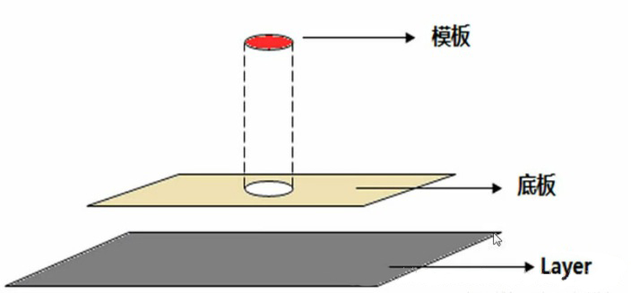
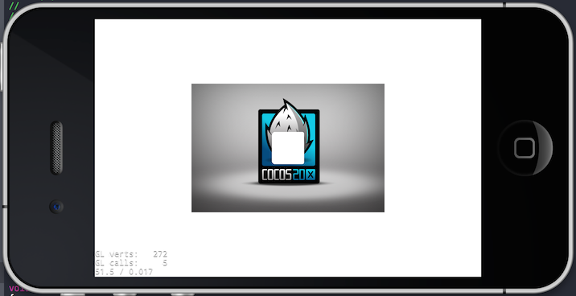
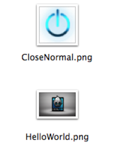

#ClippingNode的使用#

##概述

ClippingNode(裁剪节点)可以用来对节点进行裁剪，可以根据一个模板切割图片的节点，生成任何形状的节点显示。

ClippingNode是Node的子类，可以像普通节点一样放入Layer，Scene，Node中。

* ClippingNode 原理：

	ClippingNode是利用模板遮罩来完成对Node区域裁剪的技术。如何理解ClippingNode的遮罩？看下图的例子吧。

	

	所谓模板，就是一个形状，透过该形状可看到底板上的图层，如果底板上没有任何内容，则直接看到Layer上的内容，而底板上的东西又不会妨碍Layer上的东西，即模板在底板之外的空间对于Layer来说是透明的。

##ClippingNode 常用方法


1. create

	可以使用 `static ClippingNode* create();`方法创建一个ClippingNode对象。如下：

	```
	auto clipper = ClippingNode::create();
	```

	也可以使用 `static ClippingNode* create(Node *stencil);`方法创建；在创建的时候指定裁剪模板

	```
	auto stencil = Sprite::create("CloseNormal.png");//模板节点
	clipper = ClippingNode::create(stencil);
	```

2. setStencil
	可以使用`void setStencil(Node *stencil);`方法设置“裁剪模板”节点。 如下：
	
	```
	clipper->setStencil(stencil);//设置裁剪模板
	```
3. setInverted

	可以使用`void setInverted(bool inverted);`方法，设置是显示被裁剪的部分，还是显示裁剪。true 显示剩余部分。false显示被剪掉部分。 如下：
	
	```
	clipper->setInverted(true);//设置底板可见，显示剩余部分
	```
	
4. setAlphaThreshold

	可以使用`void setAlphaThreshold(GLfloat alphaThreshold);`，设置alpha阈值， 只有模板（stencil）的alpha像素大于alpha阈值（alphaThreshold）时内容才会被绘制。 alpha阈值（threshold）范围应是0到1之间的浮点数。 alpha阈值（threshold）默认为1。 如下：
	
	```
	clipper->setAlphaThreshold(0);//设置绘制底板的Alpha值为0
	```


##ClippingNode示例

```
    auto bg = LayerColor::create(Color4B(255, 255, 255,255));
    this->addChild(bg, -1);//1
    
    auto stencil = Sprite::create("CloseNormal.png");
    stencil->setScale(2);//2
    auto clipper = ClippingNode::create();
    clipper->setStencil(stencil);//设置裁剪模板 //3
    clipper->setInverted(true);//设置底板可见
    clipper->setAlphaThreshold(0);//设置绘制底板的Alpha值为0
    this->addChild(clipper);//4
    
    auto content = Sprite::create("HelloWorld.png");//被裁剪的内容
    clipper->addChild(content);//5
    
    clipper->setPosition(Vec2(visibleSize.width/2 + origin.x, visibleSize.height/2 + origin.y));
```

1. 添加了一个白色的LayerColor作为背景层。
2. 创建一个精灵，作为裁剪模板，并放大2倍
3. 创建ClippingNode节点，并设置裁剪模板
4. 设置裁剪显示，Alpha阈值，并将裁剪节点加到层中
5. 设置被裁剪的内容

运行效果如图：




将 `clipper->setInverted(true);` 改为 `clipper->setInverted(false);`
运行效果如图：


* 资源图片

