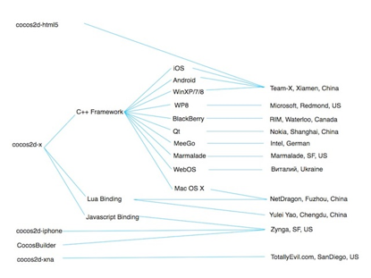

# 关于我们

我们立志创造一个世界顶级的开源项目

关于我们

1. Cocos2d-x
2. Cocos2d-html5
3. 许可证
4. 主要贡献者及维护者
5. 财力支持者

# 1.Cocos2d-x
 

Cocos2d-x是MIT许可证下发布的开源游戏引擎，游戏开发快速,简易,功能强大。Cocos2d-x核心优势在于允许开发人员利用C++,Lua及Javascript来进行跨平台部署，覆盖平台包括iOS,Android,Windows Phone,黑莓（BlackBerry）及Tizen等等，省事省力省成本。

Cocos2d-x用户不仅包括个人开发者和游戏开发爱好者，还包括许多知名大公司如Zynga,Wooga,Gamevil,Glu,GREE,Konami,TinyCo,HandyGames,IGG及Disney Mobile等。截止2013年9月，全球基于Cocos2d-x引擎的游戏下载量高达逾15亿，其中许多还占据苹果应用商店（AppStore）和谷歌应用商店（Google Play）排行榜。同时许多公司如触控,谷歌,微软,ARM,英特尔及黑莓的工程师在Cocos2d-x领域也非常活跃。

# 2.Cocos2d-html5

自2012年3月，[Cocos2d-html5](../../../wiki/cocos2d-js/zh.md)成为Cocos2d-x旗下分支游戏引擎，针对台式电脑,平板电脑及手机中支持HTML5的浏览器而设计。

# 3.许可证

上述所有分支游戏引擎均是**MIT**许可证下发布的。

利用cocos2d系列框架，我们可以容易地在iOS, Android, Windows Phone 8, BlackBerry（黑莓）, Marmalade, WindowsXP/Windows7, Linux, Mac OSX, Windows8 Metro 及Native Client (NaCl)上创建游戏或将游戏导入其中。详情请参见[支持平台](../../../wiki/supported-platforms-and-programming-languages/zh.md)。

# 4.主要贡献者及维护者

 
# 5.财力支持

目前，Cocos2d-x, Cocos2d-html5及CocoStudio由触控科技提供财力支持。欲了解更多有关触控科技公司的信息请点击[chukong-inc.com](http://www.chukong-inc.com)
