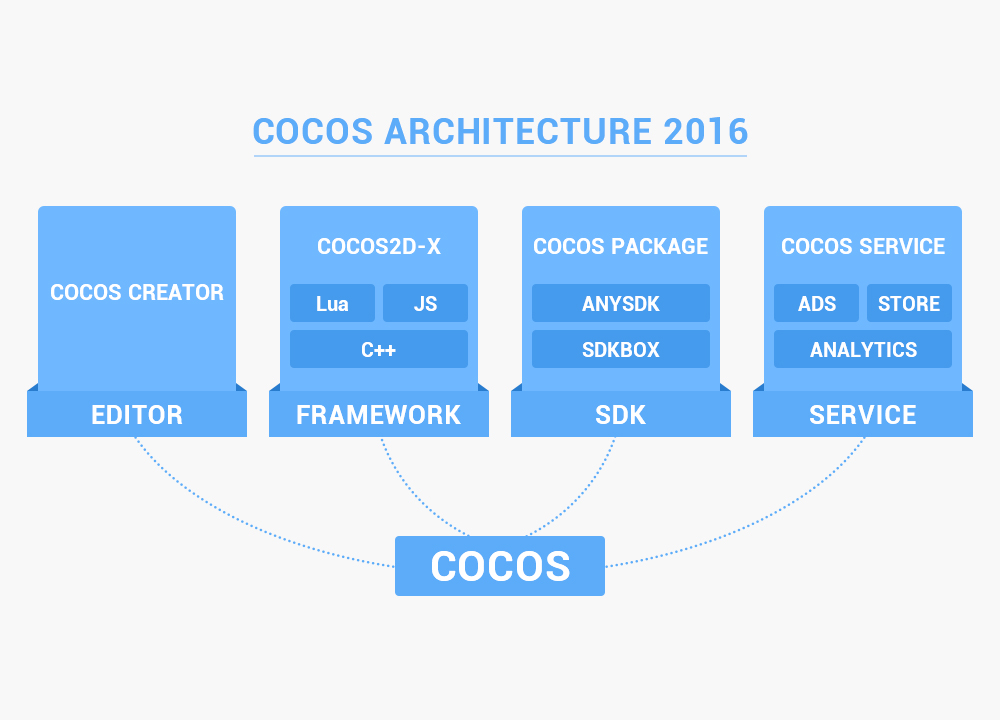

## 关于 Cocos2d-x

- Cocos2d-x 是MIT许可证下发布的开源游戏引擎，游戏开发快速，简易，功能强大。Cocos2d-x 核心优势在于允许开发人员利用C++、Lua及Javascript来进行跨平台部署，覆盖平台有iOS、Android、Windows、macOS等。

- Cocos2d-x用户不仅包括个人开发者和游戏开发爱好者，还包括许多知名大公司如Zynga、Wooga、Gamevil、Glu、GREE、Konami、TinyCo、HandyGames、IGG及Disney Mobile等。截止2013年9月，全球基于Cocos2d-x引擎的游戏下载量高达逾15亿，其中许多还占据苹果应用商店（AppStore）和谷歌应用商店（Google Play）排行榜。同时许多公司如触控、谷歌、微软、ARM，英特尔及黑莓的工程师在 Cocos2d-x 领域也非常活跃。

## Cocos 产品架构

- Cocos Creator，Cocos2d-x，AnySDK 等

    
