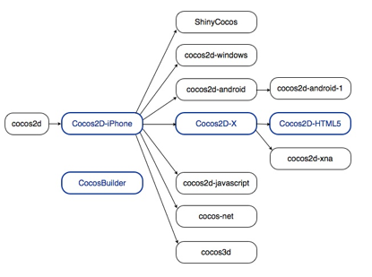

# Cocos2d系列产品关系

自Cocos2d-iPhone取得成功后，Cocos2d系列产品已经推出许多子项目。这里列出了一些最为出名的旗下分支游戏引擎。



蓝色方框中的分支引擎（包括Cocos2d-iPhone, Cocos2d-x, Cocos2d-HTML5及 [Cocos Builder 编辑器](http://www.cocosbuilder.com/)）在同一路径图上合作运行，并已发布[协调版本](http://www.cocos2d-x.org/news/81)。这意味着开发人员可以期待一条完整的工具链为网络设备或移动设备开发多平台游戏。

从下表可知，不同分支引擎支持不同的目标平台并使用不同的编程语言。

|分支引擎 | 编程语言 | 平台 |
|---|---|---|
|Cocos2d|Python	|桌面操作系统|
|Cocos2d-iphone|Objective-C, JavaScript|iOS|
|Cocos2d-x|C++, Lua, JavaScript	|参见支持平台和编程语言部分|
|Cocos2d-html5|JavaScript|支持HTML5的浏览器|
|ShinyCocos|Ruby|iOS|
|Cocos2d-windows|C++|Windows XP/7|
|Cocos2d-android|Java|	Android|
|Cocos2d-android-1|Java|	Android|
|Cocos2d-xna|C#	|Microsoft and MonoGame platforms|
|Cocos2d-javascript|JavaScript|	支持HTML5的浏览器|
|Cocos-net|C#|Mono-supported 平台|
|Cocos3d|Objective-C|iOS|


