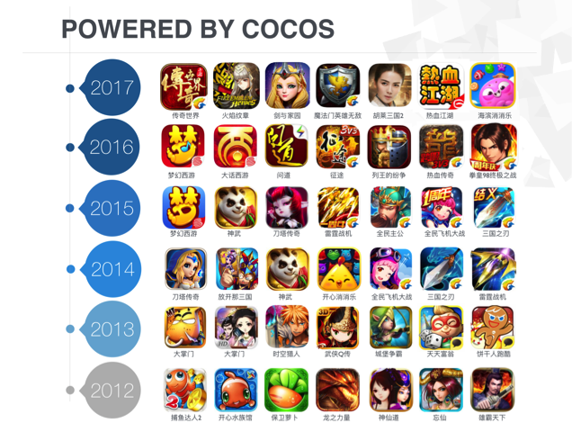

# 引擎优势

## 引擎特性

- 现代化的 C++ API
- 立足于 C++ 同时支持 JavaScript 和 Lua 作为开发语言
- 可以跨平台部署, 支持 iOS、Android、Windows、macOS 和 Linux
- 可以在 PC 端完成游戏的测试，最终发布到移动端
- 完善的游戏功能支持，包含精灵、动作、动画、粒子特效、场景转换、事件、文件 IO、数据持久化、骨骼动画、3D

## 市场占有

Cocos2d-x 用户不仅包括个人开发者和游戏开发爱好者，还包括许多知名大公司如 Zynga、Wooga、Gamevil、Glu、GREE、Konami、TinyCo、HandyGames、IGG 及 Disney Mobile 等。

许多使用 Cocos2d-x 开发的游戏还占据苹果应用商店和谷歌应用商店排行榜。同时许多公司如触控、谷歌、微软、ARM，英特尔及黑莓的工程师在 Cocos2d-x 领域也非常活跃。

在中国，每一年的榜单大作，Cocos2d-x 从未缺席，市场份额占 50% 以上，游戏品类覆盖从轻度休闲，热火棋牌，到横版，SLG，重度 MMO 等市面全品类。一些以 Cocos2d-x 为基础开发出的游戏如下：

