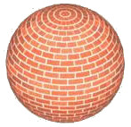

# 着色器和材质

## 什么是着色器

从维基百科：

在计算机图形学领域，着色器是一种特殊类型的计算机程序，最初用于做阴影，在图像中产生适当的光照、明暗，但现在主要用于产生特殊效果，也用于视频后期处理。非专业人士的定义可能是：告诉计算机如何以一种特定的方式绘制东西的程序。

着色器是运行在 GPU 上用于图像渲染的一段代码，用于绘制不同的 Cocos2d-x 节点。

Cocos2d-x 使用的着色器语言是 [OpenGL ES Shading Language v1.0](https://www.khronos.org/opengles/)，描述 GLSL 语言不在本文的范围之内。想了解更多，请参考规范文档 [OpenGL ES Shading Language](https://www.khronos.org/files/opengles_shading_language.pdf)。

在 Cocos2d-x 中，所有的可渲染的 Node 对象都使用着色器。比如，`Sprite` 对象使用为 2D 精灵优化的着色器，`Sprite3D` 使用为 3D 对象优化的着色器。

## 定制着色器

用户能为任一 Cocos2d-x 的节点对象设置预定义的着色器，通过下面这种方法：


sprite->setGLProgramState(programState);
sprite3d->setGLProgramState(programState);


`GLProgramState` 对象包含两个重要的东西

- `GLProgram`：从根本上来说就是着色器。包含一个顶点着色器和一个像素着色器。
- 状态属性：根本上来说就是着色器的 uniform 变量

如果你不熟悉 uniform 变量，也不知道为什么需要它，请参考刚才提到的 [语言规范](https://www.khronos.org/files/opengles_shading_language.pdf)

将 uniform 变量设置到  `GLProgramState` 是很容易的：


glProgramState->setUniformFloat("u_progress", 0.9);
glProgramState->setUniformVec2("u_position", Vec2(x,y));
glProgramState->setUniformMat4("u_transform", matrix);


你还可以将一个回调函数设置成 uniform 变量，下面是一个 lambda 表达式最为回调函数的例子：


glProgramState->setUniformCallback("u_progress", 
{
    float random = CCRANDOM_0_1();
    glProgram->setUniformLocationWith1f(uniform->location, random);
}
);


虽然可以手动设置 `GLProgramState` 对象，但更简单的方法是使用材质对象。

## 什么是材质(Material)

Assume that you want to draw a sphere like this one:

The first thing that you have to do is to define its geometry, something like this:

...and then define the brick texture, like:

- But what if you want to use a lower quality texture when the sphere is far away
from the camera?
- or what if you want to apply a blur effect to the bricks?
- or what if you want to enable or disable lighting in the sphere ?

The answer is to use a `Material` instead of just a plain and simple texture. In fact,
with `Material` you can have more than one texture, and much more features like multi-pass rendering.

`Material` objects are created from `.material` files, which contain the following information:

- `Material` can have one or more `Technique` objects
- each `Technique` can have one more `Pass` objects
- each `Pass` object has:
  - a `RenderState` object,
  - a `Shader` object including the uniforms

As an example, this is how a material file looks like:


// A "Material" file can contain one or more materials
material spaceship
{
	// A Material contains one or more Techniques.
	// In case more than one Technique is present, the first one will be the default one
	// A "Technique" describes how the material is going to be renderer
	// Techniques could:
	//  - define the render quality of the model: high quality, low quality, etc.
	//  - lit or unlit an object
	// etc...
	technique normal
	{
		// A technique can contain one or more passes
		// A "Pass" describes the "draws" that will be needed
		//   in order to achieve the desired technique
		// The 3 properties of the Passes are shader, renderState and sampler
		pass 0
		{
			// shader: responsible for the vertex and frag shaders, and its uniforms
			shader
			{
				vertexShader = Shaders3D/3d_position_tex.vert
				fragmentShader = Shaders3D/3d_color_tex.frag

				// uniforms, including samplers go here
				u_color = 0.9,0.8,0.7
				// sampler: the id is the uniform name
				sampler u_sampler0
				{
					path = Sprite3DTest/boss.png
					mipmap = true
					wrapS = CLAMP
					wrapT = CLAMP
					minFilter = NEAREST_MIPMAP_LINEAR
					magFilter = LINEAR
				}
			}
			// renderState: responsible for depth buffer, cullface, stencil, blending, etc.
			renderState
			{
				cullFace = true
				cullFaceSide = FRONT
				depthTest = true
			}
		}
	}
}


And this is how to set a `Material` to a `Sprite3D`:


Material* material = Material::createWithFilename("Materials/3d_effects.material");
sprite3d->setMaterial(material);


And if you want to change between different `Technique`s, you have to do:


material->setTechnique("normal");


###Techniques
Since you can bind only one `Material` per `Sprite3D`, an additional feature
is supported that's designed to make it quick and easy to change the way you
render the parts at runtime. You can define multiple techniques by giving them
different names. Each one can have a completely different rendering technique,
and you can even change the technique being applied at runtime by using
__Material::setTechnique(const std::string& name)__. When a material is loaded,
all the techniques are loaded ahead too. This is a practical way of handling
different light combinations or having lower-quality rendering techniques, such
as disabling bump mapping, when the object being rendered is far away from the
camera.

###Passes
A `Technique` can have one or more __passes__ That is, multi-pass rendering.
And each `Pass` has two main objects:

- `RenderState`: contains the GPU state information, like __depthTest__, __cullFace__,
    __stencilTest__, etc.
- `GLProgramState`: contains the shader (`GLProgram`) that is going to be used, including
    its uniforms.

###Material file format in detail
Material uses a file format  optimized to create Material files.
This file format is very similar to other existing Material file formats, like
GamePlay3D's and OGRE3D's.

__Notes__:

- Material file extensions do not matter. Although it is recommended to use
__.material__ as extension
- __id__ is optional for material, technique and pass
- Materials can inherit values from another material by optionally setting a
__parent_material_id__
- Vertex and fragment shader file extensions do not matter. The convention in
Cocos2d-x is to use __.vert__ and __frag__


// When the .material file contains one material
sprite3D->setMaterial("Materials/box.material");
// When the .material file contains multiple materials
sprite3D->setMaterial("Materials/circle.material#wood");


<table>
 <tr>
  <td><a name=material>material</a> material_id : parent_material_id</td>
  <td>&nbsp;</td>
  <td>&nbsp;</td>
 </tr>
 <tr>
  <td>{</td>
  <td>&nbsp;</td>
  <td>&nbsp;</td>
 </tr>
 <tr>
  <td>  renderState {}</td>
  <td>[0..1]</td>
  <td>block</td>
 </tr>
 <tr>
  <td>  technique id {}</td>
  <td>[0..*]</td>
  <td>block</td>
 </tr>
 <tr>
  <td>}</td>
  <td>&nbsp;</td>
  <td>&nbsp;</td>
 </tr>
</table>

<table>
 <tr>
  <td><a name=technique>technique</a> technique_id</td>
  <td>&nbsp;</td>
  <td>&nbsp;</td>
 </tr>
 <tr>
  <td>{</td>
  <td>&nbsp;</td>
  <td>&nbsp;</td>
 </tr>
 <tr>
  <td>  renderState {}</td>
  <td>[0..1]</td>
  <td>block</td>
 </tr>
 <tr>
  <td>  pass id {}</td>
  <td>[0..*]</td>
  <td>block</td>
 </tr>
 <tr>
  <td>}</td>
  <td>&nbsp;</td>
  <td>&nbsp;</td>
 </tr>
</table>

<table>
 <tr>
  <td><a name=pass>pass </a>pass_id</td>
  <td>&nbsp;</td>
  <td>&nbsp;</td>
 </tr>
 <tr>
  <td>{</td>
  <td>&nbsp;</td>
  <td>&nbsp;</td>
 </tr>
 <tr>
  <td>  renderState {}</td>
  <td>[0..1]</td>
  <td>block</td>
 </tr>
 <tr>
  <td>  shader {}</td>
  <td>[0..1]</td>
  <td>block</td>
 </tr>
 <tr>
  <td>}</td>
  <td>&nbsp;</td>
  <td>&nbsp;</td>
 </tr>
</table>

<table>
 <tr>
  <td><a name=renderState>renderState</a></td>
  <td>&nbsp;</td>
  <td>&nbsp;</td>
 </tr>
 <tr>
  <td>{</td>
  <td>&nbsp;</td>
  <td>&nbsp;</td>
 </tr>
 <tr>
  <td>  blend = false</td>
  <td>[0..1]</td>
  <td>bool</td>
 </tr>
 <tr>
  <td>  blendSrc = <a href="#BLEND_ENUM">BLEND_ENUM</a></td>
  <td>[0..1]</td>
  <td>enum</td>
 </tr>
 <tr>
  <td>  blendDst = <a href="#BLEND_ENUM">BLEND_ENUM</a></td>
  <td>[0..1]</td>
  <td>enum</td>
 </tr>
 <tr>
  <td>  cullFace = false</td>
  <td>[0..1]</td>
  <td>bool</td>
 </tr>
 <tr>
  <td>  depthTest = false</td>
  <td>[0..1]</td>
  <td>bool</td>
 </tr>
 <tr>
  <td>  depthWrite = false</td>
  <td>[0..1]</td>
  <td>bool</td>
 </tr>
 <tr>
  <td>}</td>
  <td>&nbsp;</td>
  <td>&nbsp;</td>
 </tr>
 <tr>
  <td>&nbsp; frontFace = CW | CCW</td>
  <td>[0..1]</td>
  <td>enum</td>
 </tr>
 <tr>
  <td>&nbsp; depthTest = false</td>
  <td>[0..1]</td>
  <td>bool</td>
 </tr>
 <tr>
  <td>&nbsp; depthWrite = false</td>
  <td>[0..1]</td>
  <td>bool</td>
 </tr>
 <tr>
  <td>&nbsp; depthFunc = <a href="#wiki-FUNC_ENUM">FUNC_ENUM</a></td>
  <td>[0..1]</td>
  <td>enum</td>
  </tr>
 <tr>
  <td>&nbsp; stencilTest = false</td>
  <td>[0..1]</td>
  <td>bool</td>
 </tr>
 <tr>
  <td>&nbsp; stencilWrite = 4294967295</td>
  <td>[0..1]</td>
  <td>uint</td>
 </tr>
<tr>
<td>&nbsp; stencilFunc = <a href="#wiki-FUNC_ENUM">FUNC_ENUM</a></td>
<td>[0..1]</td>
<td>enum</td>
</tr>
<tr>
<td>&nbsp; stencilFuncRef = 0</td>
<td>[0..1]</td>
<td>int</td>
</tr>
<tr>
<td>&nbsp; stencilFuncMask = 4294967295</td>
<td>[0..1]</td>
<td>uint</td>
</tr>
<tr>
<td>&nbsp; stencilOpSfail = <a href="#wiki-STENCIL_OP_ENUM">STENCIL_OPERATION_ENUM</a></td>
<td>[0..1]</td>
<td>enum</td>
</tr>
<tr>
<td>&nbsp; stencilOpDpfail = <a href="#wiki-STENCIL_OP_ENUM">STENCIL_OPERATION_ENUM</a> </td>
<td>[0..1]</td>
<td>enum</td>
</tr>
<tr>
<td>&nbsp; stencilOpDppass = <a href="#wiki-STENCIL_OP_ENUM">STENCIL_OPERATION_ENUM</a></td>
<td>[0..1]</td>
<td>enum</td>
</tr>
</table>

<table>
 <tr>
  <td><a name=shader>shader</a>shader_id</td>
  <td>&nbsp;</td>
  <td>&nbsp;</td>
 </tr>
 <tr>
  <td>{</td>
  <td>&nbsp;</td>
  <td>&nbsp;</td>
 </tr>
 <tr>
  <td>  vertexShader = res/colored.vert</td>
  <td>[0..1]</td>
  <td>file path</td>
 </tr>
 <tr>
  <td>  fragmentShader = res/colored.frag</td>
  <td>[0..1]</td>
  <td>file path</td>
 </tr>
 <tr>
  <td>  defines = semicolon separated list</td>
  <td>[0..1]</td>
  <td>string</td>
 </tr>
 <tr>
  <td>&nbsp;</td>
  <td>&nbsp;</td>
  <td>&nbsp;</td>
 </tr>
 <tr>
  <td>  uniform_name = <a href="#scalar">scalar</a> | <a href="#vector">vector</a></td>
  <td>[0..*]</td>
  <td>uniform</td>
 </tr>
 <tr>
  <td>  uniform_name = <a href="#AUTO_BIND_ENUM">AUTO_BIND_ENUM</a></td>
  <td>[0..*]</td>
  <td>enum</td>
 </tr>
 <tr>
  <td>  sampler uniform_name {}</td>
  <td>[0..*]</td>
  <td>block</td>
 </tr>
 <tr>
  <td>}</td>
  <td>&nbsp;</td>
  <td>&nbsp;</td>
 </tr>
</table>

<table>
 <tr>
  <td><a name=sampler>sampler</a> uniform_name</td>
  <td>&nbsp;</td>
  <td>&nbsp;</td>
 </tr>
 <tr>
  <td>{</td>
  <td>&nbsp;</td>
  <td>&nbsp;</td>
 </tr>
 <tr>
  <td>  path = res/wood.png | @wood</td>
  <td>[0..1]</td>
  <td>image path</td>
 </tr>
 <tr>
  <td>  mipmap = bool</td>
  <td>[0..1]</td>
  <td>bool</td>
 </tr>
 <tr>
  <td>  wrapS = REPEAT | CLAMP</td>
  <td>[0..1]</td>
  <td>enum</td>
 </tr>
 <tr>
  <td>  wrapT = REPEAT | CLAMP</td>
  <td>[0..1]</td>
  <td>enum</td>
 </tr>
 <tr>
  <td> minFilter = <a href="#TEXTURE_MIN_FILTER_ENUM">TEXTURE_MIN_FILTER_ENUM</a></td>
  <td>[0..1]</td>
  <td>enum</td>
 </tr>
 <tr>
  <td>  magFilter = <a href="#TEXTURE_MAG_FILTER_ENUM">TEXTURE_MAG_FILTER_ENUM</a></td>
  <td>[0..1]</td>
  <td>enum</td>
 </tr>
 <tr>
  <td>}</td>
  <td>&nbsp;</td>
  <td>&nbsp;</td>
 </tr>
</table>

__Enums__:

<table>
 <tr>
  <th align="left"><b>TEXTURE_MIN_FILTER_ENUM</b></th>
  <th>&nbsp;</th>
 </tr>
 <tr>
  <td>NEAREST</td>
  <td>Lowest quality non-mipmapped</td>
 </tr>
 <tr>
  <td>LINEAR</td>
  <td>Better quality non-mipmapped</td>
 </tr>
 <tr>
  <td>NEAREST_MIPMAP_NEAREST</td>
  <td>Fast but low quality mipmapping</td>
 </tr>
 <tr>
  <td>LINEAR_MIPMAP_NEAREST</td>
  <td>&nbsp;</td>
 </tr>
 <tr>
  <td>NEAREST_MIPMAP_LINEAR</td>
  <td>&nbsp;</td>
 </tr>
 <tr>
  <td>LINEAR_MIPMAP_LINEAR</td>
  <td>Best quality mipmapping</td>
 </tr>
</table>

<table>
 <tr>
  <th align="left"><b>TEXTURE_MAG_FILTER_ENUM</b></th>
  <th>&nbsp;</th>
 </tr>
 <tr>
  <td>NEAREST</td>
  <td>Lowest quality</td>
 </tr>
 <tr>
  <td>LINEAR</td>
  <td>Better quality</td>
 </tr>
</table>

<table>
 <tr>
  <th align="left"><b>BLEND_ENUM</b></th>
  <th>&nbsp;</th>
 </tr>
 <tr>
  <td>ZERO</td>
  <td>ONE_MINUS_DST_ALPHA</td>
 </tr>
 <tr>
  <td>ONE</td>
  <td>CONSTANT_ALPHA</td>
 </tr>
 <tr>
  <td>SRC_ALPHA</td>
  <td>ONE_MINUS_CONSTANT_ALPHA</td>
 </tr>
 <tr>
  <td>ONE_MINUS_SRC_ALPHA</td>
  <td>SRC_ALPHA_SATURATE</td>
 </tr>
 <tr>
  <td>DST_ALPHA</td>
  <td>&nbsp;</td>
 </tr>
</table>

<table>
 <tr>
  <th align="left"><b>CULL_FACE_SIDE_ENUM</b></th><th></th>
 </tr>
 <tr>
  <td>BACK</td>
  <td>Cull back-facing polygons.</td>
 </tr>
 <tr>
  <td>FRONT</td>
  <td>Cull front-facing polygons.</td>
 </tr>
 <tr>
  <td>FRONT_AND_BACK</td>
  <td>Cull front and back-facing polygons.</td>
 </tr>
</table>

<table>
 <tr>
  <th align="left"><b>FUNC_ENUM</b></th>
  <th></th>
 </tr>
 <tr>
  <td>NEVER</td>
  <td>ALWAYS</td>
 </tr>
 <tr>
  <td>LESS</td>
  <td>GREATER</td>
 </tr>
 <tr>
  <td>EQUAL</td>
  <td>NOTEQUAL</td>
 </tr>
 <tr>
  <td>LEQUAL</td>
  <td>GEQUAL</td>
 </tr>
</table>

<table>
 <tr>
  <th align="left"><b>STENCIL_OPERATION_ENUM</b></th>
  <th></th>
 </tr>
 <tr>
  <td>KEEP</td>
  <td>REPLACE</td>
 </tr>
 <tr>
  <td>ZERO</td>
  <td>INVERT</td>
 </tr>
 <tr>
  <td>INCR</td>
  <td>DECR</td>
 </tr>
 <tr>
  <td>INCR_WRAP</td>
  <td>DECR_WRAP</td>
 </tr>
</table>

__Types__:

<ul>
 <li class=MsoNormal><a name=scalar>scalar </a>is
     float, int or bool.</li>
 <li class=MsoNormal><a name=vector>vector</a> is a comma separated list of floats.</li>
</ul>

### Predefined uniforms

The following are predefined uniforms used by Cocos2d-x that can be used in
your shaders:

* `CC_PMatrix`: A `mat4` with the projection matrix
* `CC_MVMatrix`: A `mat4` with the Model View matrix
* `CC_MVPMatrix`: A `mat4` with the Model View Projection matrix
* `CC_NormalMatrix`: A `mat4` with Normal Matrix
* `CC_Time`: a `vec4` with the elapsed time since the game was started
   * CC_Time[0] = time / 10;
   * CC_Time[1] = time;
   * CC_Time[2] = time * 2;
   * CC_Time[3] = time * 4;
* `CC_SinTime`: a `vec4` with the elapsed time since the game was started:
   * CC_SinTime[0] = time / 8;
   * CC_SinTime[1] = time / 4;
   * CC_SinTime[2] = time / 2;
   * CC_SinTime[3] = sinf(time);
* `CC_CosTime`: a `vec4` with the elapsed time since the game was started:
   * CC_CosTime[0] = time / 8;
   * CC_CosTime[1] = time / 4;
   * CC_CosTime[2] = time / 2;
   * CC_CosTime[3] = cosf(time);
* `CC_Random01`: A `vec4` with four random numbers between 0.0f and 1.0f
* `CC_Texture0`: A `sampler2D`
* `CC_Texture1`: A `sampler2D`
* `CC_Texture2`: A `sampler2D`
* `CC_Texture3`: A `sampler2D`
