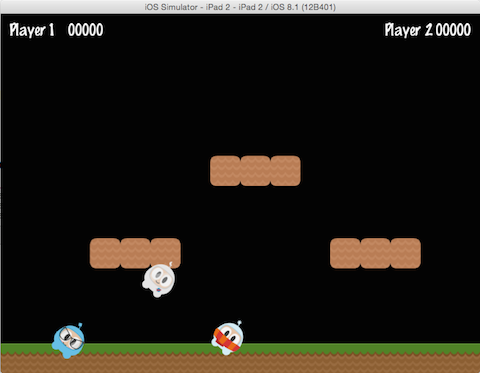

# 节点关系

Cocos2d-x 的 __节点关系__，是被附属和附属的关系，就像数据结构中的父子关系，如果两个节点被添加到一个父子关系中，那么父节点的属性变化会被自动应用到子节点中。想一下处于父子关系中的精灵有什么特性。

这三个精灵被添加到了一个父子关系中，当父精灵(被其它精灵附属的精灵)设置了旋转角度之后，子精灵也会自动做同样的改变：


auto myNode = Node::create();

// rotating by setting
myNode->setRotation(50);


var myNode = new cc.Node();

// rotating by setting
myNode.setRotation(50);



和旋转角度一样，如果你改变了父精灵的缩放比例，子精灵也会做同样的改变：


auto myNode = Node::create();

// scaling by setting
myNode->setScale(2.0); // scales uniformly by 2.0


var myNode = new cc.Node();

// scaling by setting
myNode.setScale(2.0); // scales uniformly by 2.0



需要注意的是，不是所有的父节点属性都会被自动应用到子节点，如改变父节点的锚点只会影响转换效果(*比例缩放，位置变化，角度旋转，变形等*)，不会影响子节点锚点，子节点的锚点总会是左下角 (0,0)。
