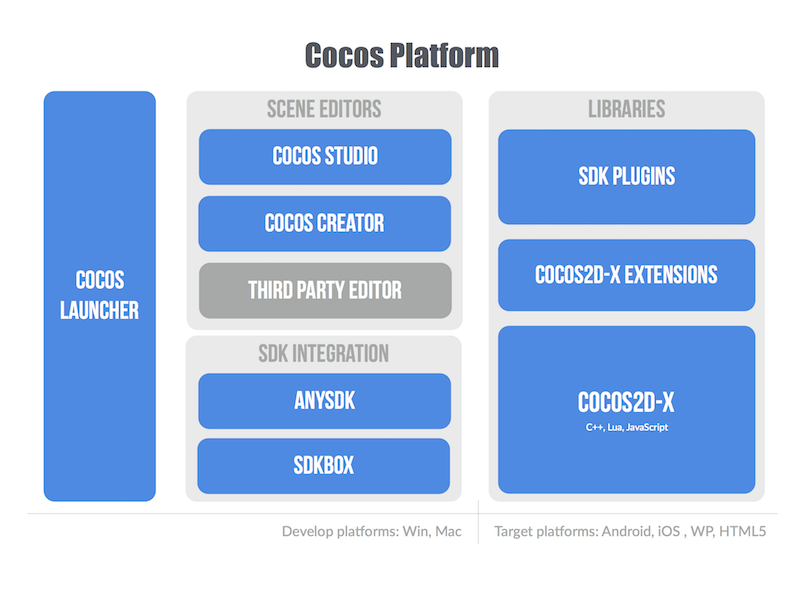
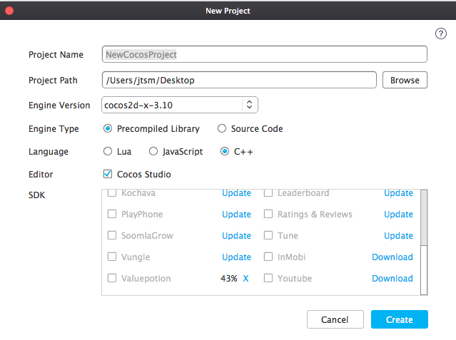
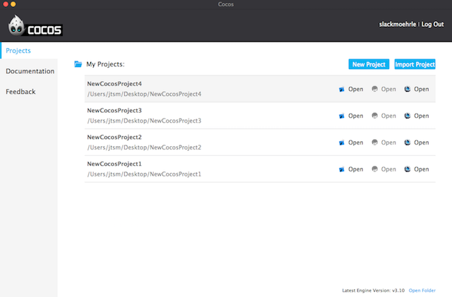

# Cocos

### What is Cocos?
Cocos is a platform to create games: it includes an editor, a game engine, it also
includes integration with the popular services every developer expects... everything
is packaged in a convenient installer. It is a complete *ecosystem*.



Historically, developers would download either a __.zip__ of the latest
release or become bleeding edge by staying in sync with our [GitHub](https://github.com/cocos2d/cocos2d-x) repo. When dealing with new releases, this was a manual integration effort for
developers. If you had multiple projects, depending upon your setup, you may have
even had to perform a manual integration for each project.

Not anymore, utilizing __Cocos__. __Cocos__ had been available as a console only
app with limited functionality for creating projects as well as compiling and
running your applications. However, now, it is your simple solutions to managing
your entire project base. __Cocos__ provides:

<!--* Auto-updates! __Cocos__ updates all the Cocos components, including Cocos2d-x,
  Cocos Studio and SDK services.-->
* A unified setup for both __Cocos2d-x__ and __Cocos__. This allows you to stay
  up to date with the latest __Cocos2d-x__ releases. This includes using precompiled
  binaries and source code, in a single place.
* Easy integration with __SDKs__ for 3rd party services: Facebook, IAP and many more.
* Developers a channel to provide feedback and get support, directly within __Cocos__,
  making it simple to contact the engine team for help.　

### What is the workflow?
Historically, you probably downloaded a __.zip__ from the website or if you stayed
a hipster and pulled from the [GitHub](https://github.com/cocos2d/cocos2d-x) repo.
Downloading the __.zip__ will no longer be available. [Github](https://github.com/cocos2d/cocos2d-x), however, will always remain available.

The workflow is now to use __Cocos__ for everything! Yes, it handles everything
from __creating__ projects, __editing__ project properties and settings,
__integrating__ SDKBOX services, __compiling and running__ your code and __building__
your user interface in __Cocos Studio__.

__Cocos__ is simple with a clean, modern interface for maximizing your productivity.
Take a look:

The main window:


Creating a new project:



Now all of your projects in a single place:



### Precompiled libraries versus source code
__Cocos__ now makes it easy for developers to use precompiled libraries instead
of the source code. Why might you want to do this? Speed for one! Using precompiled
libraries eliminates the need to compile the __Cocos2d-x__ source each time. This
eliminates the long thumb twiddling between compile sessions. Second, updating to
the latest version is simple. You download directly from within __Cocos__ and __modify__
your projects settings to switch to the latest version.

### SDK Integration
__Cocos__ provides many services that you can integrate into your apps for *FREE*
and you can add services to your apps quickly and stay on top of services updates.
As new versions of __SDKs__ become available you can download directly from within
__Cocos__ and __modify__ your projects settings to update to the latest version.

Currently, __SDKBOX__ is integrated into __Cocos__. You can read more about
__SDKBOX__ and the services it offers in the [Services Docs](../services/sdkbox/index.html).

## Using Cocos

### Creating a new project
Creating a new project with __Cocos__ is easy, just follow a few simple steps.
Using __Cocos__, you are creating a __Cocos2d-x__ project with complete flexibility
to change your projects settings at any time. To create a new new project:

- Open __Cocos__
- Click **New Project**
- Specify your project settings. Let's make sure we know what the settings are:

<table>
 <tr>
  <th><u><b>Setting</b></u></th>
  <th><u><b>Description</b></u></th>
 </tr>
 <tr>
  <td><b>Project Name</b></td>
  <td>the name of the project to be created.</td>
 </tr>
 <tr>
  <td><b>Project Path</b></td>
  <td>the folder in which your projects are located.</td>
 </tr>
 <tr>
  <td><b>Engine Version</b></td>
  <td>version of Cocos2d-x you will use to create this project.</td>
 </tr>
 <tr>
  <td><b>Engine Type</b></td>
  <td><ul><li><b><u>Precompiled Library:</u></b> a static library of the cocos2d-x source code. This would speed up compile times as there is no need to continually build the engine's source.</li>
  <br />
  <li><b><u>Source Code:</u></b> cocos2d-x source code.</li>
  </ul>
  </td>
 </tr>
 <tr>
  <td><b>Project Language</b></td>
  <td><ul><li><b><u>Lua:</u></b> based on cocos2d-x Lua binding. It can run on Android, iOS, Windows Phone, Windows, Mac.</li>
  <br />
  <li><b><u>JavaScript:</u></b> based on cocos2d-js, also includes cocos2d-x JavaScript bindings. The JavaScript bindings are compatible with HTML5. You can run code in cocos2d-x runtime and HTML5 native engine. The default settings will be JavaScript bindings if the projects are built for running on Android, iOS, Windows Phone, Windows and Mac. The default settings will be cocos2d-js if the projects are for HTML5.</li>
  <br />
  <li><b><u>C++:</u></b> based on cocos2d-x, It can run on Android, iOS, Windows Phone, Windows, Mac.</li>
  </ul></td>
 </tr>
 <tr>
  <td><b>Editor</b></td>
  <td>whether or not to create a Cocos Studio project. Cocos Studio is the official editor of Cocos2d-x.</td>
 </tr>
 <tr>
  <td><b>SDKs</b></td>
  <td>which SDK services are available to add to your project. These services wrap
  up all the libraries and APIs from the service providers. All will be integrated
  for you to update the settings and call the service from your project.</td>
 </tr>
</table>

- Click **Create**


<!--## Prerequisite
* Completed one of the Appendices **[A](../A/index.html)**, **[B](../B/index.html)**,
**[C](../C/index.html)**, **[D](../D/index.html)**, **[E](../E/index.html)**,
**[F](../F/index.html)**, **[G](../G/index.html)**, **[H](../H/index.html)**

## `cocos` command-line tool
Cocos2d-x comes with a command-line tool called __cocos__. It is a cross-platform
tool that allows you to create new Cocos2d-x applications as well as __run__ them
and _deploy_ them. __cocos__ works for all Cocos2d-x supported platforms, which
include: __ios</b>, <b>android</b>, <b>mac</b>, <b>linux</b>, <b>win32</b>, <b>wp8_1__ and
__web__. You don't need to use an IDE unless you want to. It has many options,
so let's go through them grouped by function.

### Testing your path for `cocos`
It is necessary for __cocos__ to be in your path or to specify the complete path
to it when using it. An easy test:
```
> cocos -v
```

If you see output like __1.2__ you are all set. If you see anything else you need
to either add the location to your __PATH__ or run __source ~/.bash_profile__ or
specify the full path to __<cocos root>\tools\cocos2d-console\bin__.

### Creating a new project
To create a new project you use the __cocos new__ command. The command is formatted
as:
```
cocos new <game name> -p <package identifier> -l <language> -d <location>
```

Examples:
```
cocos new MyGame -p com.MyCompany.MyGame -l cpp -d ~/MyCompany

cocos new MyGame -p com.MyCompany.MyGame -l lua -d ~/MyCompany

cocos new MyGame -p com.MyCompany.MyGame -l js -d ~/MyCompany
```

You can run __cocos new --help__ to see even more options as well as platform
specific options.

## Compiling a project
As you make changes to your code it is necessary to compile it. We all know this
has to happen, let's go through it. The command is formatted as:
```
cocos compile -s <path to your project> -p <platform> -m <mode> -o <output directory>
```

Examples:
```
cocos compile -s ~/MyCompany/MyGame -p ios -m release -o ~/MyCompany/MyGame/bin

cocos compile -s ~/MyCompany/MyGame -p android -m release -o ~/MyCompany/MyGame/bin

cocos compile -s c:\MyCompany\MyGame -p win32 -m release -o c:\MyCompany\MyGame\bin
```

There is a lot going on here so let's go over the finer points. __-p__ is the __platform__
you are compiling for. __-m__ is mode, __debug__ or __release__ with the default
being __debug__ if this parameter is not specified.

Also, it is important to know that the __-s__ and __-o__ parameters are optional as
well as long as you are already in your project's working directory. Taking the
example above if you are already in __~/MyCompany/MyGame__ then the __cocos compile__
command can be shortened:
```
cocos compile . -p ios -m release
```

You can also specify an optional parameter __-q__ for __quiet__. This lessens the
output that is outputted to the console. Taking an example from above:
```
cocos compile -q -s ~/MyCompany/MyGame -p ios -m release -o ~/MyCompany/MyGame/bin
```

As __cocos__ supports a lot of platforms there are also platform specific options
which allow you to fine tune targeting specific SDK versions, signing code, lua
options as well as web specific options. You can run __cocos compile --help__ to see
all available options broken down by platform.

## Running a project
Once you have created a project you can run it right from the command-line. __cocos__
takes care of launching the environment you specify. The command is formatted as:
```
cocos run -s <path to your project> -p <platform>
```

Examples:
```
cocos run -s ~/MyCompany/MyGame -p ios

cocos run -s ~/MyCompany/MyGame -p android

cocos run -s c:\MyCompany\MyGame -p win32
```

You can also specify to run in __debug__ or __release__ mode using the optional
__-m__ parameter. Excluding this parameter defaults to __debug__.
```
cocos run -s ~/MyCompany/MyGame -p ios -m release
```

As with the __cocos compile__ command above, it is important to know that the
__-s__ and __-o__ parameters are optional as well as long as you are already in your
project's working directory. Taking the example above if you are already in
__~/MyCompany/MyGame__ then the __cocos run__ command can be shortened:
```
cocos run . -p ios -m release
```

When running for the __web__ there are additional parameters that allow you to
specify what web browser you want to run in. You can also specify ip address and
port. This, again is done via command-line parameters. Examples, specifying
Google Chrome:
```
cocos run -s ~/MyCompany/MyGame -p web -b /Applications/Google\ Chrome.app

cocos run -s ~/MyCompany/MyGame -p web -b C:\Program Files\Google\Chrome\Application\chrome.exe

cocos run -s ~/MyCompany/MyGame -p web -b /usr/local/bin/chrome
```
You can run __cocos run --help__ to see all available options broken down by platform.

## Deploy a project
Once you are ready to ship your game __cocos__ provides an easy mechanism for
deploying it. Just like with the commands above you specify what want to do. The
command is formatted as:
```
cocos deploy -s <path to your project> -p <platform> -m <mode>
```

Examples:
```
cocos deploy -s ~/MyCompany/MyGame -p ios -m release

cocos deploy -s ~/MyCompany/MyGame -p android -m release

cocos deploy -s c:\MyCompany\MyGame -p win32 -m release
```

You can also specify an optional parameter __-q__ for __quiet__. This reduces the
output that is logged to the console. Taking an example from above:
```
cocos deploy -q -s ~/MyCompany/MyGame -p ios -m release
```

You can run __cocos deploy --help__ to see all available options broken down by
platform.
-->
