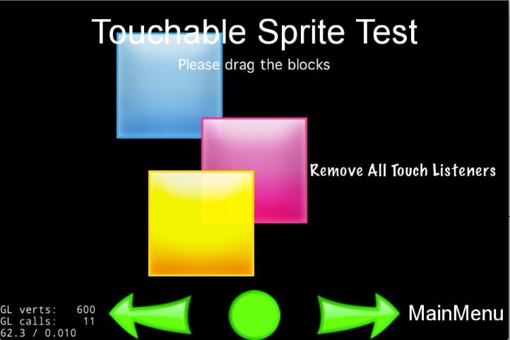

#事件分发机制


`新事件分发机制：`在2.x 版本事件处理时，将要触发的事件交给代理（delegate）处理，再通过实现代理里面的onTouchBegan等方法接收事件，最后完成事件的响应。而在新的事件分发机制中，只需通过创建一个事件监听器-用来实现各种触发后的逻辑，然后添加到事件分发器`_eventDispatcher`，所有事件监听器有这个分发器统一管理，即可完成事件响应。

事件监听器有以下几种：

- 触摸事件 (EventListenerTouch)
- 键盘响应事件 (EventListenerKeyboard)
- 鼠标响应事件 (EventListenerMouse)
- 自定义事件 (EventListenerCustom)
- 加速记录事件 (EventListenerAcceleration)

`_eventDispatcher`的工作由三部分组成：

- 事件分发器 EventDispatcher
- 事件类型 EventTouch, EventKeyboard 等
- 事件监听器 EventListenerTouch, EventListenerKeyboard 等

监听器实现了各种触发后的逻辑，在适当时候由事件分发器分发事件类型，然后调用相应类型的监听器。

##用户输入事件

###触摸事件

在处理触摸事件时，既可以重写三个方法`onTouchBegan`,`onTouchMoved`和`onTouchEnded`，也可以直接通过Lambda表达式完成响应逻辑。

在2.x版本中，开启多点触摸需要在`AppController.mm`中的`application didFinishLaunchingWithOptions:launchOptions `中添加`[__glView setMultipleTouchEnabled: YES]`，另外还需重载5个相应函数：

- virtual void registerWithTouchDispatcher(void);
- virtual void ccTouchesBegan(cocos2d::CCSet *pTouches, cocos2d::CCEvent *pEvent);
- virtual void ccTouchesMoved(cocos2d::CCSet *pTouches, cocos2d::CCEvent *pEvent);
- virtual void ccTouchesEnded(cocos2d::CCSet *pTouches, cocos2d::CCEvent *pEvent);
- virtual void ccTouchesCancelled(cocos2d::CCSet *pTouches, cocos2d::CCEvent *pEvent);

而在3.0中，只需创建多点触摸事件监听器，并将其添加到事件分发器中即可。


以下代码在一个界面中添加三个按钮，三个按钮相互遮挡，并且都能触发触摸事件：

```
	// 创建按钮精灵
	auto sprite1 = Sprite::create("Images/CyanSquare.png");
    sprite1->setPosition(origin+Point(size.width/2, size.height/2) + Point(-80, 80));
    addChild(sprite1, 10);
	// sprite2
	...
	// sprite3
	...
```



创建好按钮精灵后，创建单点触摸事件监听器，并完成相应逻辑处理

```
	// 创建一个事件监听器类型为 OneByOne 的单点触摸
    auto listener1 = EventListenerTouchOneByOne::create();
    // 设置是否吞没事件，在 onTouchBegan 方法返回 true 时吞没
    listener1->setSwallowTouches(true);

    // 使用 lambda 实现 onTouchBegan 事件回调函数
    listener1->onTouchBegan = [](Touch* touch, Event* event){
        // 获取事件所绑定的 target 
        auto target = static_cast<Sprite*>(event->getCurrentTarget());

        // 获取当前点击点所在相对按钮的位置坐标
        Point locationInNode = target->convertToNodeSpace(touch->getLocation());
        Size s = target->getContentSize();
        Rect rect = Rect(0, 0, s.width, s.height);

        // 点击范围判断检测
        if (rect.containsPoint(locationInNode))
        {
            log("sprite began... x = %f, y = %f", locationInNode.x, locationInNode.y);
            target->setOpacity(180);
            return true;
        }
        return false;
        };

    // 触摸移动时触发
    listener1->onTouchMoved = [](Touch* touch, Event* event){...};

    // 点击事件结束处理
    listener1->onTouchEnded = [=](Touch* touch, Event* event){...};
```

最后需要将事件监听器添加到事件分发器

```
	// 添加监听器
    _eventDispatcher->addEventListenerWithSceneGraphPriority(listener1, sprite1);
    _eventDispatcher->addEventListenerWithSceneGraphPriority(listener1->clone(), sprite2);
    _eventDispatcher->addEventListenerWithSceneGraphPriority(listener1->clone(), sprite3);
```

以上代码中`_eventDispatcher`是Node的属性，通过它管理当前节点（场景,层,精灵等）的所有事件的分发。但它本身是一个单例模式值的引用，在Node的构造函数中，通过`Director::getInstance()->getEventDispatcher();` 获取，有了这个属性，就能方便的处理事件。

`注意：`当再次使用 listener1 的时候，需要使用`clone()`方法创建一个新的克隆，因为在使用`addEventListenerWithSceneGraphPriority`或者`addEventListenerWithFixedPriority`方法时，会对当前使用的事件监听器添加一个已注册的标记，这使得它不能够被添加多次。另外，有一点非常重要，FixedPriority listener添加完之后需要手动remove，而SceneGraphPriority listener是跟Node绑定的，在Node的析构函数中会被移除。具体的示例用法可以参考引擎自带的tests。


我们可以通过以下方法移除一个已经被添加了的监听器。

`_eventDispatcher->removeEventListener(listener);`

也可以使用如下方法，移除当前事件分发器中所有监听器。

`_eventDispatcher->removeAllEventListeners();`

当使用`removeAll`的时候，此节点的所有的监听将被移除，推荐使用 指定删除的方式。`removeAll`之后菜单也不能响应。因为它也需要接受触摸事件。

###键盘响应事件

键盘响应事件和处理触摸事件使用了相同的处理方式，一下代码演示如何处理键盘响应事件：

```
	// 初始化并绑定
    auto listener = EventListenerKeyboard::create();
    listener->onKeyPressed = CC_CALLBACK_2(KeyboardTest::onKeyPressed, this);
    listener->onKeyReleased = CC_CALLBACK_2(KeyboardTest::onKeyReleased, this);

    _eventDispatcher->addEventListenerWithSceneGraphPriority(listener, this);

    // 键位响应函数原型
    void KeyboardTest::onKeyPressed(EventKeyboard::KeyCode keyCode, Event* event)
    {
        log("Key with keycode %d pressed", keyCode);
    }

    void KeyboardTest::onKeyReleased(EventKeyboard::KeyCode keyCode, Event* event)
    {
        log("Key with keycode %d released", keyCode);
    }
```

###鼠标响应事件

在 3.0 中多了鼠标捕获事件派发，这可以在不同的平台上，丰富我们游戏的用户体验。

下面代码实现鼠标响应事件的实现步骤：

```
	// 创建监听器
	_mouseListener = EventListenerMouse::create();
	
	// 时间响应逻辑
    _mouseListener->onMouseMove = [=](Event *event){
    EventMouse* e = (EventMouse*)event;
    string str = "Mouse Down detected, Key: ";
    str += tostr(e->getMouseButton());
    // ...
};
    _mouseListener->onMouseUp = [=](Event *event){...};
    _mouseListener->onMouseDown = [=](Event *event){...};
    _mouseListener->onMouseScroll = [=](Event *event){...};
	// 添加到事件分发器
    _eventDispatcher->addEventListenerWithSceneGraphPriority(_mouseListener, this);
```

##自定义事件

以上是系统自带的事件类型，事件由系统内部自动触发，如 触摸屏幕，键盘响应等，除此之外，还提供了一种 自定义事件，简而言之，它不是由系统自动触发，而是人为的干涉，如下：

```
	_listener = EventListenerCustom::create("game_custom_event1", [=](EventCustom* event){
        std::string str("Custom event 1 received, ");
        char* buf = static_cast<char*>(event->getUserData());
        str += buf;
        str += " times";
        statusLabel->setString(str.c_str());
    });

    _eventDispatcher->addEventListenerWithFixedPriority(_listener, 1);
```

以上定义了一个 “自定义事件监听器”，实现了相关逻辑，并且添加到事件分发器。上面的自定义事件将由以下代码触发：

```
	static int count = 0;
    ++count;
    char* buf = new char[10];
    sprintf(buf, "%d", count);
    EventCustom event("game_custom_event1");
    event.setUserData(buf);
    if(...)
    {
    	_eventDispatcher->dispatchEvent(&event);
    }
    CC_SAFE_DELETE_ARRAY(buf);
```

定义一个 EventCustom，并且设置了其 UserData 数据，手动的通过 _eventDispatcher->dispatchEvent(&event); 将此事件分发出去，从而触发之前所实现的逻辑。

##加速计事件

除了触摸，移动设备上一个很重要的输入源是设备的方向，因此大多数设备都配备了加速计，用于测量设备静止或匀速运动时所受到的重力方向。

重力感应来自移动设备的加速计，通常支持X,Y和Z三个方向的加速度感应，所以又称为三向加速计。在实际应用中，可以根据3个方向的力度大小来计算手机倾斜的角度或方向。

3.0中，新的事件机制下，我们需要通过创建一个加速计监听器`EventListenerAcceleration`，其静态create方法中有个Acceleration的参数需要注意。Acceleration是一个类，包含了加速计获得的3个方向的加速度，相关代码如下：

```
class Acceleration
{
public:
    double x;
    double y;
    double z;
    
    double timestamp;
    
    Acceleration(): x(0), y(0), z(0), timestamp(0) {}
};

```

该类中每个方向的加速度大小都为一个重力加速度大小。

在使用加速计事件监听器之前，需要先启用此硬件设备：

`Device::setAccelerometerEnabled(true);`

然后创建对应的监听器，在创建回调函数时，可以使用 lambda 表达式创建匿名函数，也可以绑定已有的函数逻辑实现，如下：

```
	auto listener = EventListenerAcceleration::create([=](Acceleration* acc, Event* event){
    	//逻辑代码段
    });
    _eventDispatcher->addEventListenerWithSceneGraphPriority(listener, this);
```