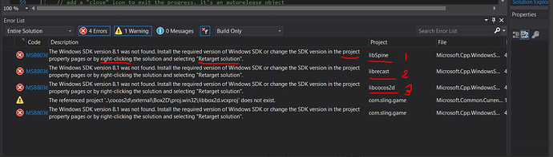

## Windows

### Re-target the Windows SDK
If you see these types of errors:

  

This is because the template project was created in an older version of Visual Studio. To fix:

  * **Right** click on **every project**
  * select **Retarget Projects**
  * click **Ok**. 
  * Next, **rebuild** the project.

If you create a new project in the future you will need to repeat these steps.

### Distributing a Cocos2d-x app on Windows

> __Note:__ this falls outside of the realm of Cocos2d-x. Please consult Microsoft resources for assistance.
  
If you try to run a game created with Cocos2d-x on a non-development machine, it may be required for this machine to have the __Visual Studio runtime__ installed. The easiest way is to create an installer for your game, but it is possible to do it without by installing all required pieces manually.

* Use [Dependency Walker](http://www.dependencywalker.com/) to check what DLLs your game requires.

* Install the required Visual Studio runtime.  Microsoft has now merged VS2015, 2017 and 2019 runtimes into one, which you can find [here](https://support.microsoft.com/ms-my/help/2977003/the-latest-supported-visual-c-downloads).

For the installer, check these posts:

* [InnoSetup](https://discuss.cocos2d-x.org/t/please-give-me-some-pointers-advice-before-pc-release/43935/3) (also shows you a sample for how to install the VS C++ runtime using it).

* Sample InnoSetup script for Cocos2d-x [here](https://discuss.cocos2d-x.org/t/exe-file-sharing/45569/6).