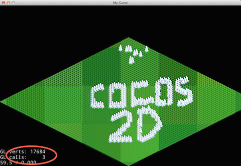

#Fast TileMap#

##概述

  在游戏中常常会有丰富的背景元素，如果直接使用大的背景图实现，这会造成资源浪费。TileMap就是为了解决这问题而产生的。Cocos2d-x支持使用[Tile地图编辑器](http://www.mapeditor.org/)创建的TMX格式的地图。
  
  Cocos2d-x为我们提供了TMXTileMap和TMXLayer两个类来处理瓦片地图。通过使用TMXTileMap和TMXLayer，我们可以很方便的加载TMX格式的地图文件，获取地图上的图层,对象,属性等信息。

新发布的3.2版本，对瓦片地图进行了大幅改进，通过自动裁剪不在视图范围内的瓦片来提升性能，并支持渲染更大尺寸的瓦片地图！我们称之为"Fast TileMap"，下面我们就来一起研究Fast TileMap。

## TileMap VS Fast TileMap

### Fast TileMap的不同

在3.2版本，新增了`CCFastTMXTiledMap.h/CCFastTMXTiledMap.cpp/CCFastTMXLayer.h/CCFastTMXLayer.cpp`文件用于实现快速高效的瓦片地图功能。

在cocos2d::experimental的名字空间下重新实现了TMXTiledMap和TMXLayer。其中对TMXLayer的改动较大。
`TMXLayer`不在继承`SpriteBatchNode`，改为继承`Node`。并重新实现TileMap的绘制来提升性能。

* old

```
class CC_DLL TMXLayer : public SpriteBatchNode
```

* new

```
class CC_DLL TMXLayer : public Node
```

新的`TMXTiledMap`接口和原有的保持一致。我们依然可以像以前那样使用TMXTiledMap创建瓦片地图。


### Fast TileMap的用法

```
	auto map = cocos2d::experimental::TMXTiledMap::create("tilemap.tmx");
    addChild(map, 0, kTagTileMap);
```

上面代码演示了，使用Fast TileMap加载tilemap.tmx文件创建一幅地图，并加到场景中。

更多API使用方法参考:

- [COCOS2DX_ROOT/tests/cpp-tests/Classes/TileMapTest/TileMapTest2.cpp](https://github.com/cocos2d/cocos2d-x/blob/v3/tests/cpp-tests/Classes/TileMapTest/TileMapTest2.cpp)

- [TileMap](http://cn.cocos2d-x.org/article/index?type=cocos2d-x&url=/doc/cocos-docs-master/manual/framework/native/v2/graphic/tiled-map/zh.md)


## 性能对比

 我们分别使用以前的TileMap和Fast TileMap加载同一个tmx文件创建地图，并在同一设备上进行测试。
 
 测试设备: 
 
 `MacBook Pro Retina,13-inch,Late 2012   OS X 10.9.4`
 
 
 * TileMap

 ```
    auto map = TMXTiledMap::create("TileMaps/iso-test-bug787.tmx");
    addChild(map, 0, kTagTileMap);
    map->setScale(0.25f);
 ```
 
 运行结果：
 
 
 
 * Fast TileMap
 
 ```
 	auto map = cocos2d::experimental::TMXTiledMap::create("TileMaps/iso-test-bug787.tmx");
    addChild(map, 0, kTagTileMap);
    map->setScale(0.25f);
 ```
 
 运行结果：
 
 
 
 
 运行结果对比:
 
 * 两者的GL calls都相同
 * 使用Fast TileMap的GL verts更少
 * 使用Fast TileMap的帧率更高
 
因为相同的GL calls(渲染次数)下，GL verts(显卡绘制的顶点数)越少，绘制效率越高。FPS(帧率)越高游戏越流畅。所以 **使用Fast TileMap渲染地图的性能更优**。
 
 
