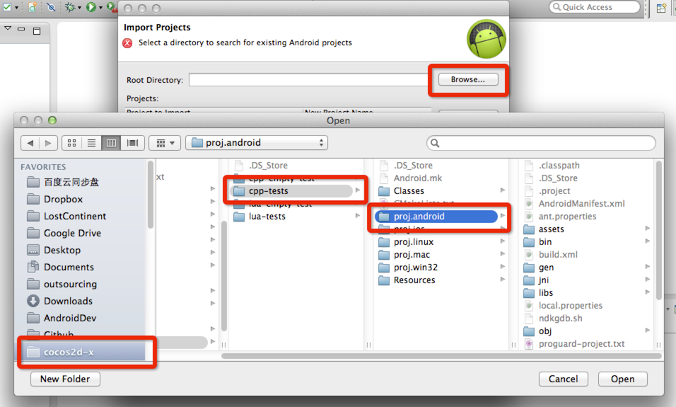

# EclipceでAndroidのプロジェクトをビルドする方法

このページでは,Cocos2d-xのAndroidプロジェクトをEclipceを通してビルドする方法を説明します。
Eclipceはマルチプラットフォームのソフトウェアなので,一例としてMacOSを使用して説明します。
他のプラットフォームでの進行方法も大体同じです。

## 始める前に

- ADT bundleをダウンロードしましょう

まず [Android SDK](https://developer.android.com/sdk/index.html?hl=sk) をダウンロードしましょう, その中にEclipceフォルダがあると思います。
そこにあるEclipceアイコンをダブルクリックすることでプログラムを起動することができます。

- JDK,Android NDK,python をインストールして設定する。

Android用のコマンドライン開発環境を設定するために [このドキュメント](https://github.com/cocos2d/cocos-docs/blob/master/manual/framework/native/getting-started/v3.0/how-to-run-cpp-tests-on-android/en.md) を見ることをお勧めします。

少なくとも,JDK,AndroidNDK,pythonを設定しておく必要があります。

あなたがAndroidプロジェクトをビルドするためにpythonコマンドを実行することができるなら,それEclipceで始めるほうがはるかに簡単でしょう。

## ワークフロー

私たちは,EclipceでAndroidプロジェクトをビルドする場合,以下のようなワークフローを提案します

- proj.androidディレクトリに行って`python build_native.py`を実行します. (注: もしあなたがCpp-Testsをビルドしようとしている場合は,ディレクトリをビルドする為に `python android-build.py -p 10 cpp-tests`コマンドを実行します。) もしこれを行う方法が分からない場合,[このリンク](https://github.com/cocos2d/cocos-docs/blob/master/manual/framework/native/getting-started/v3.0/how-to-run-cpp-tests-on-android/en.md) を参照してください。

- Eclipseで既存のAndroidプロジェクトを開きます。

- libcocos2dx projectをインポートします。(注意: cpp-testsプロジェクトをビルドする場合を除き,Cocos2d-xのディレクトリの下libcocos2dxプロジェクトをインポートしないでください。 あなたが`cocos` コマンドでプロジェクトを作成した場合は,あなた自身のプロジェクトディレクトリの下にlibcocos2dxをインポートしていることを確認してください。)

- Androidプロジェクトをビルドし,実行します。

私はどのようにこのワークフローを実行する方法を示すために次の2つの例を使用します。

## Cpp-Testsをビルドします

### python scriptsを使用してCpp-Testsをビルドします

まず始めに, [Cocos2d-x](http://www.cocos2d-x.org/download) and unzip it under a location. をダウンロードして解凍します。私たちは,私のホームディレクトリの下に解凍します。

ターミナルを開いて, Cocos2d-xフォルダのディレクトリを`ビルド`します。以下はスクリーンショットです

そして,cpp-tests Androidプロジェクトをビルドする為に,`python android-build.py -p 10 cpp-tests` コマンドを実行してください。

ターミナルからビルドの成功メッセージが得られたら, [Cocos2d-x root]tests/cpp-tests/proj.android/libs/armeabi/libcpp_tests.so `にあるはずのlibcocos2dcpp.soファイルがあるかどうか調べなければなりません

### エクリプスでproj.androidプロジェクトを開く

ここでの処理は次の通りです。

- Eclipceを起動

- `パッケージエクスプローラ`の空白領域でマウスを右クリックし,`インポート`を選択します. 

- ポップアップダイアログから `Existing Android Code Into Workspace`を選択して`次へ`をクリックします.

- `参照...`をクリックして,Cpp-Testsの' `proj.android`ディレクトリを選択して,OKをクリックします。

proj.androidディレクトリを選択する前

proj.androidディレクトリを選択した後

- 完了をクリック

上記すべてのプロセスが正しければ`完了`ボタンが使用可能になっているはずなので,それをクリックしてください。

### Libcocos2dxプロジェクトをインポート
これはおおよそ,パスが proj.androidの時と異なること以外は前のセクションと同じ処理です。

libcocos2dx プロジェクトのパスは `[your Cocos2d-x root]cocos/2d/platform/android/java`です。 

### Androidプロジェクトをビルドし,実行する
今,あなたはAnfroidプロジェクトをビルドして実行できるが,しかしそれにはいくつかやらなければいけないことが残されている。

まず初めに, あなたは`USBリモートデバッグ`が有効になったAndroid携帯電話を接続しなければなりません

その後,あなたは,携帯電話を認識させるために,あなたのコンピュータにいくつかのドライバをインストールする必要があるかもしれません。どちらにしても携帯電話を認識することを確認する必要があります。

最後に,`CppTests`プロジェクトを右クリックして `実行` -> `Androidアプリケーション`を選択します。

以下はスクリーンショットです。

##作成された空のプロジェクトを`cocos`コマンドでビルドする
ここでの処理は,作成された空のプロジェクトを [cocos](https://github.com/cocos2d/cocos-docs/blob/master/manual/framework/native/getting-started/v3.0/how-to-start-a-new-game/en.md)コマンドでビルドします。Cpp-Testsプロジェクトをビルドするときもほぼ同じです。
それでは,やっていきましょう。

###cocosコマンドでビルドする。
(注 これは前のセクションと同じでないかもしれませんが,しかしあなたはproj.androidディレクトリを操作することで,build_native.pyスクリプトを実行することができます。)

私たちはpythonスクリプトの`cocos run -s ~/MyCompany/MyGame -p android`を使用することができます。詳細については[このドキュメント](https://github.com/cocos2d/cocos-docs/blob/master/manual/framework/native/getting-started/v3.0/how-to-start-a-new-game/en.md)を参照してください。

###Eclipceでproj.androidプロジェクトを開く。
私たちが前のセクションで行ってきた処理のまさにそのままです。
###Libcocos2dxプロジェクトをインポートする。
同じことですが,MyGameフォルダの下でⅡlibcocos2dxプロジェクトをインポートするのを忘れないでください。
###Androidプロジェクトをビルドし,実行する。
面倒に感じるかもしれませんが,この作業も同じことです。

## トラブルシューティング
- もしAndroidプロジェクトをインポートした際にエラーが発生しても,心配しないでください。libcocos2dxプロジェクトをインポートしたらそれは消えます。

- あなたはすべてのプロジェクトをインポートしても,エラーが残っている場合は,libcocos2dxのbinディレクトリの下にlibcocos2dx.jarファイルがあるかどうかを確認する必要があるかもしれません。

- あなたのAndroid携帯電話にプロジェクトをインストールして,起動時にクラッシュした場合 `libs/armeabi`ディレクトリの下に`libxxx.so`ファイルがあることを確認してください。

## 要約
あなたがこれらのプロセスに従えば,EclipceでAndroidプロジェクトをビルドし,実行するのはそこまで難しいことではありません。

それでもできないのならば,ワークスペースをクリーンしてもう一度これらのプロセスを試してみてください。

問題を解決する為に,Eclipceを再起動する必要があるかもしれません。

それでももしできない場合はこの[フォーラム](http://www.cocos2d-x.org/forums/6)に投稿して頂ければと思います。