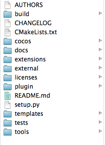
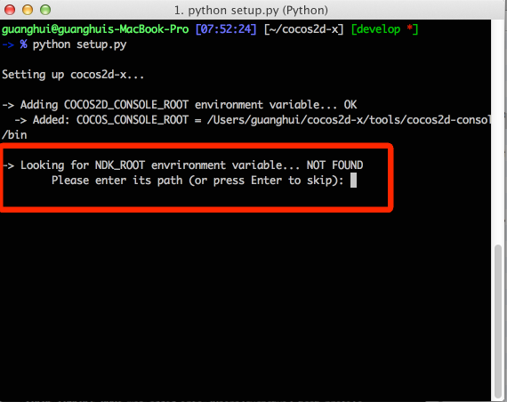
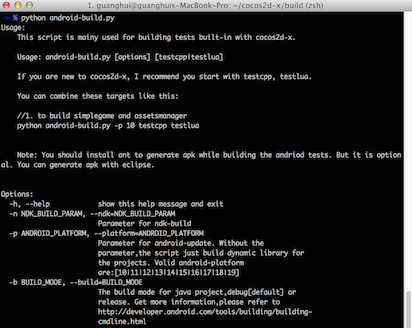
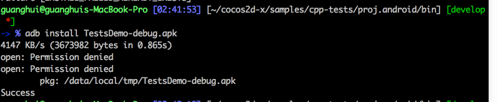

## Android端末でCocos2d-xのサンプルを実行する方法

それでは,例としてMacOSを見てみましょう。Win32とLinux上のプロセスは多少の違いがありますが,基本的には同じです。

### 初めに

#### Cocos2d-xをダウンロード
まず初めに,Cocos2d-xを[ダウンロード](http://cocos2d-x.org/download)し,解凍してください。  
この例では,ホームフォルダのルートディレクトリに解凍しています。

cocos2d-xフォルダを開くと,スクリーンショットのようなフォルダ,ファイルが展開されます。



開発構築を構築する前に,いくつかのソフトをダウンロードします。

#### JDKのSDKとNDKをダウンロード
私達は,Android端末を使用したゲームを開発するので,Javaが必要になります。

- まずはターミナルを開きます。(Control + SpaceでSpotlightを開き,"ターミナル"と入力し,"Enter"を押します)

次のコマンドは,あなたのマシンがJavaをサポートしているかを確認します。

```
java -version
```

以下の行がターミナルに表示される場合は,[JDK](http://www.oracle.com/technetwork/java/javase/downloads/index.html)が正しくインストールされています。

(Javaのバージョンが異なる場合もありますが,問題ありません。Cocos2d-xではJDKのバージョン1.6または1.7のインストールを推奨します。)

```
java version "1.7.0_51"
Java(TM) SE Runtime Environment (build 1.7.0_51-b13)
Java HotSpot(TM) 64-Bit Server VM (build 24.51-b03, mixed mode)
```
- Android SDKをダウンロードします。Macを使用している場合は,この[リンク](https://developer.android.com/sdk/index.html?hl=sk)をクリックして,Mac用のADT Bundleをダウンロードしてください。

ADT Bundleには最新のAndroid SDK, Android Development Tool, Eclipseが含まれているので,
新たにEclipseをダウンロード,インストールする必要はありません。

ダウンロードが完了したら,任意のフォルダにパッケージを解凍します。この例では~/AndroidDevディレクトリに解凍します。  
解凍したフォルダにはSDKとEclipseの2つのフォルダが存在するので,Eclipseを起動してください。次のスクリーンショットのようにSDKをバージョン別にインストールすることができます。


- NDKをダウンロードします。この[リンク](https://developer.android.com/tools/sdk/ndk/index.html)からダウンロードすることができます。NDKは最新のバージョンを使用するのを推奨します。この記事を書いた段階での最新バージョンは*r9d*です。

ダウンロードが完了したら,Android SDKと同じディレクトリにパッケージを解凍します。この例ではAndroidDevディレクトリです。


#### 環境を確認します
これで必要なソフトウェアが全て揃いました。最後に,構築した環境の検証を行います。

まず,python 2.7がインストールされているかを確認します。ターミナル(Win32の場合はコマンドライン)を開き,`python --version`と入力してください。  
以下の様な結果になれば,pythonがインストールされている事になります。

```
-> % python --version
Python 2.7.5
```

プロンプトに"command not found: python"と表示される場合は,pythonがインストールされていません。homebrewのpythonをインストールしてください。

```
brew install python
```
homebrewがインストールされていない場合は,この[リンク](http://brew.sh/)を参照してください。

最後に,ANTをインストールします。あなたがhomebrewのユーザの場合,ターミナルで以下のコマンドを入力することでインストールすることができます。

```
brew install ant
```


### 行動をする時間 - 段階的なガイド
Androidの開発環境を構築するのはなかなか大変です。ですが,それだけの価値はあります。

#### Androidの開発環境を構築するためにsetup.pyを使います
初めに,ターミナルとcdコマンドを使い~/cocos2d-xを開きます。

lsコマンドを入力した場合,全てのファイルを閲覧する事ができます。

`python setup.py`と入力すると,次のスクリーンショットのような結果になると思います。



~/cocos2d-x/tools/cocos2d-consoleディレクトリの下のbinディレクトリを指すように*COCOS2D_CONSOLE_ROOT*環境変数を追加しました。


そして,*NDK_ROOT*環境変数が探索されます。以前に環境変数を設定している場合は問題ありませんが,環境変数を設定してない場合はスクリーンショットの様に環境変数の追加を促すプロンプトが表示されるので,NDKの環境変数を設定します。

今回の例ではAndroidDevディレクトリに解凍したのでこのように入力します`/Users/guanghui/AndroidDev/android-ndk-r9d/`

注意：この作業はあなた自身のユーザディレクトリパスを展開してください。そうでない場合はパスが違うというエラーが発生します。

ここまでのスクリーンショットです。


環境を構築する最終段階に入りました。最後は*ANDROID_SDK_ROOT*の環境変数を設定します。`/Users/guanghui/AndroidDev/adt-bundle-mac-x86_64-20130522/sdk/`と入力してください。  
adt-bundle-mac-x86_64-xxxxのxxxx部分は異なる可能性があるので,注意して入力してください。

ANTをインストールしていない場合,始めにANTをインストールしておく必要があります。  
ANTをインストールした後,*ANT_ROOT*を設定するスクリプトが表示されます。
Enterキーでスキップすることも可能です。


全ての環境変数が正しく設定されている場合,それらを有効にする必要があります。このコマンドを実行してください。

```
source ~/.bash_profile
```

Win32システムの場合はコマンドラインを閉じて,再起動してください。


#### android-build.pyを使ってCocos2d-xのサンプルをビルド

Cocos2d-xに内蔵されているサンプルをコンパイルします。

初めに,android-build.pyが存在するディレクトリに変更する必要があります。変更した後に

```
cd build
```

と入力し,

```
python android-build.py -p 10 cpp-tests
```
と入力し,エンターキーを押すとスクリプトが実行されます。

もしも,ターミナルで`python android-build.py`のみを入力すると次のような結果になります。



あなたが初めてCocos2d-xをビルドする場合,ヘルプ情報を注意してお読みください。

問題なくできた場合,次のようなメッセージが表示されると思います。


#### コマンドライン経由でAndroid端末に展開する方法
これからAndroid端末でテストをします。

まず初めに[USBデバッグ](http://stackoverflow.com/questions/16707137/how-to-find-and-turn-on-usb-debugging-mode-on-nexus-4)を有効にし,PCとAndroid端末をUSBケーブルで接続してください。

次にディレクトリを変える必要があります。testcppディレクトリ内のandroid project内のbinに変更します。

```
cd ~/cocos2d-x/tests/cpp-tests/proj.android/bin
```

(現在のディレクトリがある場合,ビルドに`cd ../tests/cpp-tests/proj.android/bin`のようないくつかの相対パスを使用する事ができます。)

次にあなたのAndroid端末にapkをインストールする為,ADBを使用します。

```
adb install CppTests-debug.apk
```

もしもADBのコマンドが使用できない場合,ターミナルで以下のコマンドを実行するか,~/.bashrc file.に以下の行を追加してください。

```
 export PATH=$PATH:$ANDROID_SDK_ROOT/tools:$ANDROID_SDK_ROOT/platform-tools
```

次のスクリーンショットのような結果が出れば成功です。おめでとうございます！



#### トラブルシューティング
- setup.pyファイルを構成した後にNDK_ROOTが存在しないなどの問題が発生した場合,恐らく~/.bash_profileにNDK_ROOTの記述が欠落している可能性があります。

- WindowsPCを使用している場合は,ファイルシステムの表記規則の違いなどに注意してください。


### 要約すると
この記事では開発環境としてMacOSを使用しています。ですが,他のプラットフォームでも問題なく動作するはずです。

あなたがcocos2d-consoleを使用してプロジェクトを作成している場合,[当ページ]()を参考にしてみてください。Android端末で実行するための手助けになるかもしれません。

なにか問題がありましたら,[フォーラム](http://cocos2d-x.org/forums/6)に投稿して頂ければと思います。