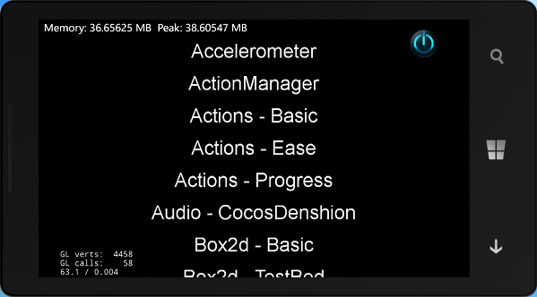
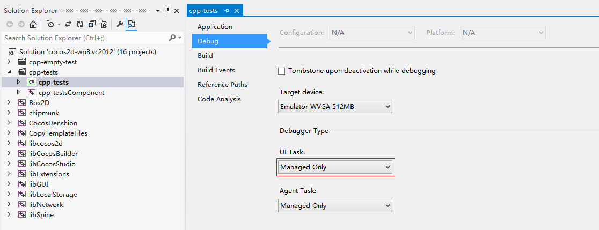

# How to Run cpp-tests on WP8

In this article, I will show you how to run cpp-tests on your windows PC.

## Environmental Requirements

- Windows version: Windows 8.0/8.1

- Cocos2D-X version: Cocos2d-x v3.0 ([https://github.com/cocos2d/cocos2d-x/](https://github.com/cocos2d/cocos2d-x/ "cocos2d-x"))

- IDE: Visual Studio 2012

- SDK: windows phone SDK 8.0 [http://dev.windowsphone.com/en-US/downloadsdk](http://dev.windowsphone.com/en-US/downloadsdk)

## Enable to start develop on Windows phone

### registe to be a windows phone developer

visit the MSDN's windows phone link of developer register [http://msdn.microsoft.com/en-us/library/windowsphone/help/jj206719(v=vs.105)](http://msdn.microsoft.com/en-us/library/windowsphone/help/jj206719(v=vs.105))

fill with your windows account and register Windows phone developer account in steps

explanation of the Windows account: your account of Hotmail or SkyDrive or Xbox LIVE

the fee of developer account: $19 per year, while students account is free but cannot release applications with fees.

## Compile and Run the TestCpp Project

- Download Cocos2d-x from our [download page](http://cocos2d-x.org/download) and unzip it on your working directory. The structure of the directory should look like as following:

- Open file "cocos2d-wp8.vc2012.sln" in "build" folder as following:

- Right click the "cpp-tests" project, and select "Set as StartUp Project", you can select "Emulator" or a "Device" to run project, if you use Device, you need to connect your phone device using usb.

then you can compile and run the TestCpp project, here is the screenshot in Emulator:

## How to debug in project

right click cpp-tests, select "Properties", in "Debug", you can select debug target:

If you select "Managed Only" in "UI Task", it's to debug c# code in cpp-tests. And if you select "Native Only", it's to debug c++ code in cpp-testsComponent. Note that If you select "Native Only" and want to use CCLog function to write log in Output, right click cpp-testsComponent and define "COCOS2D_DEBUG=1" in "Preprocessor Definitions":

