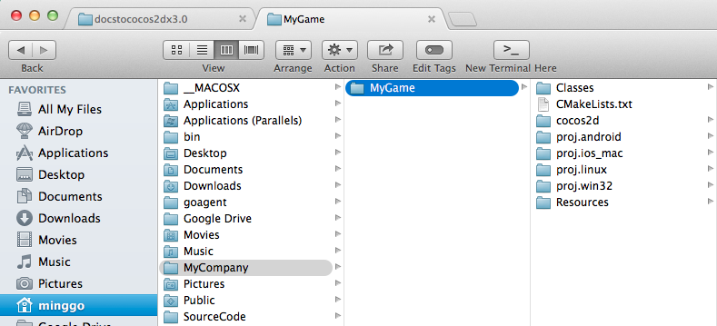
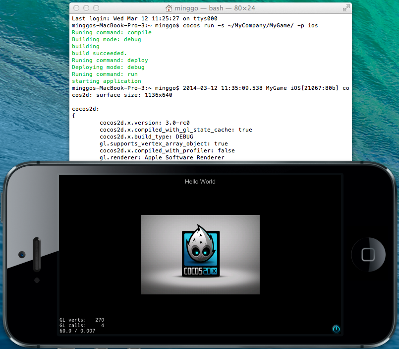

# How To Start A New Game

This documentation will show you how to use [cocos console](https://github.com/cocos2d/cocos2d-console) to create and run a new project. 

## Runtime Requirements

* Android 2.3 or newer
* iOS 5.0 or newer
* OS X 10.7 or newer
* Windows 7 or newer
* Linux Ubuntu 12.04 (or newer)
* Cocos2d-x v3.0rc(or newer)

## Software Requirements

* Xcode 4.6 (for iOS or Mac)
* gcc 4.7 for Linux or Android. For Android ndk-r9 or newer is required.
* Visual Studio 2012 (for Windows)
* Python 2.7.5

## Create A New Project

    $ cd cocos2d-x
    $ ./setup.py
    $ source ~/.bash_profile # may be ~/.bash_login or ~/.profile, depends on your environemnt
    $ cocos new MyGame -p com.MyCompany.MyGame -l cpp -d ~/MyCompany

* `MyGame`: name of your project 
* `-p com.MyCompany.MyGame`: package name for android
* `-l cpp`: programming language used for the project, valid value is `cpp`and `lua`
* `-d ~/MyCompany`: directory to hold your project

Folder structure of the generated project is as following:

(Note: The directory may be different when the project type is lua.)

## Build And Run New Project

    $ cocos run -s ~/MyCompany/MyGame -p ios
    
* `-s`: directory of the new project. This could be an absolute path or a relative path.
* `-p`: which platform to run on. Options are `ios`,`android`,`win32`,`mac` and `linux`.

(Note: You are a tmux user, you should add `reattach-to-user-namespace` before the command `cocos`. For more information, please refer to [this link](https://github.com/phonegap/ios-sim) for more information.)

You can run `cocos run --help` for more detail information.

### For Win32 Users

