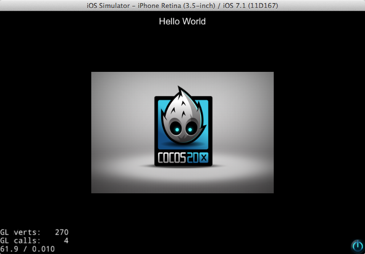

#Xcode下运行HelloWorld

##准备工作

到Cocos2d-x官方网站下载最新版本[v3.2alpha0](http://cocos2d-x.org/download)

##创建HelloWorld项目

将刚才下载的压缩包解压到你指定的文件夹里。

进入到目录**cocos2d-x-3.2alpha0/tools/cocos2d-console/bin/cocos.py**

打开终端运行**cocos.py**脚本创建文件

```
./cocos.py new HelloWorldDemo -p com.coco2dx.org -l cpp -d ~/Desktop

或者

python cocos.py new HelloWorldDemo -p com.coco2dx.org -l cpp -d ~/Desktop
```

参数说明：

- HelloWorldDemo为项目名称
- `-p`后面接包名
- `-l`后面接开发语言类型，有cpp, lua, js三种类型
- `-d`后面接项目存放的目录

##运行项目

项目创建完成后，用Xcode打开**HelloWorldDemo/proj.ios_mac**里的Xcode项目文件，运行项目


