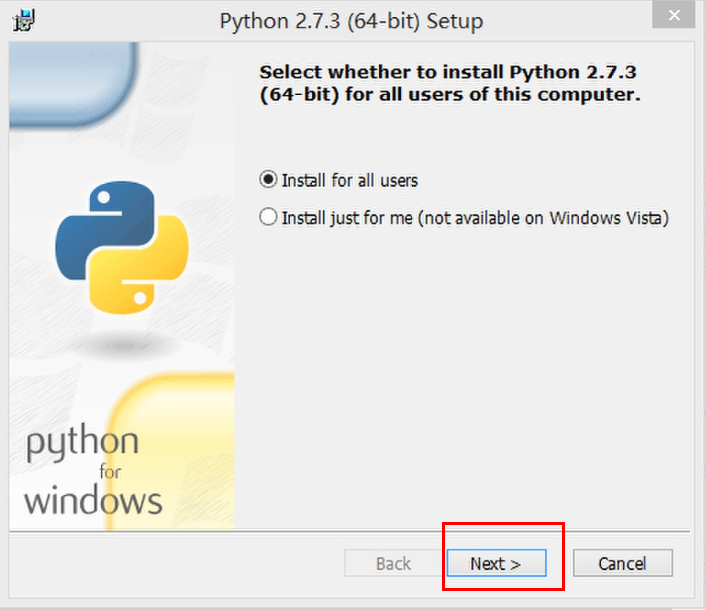
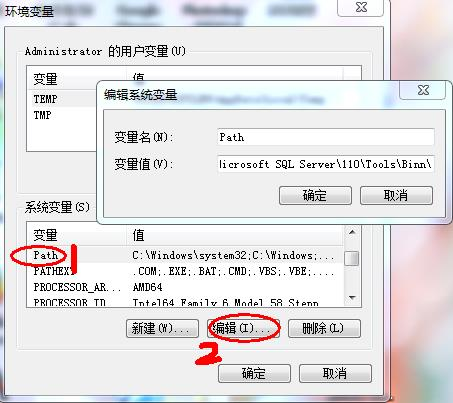
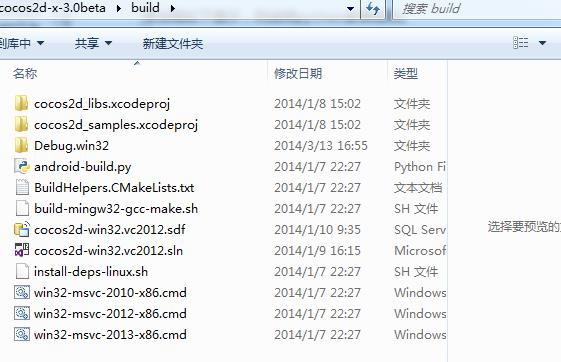
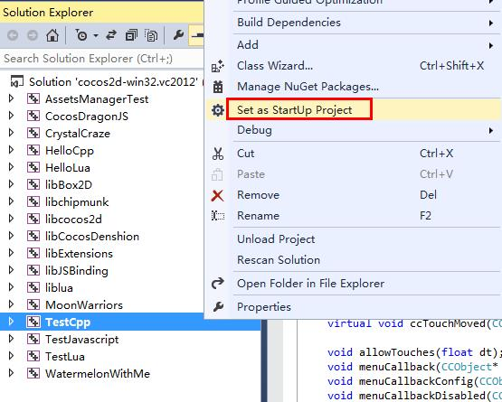

# 在Windows7上搭建Cocos2d-x 3.2alpha0开发环境
---

在windows7上搭建COCOS2D-X开发环境并不难， 但是由于框架更新过快，很多用户都有困难。我希望你们认为这个教程有用。

建议：为了避免安全相关的问题，请以管理员权限执行所有的操作，当运行命令的时候，也要确保之前是以管理员权限打开了命令行窗口.


## 工具准备

搭建开发环境需要安装工具包括

- Visual Studio    
- python  ———(本教程以python2.7.3版本为例），下载地址：[http://www.python.org/download/releases/2.7.3/](http://www.python.org/download/releases/2.7.3/)。     
- Cocos2d-x ———(本教程以cocos2d-x-3.0版本为例），下载地址：[https://code.google.com/p/cocos2d-x/downloads/list](https://code.google.com/p/cocos2d-x/downloads/list)。
    
## 安装配置过程
Visual Studio 的安装过程略过，本教程主要讲解python2.7.3和cocos2d-x-3.2alpha0的安装配置过程。

### 安装配置python2.7.3
#### 1. 下载并安装python2.7.3。         

#### 2. 配置环境

右键单击“计算机”，选择“属性”----》“高级系统设置”，在“高级”选项卡下选择“环境变量”!      
       

在“系统变量”下选中“Path”，并点击下方的编辑按钮：    
      

在弹出的“编辑系统变量”对话框中编辑“变量值”，在“变量值”的后面添加Python的安装路径（D:\Program Files (x86)\Python27），用英文分号（;）将其与后面的其他内容隔开。    
   

同样地，在“PATHEXT“的变量值中添加 .PY;.PYM 。

#### 3. 检验安装是否成功
打开cmd控制台，输入 python，如果出现如下提示，则说明python安装成功。


### 安装创建cocos2d-x-3.2alpha0项目

- cocos2d-x-3.2alpha0项目无需安装，下载cocos2d-x-3.2alpha0文件并解压，打开 “build”目录，直接双击运行 cocos2d-win32.vc2012.sln解决方案即可。       
     
    

- 将你要运行的项目设为启动项，点击运行。



- 如果一切正常，你将得到如下的界面。那么祝贺你！你已成功的在Windows 7平台中运行Cocos2d-x引擎了。


#### 创建项目

进入到目录**cocos2d-x-3.2alpha0/tools/cocos2d-console/bin/cocos.py**

打开终端运行**cocos.py**脚本创建文件

```
python cocos.py new HelloCpp -p com.coco2dx.org -l cpp -d ~/Desktop
```

参数说明：

- HelloCpp为项目名称
- `-p`后面接包名
- `-l`后面接开发语言类型，有cpp, lua, js三种类型
- `-d`后面接项目存放的目录


- 查看项目路径，你会发现目录中会出现新建的“HelloCpp”项目。依次打开“ HelloCpp/proj.win32 ”文件夹，“ HelloCpp.sln ”解决方案，单击运行项目。出现下面的界面则项目创建成功        


 
