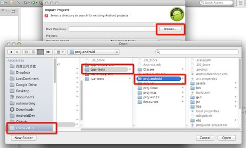
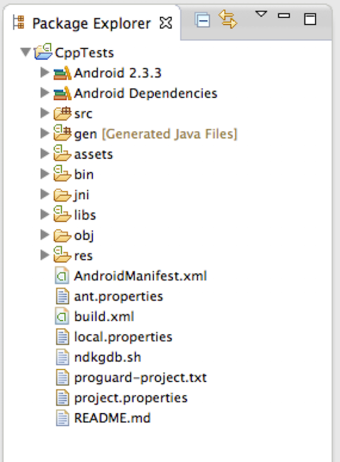

# Eclipse ADT （已弃用）

## 背景

由于 Google 自 2015 年底已中止了对 ADT 的支持，希望开发者转向 Android Studio。同时 Android Studio 的功能也已日趋完善，足够我们使用它完成 Cocos2d-x 项目的全部开发流程：编码、编译、调试、发布。因此自 3.16 版本我们不再支持 ADT。

如果你是一个新手，请转向 [Android Studio](Android-Studio.md) 进行 Cocos2d-x 的环境搭建学习。如果明确有对老版本引擎的 Android 环境搭建需求，请继续阅读。

## 工具准备

* 完成上一节的 **[Android 命令行](Android-terminal/index.html)**，上一节是本节的基础

* 下载 Eclipse ADT [//www.eclipse.org/downloads/](//www.eclipse.org/downloads/)

## 导入游戏项目

1. 打开 Eclipse

1. 在 _Package Explorer_ 的空白区域鼠标右键，选择 _Import_

1. 在弹出框中选择 _Existing Android Code Into Workspace_，点击 _Next_

    

1. 点击 _Browse_ 按钮，进入上一节操作的 __cpp-tests__ 项目目录，进入 _proj.androi_ 子目录，点击确定

    

1. 点击 __Finish__，等待导入操作完成

## 导入库项目

* 导入库项目的步骤基本与导入游戏项目一致，不同的是在 _Browse_ 步骤，选择引擎根目录下 _/cocos/platform/android/java_ 子目录。

    

* 导入完成后，将库项目添加到游戏项目 Java Build Path 的 Project 中。

## 构建并运行

* 将开启 USB 调试的手机，连接到电脑上。

* 确保你的电脑能识别手机 _对于某些机型可能需要安装驱动_。

* 右键游戏项目，选择 _Run as_，在子菜单中选择 _Android Application_。

    

> 注意：本文档教程只适用于 Cocos2d-x V3.15 或更低的版本
