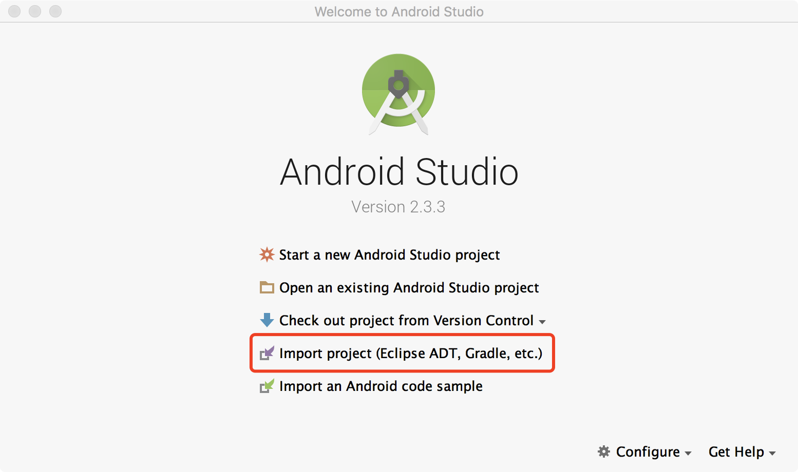
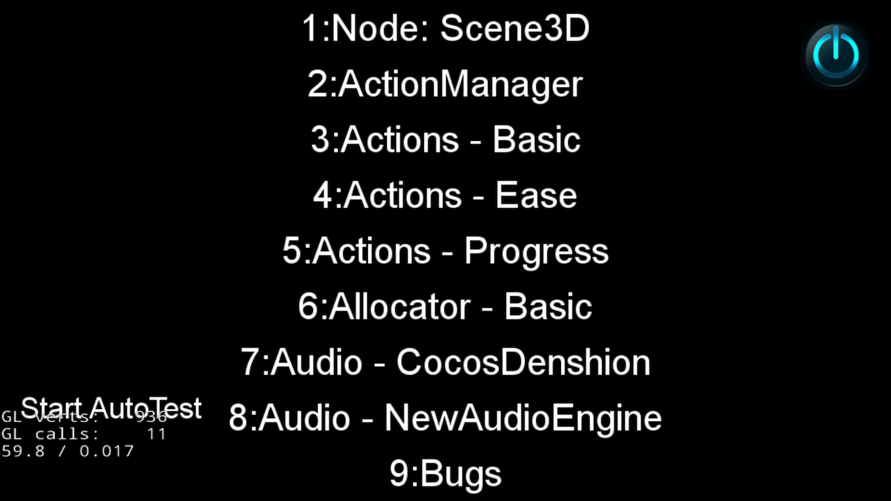
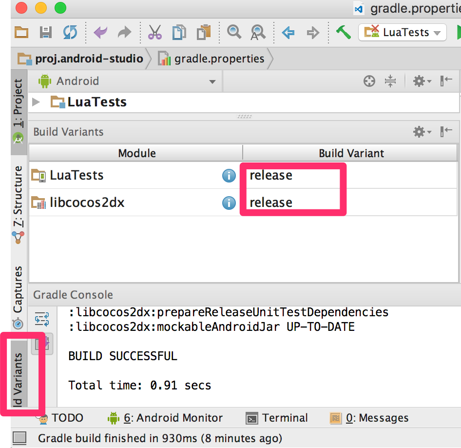
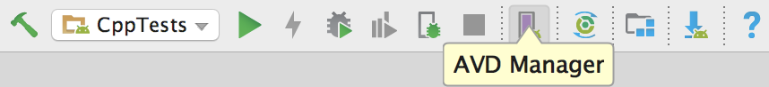
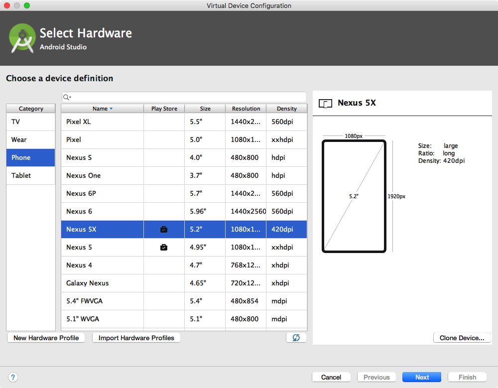

# cocos2d-x 在 Android Studio 的环境搭建

## 工具准备

1. Android Studio v2.3， 下载参见：[Google中国开发者网站](https://developer.android.google.cn/studio/index.html)
1. cocos2d-x v3.16，下载后解压，下载参见：[Cocos官网页面](http://www.cocos.com/download)

## 配置步骤：

1. 完成 Android Studio 安装，进入欢迎界面，选择 `Import project(Eclipse ADT, Gradle, etc.)`。选择目录`cocos2d-x root/tests/cpp-tests/proj.android-studio`，点击 `OK` 进入IDE主界面。

    

1. 第一次导入 cocos2d-x 工程，控制台会提示缺少组件，点击提示下方的链接，下载安装即可。提示类似：

    ```console
    Gradle sync failed: Failed to find target with hash string 'android-14' in ...
    Gradle sync failed: Failed to find Build Tools revision 25.0.0
    ```
1. 组件安装完成，点击工具栏 `Run`，进行编译运行，编译过程可能会花费一点时间。

    
1. 选择运行应用的设备，IDE将自动安装应用，并控制应用展示主界面。建议直接使用Android手机接入电脑作为设备，进行测试。这样应用会有较快的运行速度。如果使用模拟器请下载ARM的Image进行模拟器的创建。运行成功界面：

    

## 如何调试(Debug)

* __Android Studio 2.3+__ 已经支持 C++ 代码的调试，按照以下步骤，进行 cpp-tests 的调试

    1. 点击代码行左侧的空白，设置断点
    1. 以 debug 模式运行 cpp-tests
    1. 操作 App 触发断点，IDE 将卡在断点处，在底栏打开`Debug`视图，可以查看运行堆栈和变量的值

    

## 如何打包

按照下面的步骤，构建 App 的发布(Release)版本

1. 将 __Build Variant__ 设置为 __release__ 模式
1. 在 __gradle.properties__ 文件中，添加签名信息
1. 对于 Lua 项目，如果想加密 Lua 代码，也需要在 __gradle.properties__ 文件中添加签名信息

    

    

## 模拟器的创建

1. 点击工具栏 `AVD Manager` 进入模拟器的管理界面。

    
1. 在 `Android Virtual Device Manager` 界面左下角，可以看到按钮 `Create Virtual Device...`，点击进入 `Choose a device definition`页面，选择设备，此处选择只决定了尺寸和分辨率，与设备中运行的系统无关。此处选择 `Nexus 5X`，选择后点击 `Next`，进入选择系统镜像页面。

    
    


1. 在 `Select a system image` 界面，选择系统镜像，此处选择决定了设备的`API Level` 和 `ABI`。`API Level`代表了 Android 系统版本，如 API Level 24，代表 Android 7.0 系统。`ABI` 是与CPU相关的一个参数，Intel 处理器多为x86，高通处理器 多为ARM。更多关于 ABI 的了解,参见官方文档 [ABI 管理](https://developer.android.google.cn/ndk/guides/abis.html?hl=zh-cn)。

    

1. 选择完成，点击 Next，进入`Verify Configuration`，点击 Finish 结束。

## FAQ

### 如何使用 x86 ABI 的模拟器运行 cocos2d-x 的 cpp-tests 项目？

在项目中找到 `gradle.properties` 文件，将 `PROP_APP_ABI=armeabi` 修改为 `PROP_APP_ABI=x86`，点击提示中的 `Sync Now`，完成后重新编译运行。

### 如何下载ARM的Image进行模拟器的创建？

依照**模拟器的创建**中的步骤，在`Select a system image` 界面，到 `Other Images` 选项卡， 选中 ABI 为 armeabi 的系统镜像。