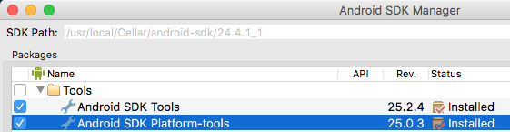

# Android 命令行（已弃用）

## 背景

由于 Google 自 2015 年底已中止了对 ADT 的支持，希望开发者转向 Android Studio。同时 Android Studio 的功能也已日趋完善，足够我们使用它完成 Cocos2d-x 项目的全部开发流程：编码、编译、调试、发布。因此在 3.16 版本我们不再支持 ADT。

如果你是一个新手，请转向 [Android Studio](Android-Studio.md) 进行 Cocos2d-x 的环境搭建学习。如果明确有对老版本引擎的 Android 环境搭建需求，那请继续阅读。

## 工具准备

在正式开始搭建 Cocos2d-x 开发环境之前，你需要一个可用的 Android 开发环境。这包括

* JDK/SDK 1.6+ [http://www.oracle.com/technetwork/java/javase/downloads/index.html](http://www.oracle.com/technetwork/java/javase/downloads/index.html)

* Android NDK [https://developer.android.com/tools/sdk/ndk/index.html](https://developer.android.com/tools/sdk/ndk/index.html)

* Apache Ant [http://ant.apache.org/bindownload.cgi](http://ant.apache.org/bindownload.cgi)

* Python 2.7.X [https://www.python.org/downloads/](https://www.python.org/downloads/) _不是 PYTHON 3_

你的操作系统可能已经包含其中一些了，请下载缺失的组件。

## macOS 配置

### Python

macOS 系统默认安装了 Python，请在终端中输入以下命令，验证 Python 是否工作。

```sh
> python --version
```

如果有类似下面的输出，版本号是 2.7.X，证明 Python 环境是好的。

```sh
Python 2.7.10
```

如果是找不到命令，请使用工具准备中提到的链接，安装一个 2.7.X 新版本的 Python，注意不要安装 Python 3.X 的版本。

### JAVA

macOS 系统默认是不安装 Java 的，所以你需要手动下载 Java，注意要下载 JDK，而不是 JRE。


下载安装完成后，在终端中输入以下命令验证 Java 环境是否自动配置好。

```sh
> java -version
```

如果可以看到类似下面的输出，则证明环境是好的，

```sh
java version "1.8.0_111"
Java(TM) SE Runtime Environment (build 1.8.0_111-b14)
Java HotSpot(TM) 64-Bit Server VM (build 25.111-b14, mixed mode)
```

如果命令不可用，请自行配置环境变量，配置完后通过 `java -version` 验证环境是否配置成功。

### Apache Ant

__Apache Ant__ 是另一个需要的工具，默认没有安装在 OS X 系统上。请使用工具准备中提到的链接下载，建议直接下载二进制版本。

下载后解压缩，在 _.bash\_profile_ 中添加一个 _ANT\_ROOT_ 的环境变量，变量值是 _Apache Ant_ 目录下 bin 子目录的路径，然后将该变量添加到 PATH 中。像这样：

```sh
export ANT_ROOT=/Applications/Cocos/tools/ant/bin
export PATH=$ANT_ROOT:$PATH
```

### Android NDK 和 SDK

显然，进行 Android 开发需要 Android SDK 和 NDK，这两个默认都未安装在 OS X 系统上，你可以使用工具准备中提到的链接进行下载。也有另外一种方式使用 _brew_ 包管理器。

#### 通过 Brew 安装

使用 [__brew__](http://brew.sh/) 安装 NDK 和 SDK 是一种更简单的方式，一个命令，几个环境变量就 OK。这样操作：

```sh
brew install android-ndk android-sdk
```

下载和安装过程会需要一点时间，完成后，你需要在 _.bash_profile_ 设置一些环境变量：

```sh
export NDK_ROOT=/usr/local/Cellar/android-ndk/r12b
export PATH=$NDK_ROOT:$PATH
export ANDROID_HOME=/usr/local/opt/android-sdk
export ANDROID_SDK_ROOT=/usr/local/Cellar/android-sdk/24.4.1_1
export PATH=$ANDROID_SDK_ROOT:$PATH
export PATH=$ANDROID_SDK_ROOT/tools:$ANDROID_SDK_ROOT/platform-tools:$PATH
```

设置完成后，记得执行 `source ~/.bash_profile` 使环境变量生效。

#### 手动安装

如果你选择不使用 _brew_，那就手动下载安装。环境变量的设置与上面的基本相同，假设你将 SDK 和 NDK 下载到了 _~/Projects/_ 目录，设置的环境变量就类似这样：

```sh
export NDK_ROOT=/Users/username/Projects/android-ndk/r12b
export PATH=$NDK_ROOT:$PATH
export ANDROID_HOME=/Users/username/Projects/android-sdk
export ANDROID_SDK_ROOT=/Users/username/Projects/android-sdk/24.4.1_1
export PATH=$ANDROID_SDK_ROOT:$PATH
export PATH=$ANDROID_SDK_ROOT/tools:$ANDROID_SDK_ROOT/platform-tools:$PATH
```

_如果在 Windows 系统上配置，基本流程一致，只是环境变量的配置方式略有区别。_

#### 安装额外的 SDK

不同的 SDK 对应不同的 Android 操作系统，如果你需要测试应用在不同版本上的适用性，就需要下载不同的 SDK。随着 Android 的发展，一些旧有的系统版本已经被弃用，这意味着你无须下载特别旧的 SDK。支持哪些版本，不支持哪些版本，由你来决定。

如果你希望安装额外的 SDK，可以使用内置的 Android 界面工具，使用下面的命令打开工具。

```sh
> android
```


只需要为你已经安装在系统上的 SDK 版本，安装 _Android SDK Tools_，对于 _Android SDK Platform-Tools_ 推荐更新至最新版本。



## 安装 Cocos2d-x

安装 Cocos2d-x 可能是这个过程中最简单的部分，你可以从 [Cocos2d-x 官网](http://www.cocos.com/download) 下载独立的压缩包，也可以克隆 [GitHub 仓库](https://github.com/cocos2d/cocos2d-x)。不用安装这两个，选择你喜欢的一个。

### 下载压缩包

从官网下载压缩包，然后解压。


### 克隆 GitHub 仓库

使用下面的命令克隆 GitHub 仓库，并进行一些初始化设置。如果你不熟悉 GitHub 的工作流程，建议采取从官网下载压缩包的方式。

```sh
cd <to where you want to clone this repo>

git clone git@github.com:cocos2d/cocos2d-x.git

git submodule update --init

git submodule update

./download-deps.py
```

之前不熟悉 GitHub，可以从 [这个地方](https://guides.github.com/activities/hello-world/) 学习后，再从 GitHub 克隆。

## 开发环境验证

在开始一个新项目之前，推荐先构建 cpp-tests 测试项目，他能确保你的开发环境已经完全配置好。如果在这个步骤中发生任何错误，请先仔细阅读错误信息，思考一下是否是上述步骤的环境配置存在问题。

查看有哪些 SDK 版本可用，运行：

```sh
> android list targets
```


在终端中，将目录调整为 _android-build.py_ 脚本的位置，这个脚本通常在引擎根目录 _build_ 子目录下。运行：

```sh
> python android-build.py -p <target from above> cpp-tests
```

`<target from above>` 使用一个版本号代替，如：22。构建成功，证明环境配置没问题。


## 开始新项目

上面的工作都完成后，就可以开始创建新项目了。创建方法，在：[cocos 命令行工具](../editors_and_tools/cocosCLTool.md)。

## 安装应用到手机

在手机上开启 [USB 调试](http://stackoverflow.com/questions/16707137/how-to-find-and-turn-on-usb-debugging-mode-on-nexus-4)，然后通过 USB 连接手机，在终端中调整目录到 Android 项目的 bin 目录，运行下面的命令，即可将 _apk_ 安装到你的 Android 手机：

```sh
> adb install MyGame-debug.apk
```

> 注意：本文档教程只适用于 Cocos2d-x V3.15 或更低的版本
