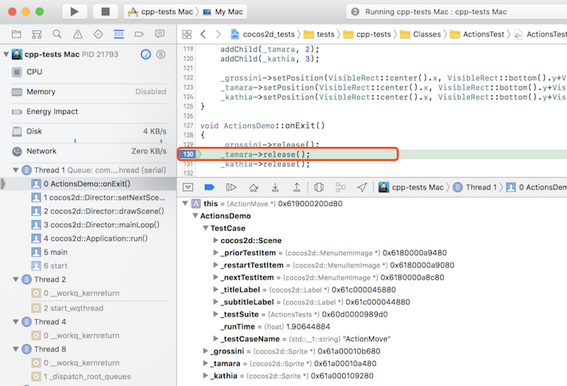

# 搭建开发环境 - iOS

## 工具准备

1. Cocos2d-x v4，下载后解压，下载参见：[Cocos官网页面](//www.cocos.com/download)
1. Xcode 11 下载后安装，下载参见：[Apple官网页面](https://developer.apple.com/download/more/)

## 配置步骤：

__使用 cmake__
```bash
cd COCOS2DX/tests/cpp-tests
mkdir ios-build
cd ios-build
cmake ..
make
```

__使用 Xcode__

先用 CMake 生成 Xcode 工程,
```bash
cd COCOS2DX/tests/cpp-tests
mkdir ios-build
cd ios-build
cmake .. -GXcode -DCMAKE_SYSTEM_NAME=iOS
```
然后打开 `cpp-tests.xcodeproj`，选择 `cpp-tests` 运行.

__使用 cocos 命令行工具__
```bash
cd COCOS2DX/tests/cpp-tests
cocos run -p ios
```

## 如何调试(Debug)

1. 点击代码行左侧的空白，设置断点
1. 运行 cpp-tests
1. 操作 App 触发断点，IDE 将卡在断点处，视图会自动变化，左侧导航栏可以查看运行堆栈，底部窗口可以查看变量的值：

    
