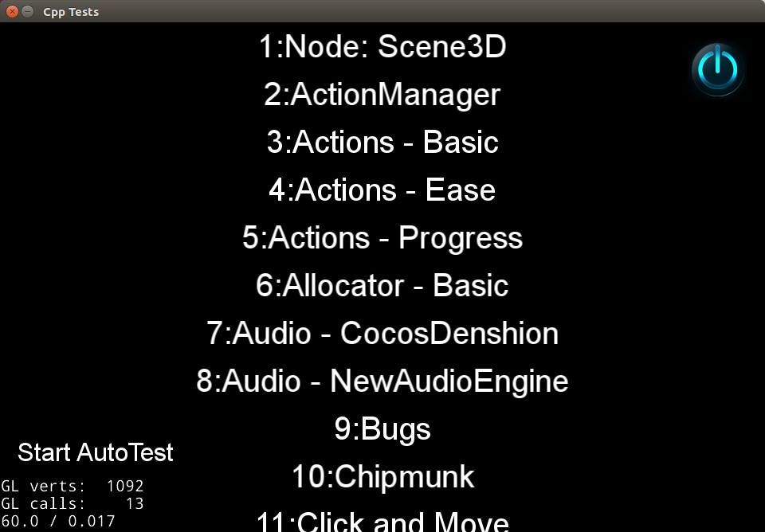

# 搭建开发环境 - Linux 平台

## 工具准备

1. **Ubuntu 16.04**，我们已在 `Ubuntu 16.04` 上做了版本功能的完整验证，建议用户使用此发行版，以防止由于版本不同引发编译或运行错误。下载参见：[官网页面](https://www.ubuntu.com/download/desktop)，[aliyun 镜像站](https://mirrors.aliyun.com/ubuntu-releases/16.04/)。
1. cocos2d-x v3.16，下载后解压，下载参见：[Cocos官网页面](http://www.cocos.com/download)
1. 建议将默认软件源，替换为国内的软件源, 如`http://mirrors.aliyun.com/ubuntu`, 这样在下载依赖时会有更快的速度

## 环境配置

1. 运行引擎文件夹根目录 `setup.py`，脚本将会自动设置一些环境变量，遇到需要交互输入的可以直接回车跳过。

1. 打开终端 terminal，运行脚本 __build/install-deps-linux.sh__ 安装依赖

    ```sh
    > cd $cocos2dx_root/build
    > sudo ./install-deps-linux.sh
    ```

    建议使用 Ubuntu 16.04，使用其它系统，如果脚本未正确执行，请手动安装以下依赖

    ```sh
    libx11-dev
    libxmu-dev
    libglu1-mesa-dev
    libgl2ps-dev
    libxi-dev
    g++
    libzip-dev
    libpng12-dev
    libcurl4-gnutls-dev
    libfontconfig1-dev
    libsqlite3-dev
    libglew*-dev
    libssl-dev
    ```

## 编译 Cocos2d-x

1. 运行 __cmake__ 命令，生成 __makefile__：

    ```sh
    > mkdir linux-build
    > cd linux-build
    > cmake ../..
    ```

    命令执行成功，在 __cmake__ 命令执行时的目录，会生成一系列文件：

    ```sh
    build/linux-build$ tree -L 1
    .
    ├── bin
    ├── CMakeCache.txt
    ├── CMakeFiles
    ├── cmake_install.cmake
    ├── cocos
    ├── external
    ├── lib
    ├── Makefile
    └── tests
    ```

1. 在上面的目录执行 __make__ 命令，项目将进行编译，编译时可以看到百分比:

    ```sh
    > make
    ```

    编译完成，`./bin` 子目录将生成 cocos2d-x 的全部测试项目：

    ```sh
    /build/linux-build/bin$ tree -L 2
    .
    ├── cpp-empty-test
    │   ├── cpp-empty-test
    │   └── Resources
    ├── cpp-tests
    │   ├── cpp-tests
    │   └── Resources
    ├── js-tests
    │   ├── js-tests
    │   └── Resources
    ├── lua_empty_test
    │   ├── lua_empty_test
    │   └── Resources
    └── lua-tests
        ├── lua-tests
        └── Resources
    ```

1. 运行任一测试项目，如 `cpp-tests`

    ```sh
    > cd bin/cpp-tests/
    > ./cpp-tests
    ```
    可以看到这样的效果

    
