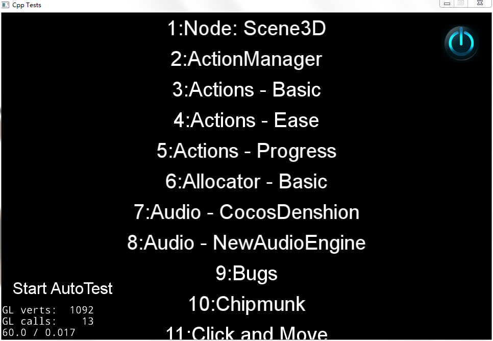
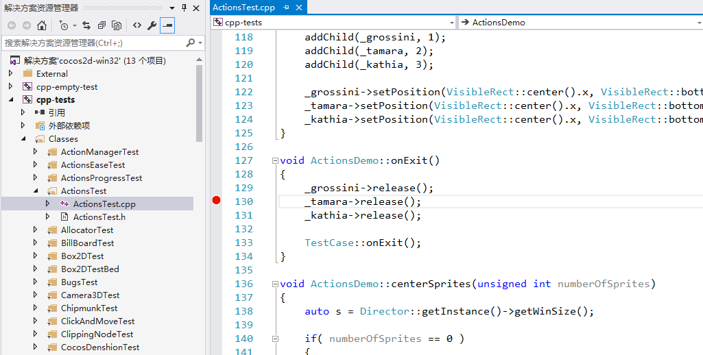
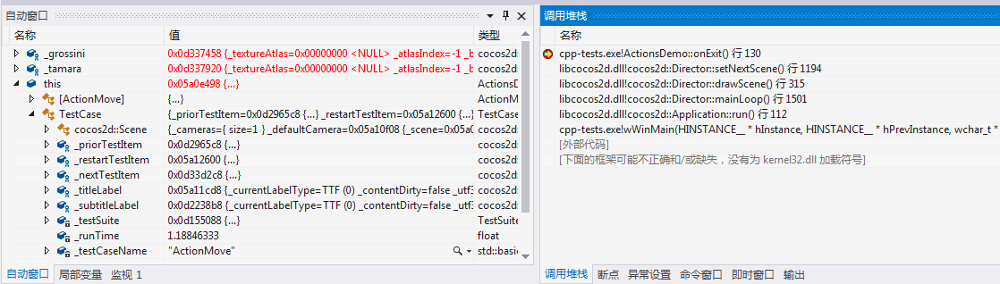

# 搭建开发环境 - Windows 平台

## 工具准备

1. Visual Studio 2015，我们已在 `Visual Studio 2015` 上做了版本功能的完整验证，建议用户使用此IDE，以防止由于版本不同引发编译或运行错误。下载参见：[官网页面](https://www.visualstudio.com/zh-hans/downloads/)，[Visual Studio 2015 发布页面](https://www.visualstudio.com/zh-cn/news/releasenotes/vs2015-update3-vs)。
1. cocos2d-x v3.17，下载后解压，下载参见：[Cocos官网页面](//www.cocos.com/download)

## 配置步骤

1. 双击 `cocos2d-x-3.17\build\cocos2d-win32.sln`， Visual Studio 将打开此解决方案，解决方案打开后，可以看到这样的项目列表：

    

1. 默认情况下项目列表中 `cpp-tests` 加粗显示，表示是启动项目，此时点击菜单栏中`本地 Windows 调试器`进行项目的编译和运行。编译过程视机器性能不同，会花费 10-30 分钟的时间，编译完成后，将自动运行，运行成功将看到测试程序：

    

## 如何调试(Debug)

1. 点击代码行左侧的空白，设置断点

    

1. 以 debug 模式运行 cpp-tests
1. 操作 App 触发断点，IDE 将卡在断点处，`Debug` 视图会自动跳出，可以查看运行堆栈和变量的值

    

## FAQ

### 使用 `Visual Studio 2017` 运行 `cpp-tests` 注意事项

1. 由于 `Visual Studio 2017` 默认下载的组件可能与 `cocos2d-x-3.17.zip` 发布包中项目的配置不同，造成打开 `cocos2d-x-3.17\build\cocos2d-win32.sln` 会缺少组件，按照提示安装。
1. 可能 `Visual Studio 2017` 与 `Visual Studio 2015` 读取配置文件逻辑有差异，`cpp-tests` 未自动设置为启动项目，在项目列表中右键单击此项目，选择 `设为启动项目`。
1. 编译时有工具集报错, 按照报错提示 `右键单击该解决方案，然后选择“重定解决方案目标”` 操作，完成后右键单击项目重新生成。报错信息如下：

     ```error MSB8020: 无法找到 Visual Studio 2010 的生成工具(平台工具集 =“v100”)。若要使用 v100 生成工具进行生成，请安装 Visual Studio 2010 生成工具。或者，可以升级到当前 Visual Studio 工具，方式是通过选择“项目”菜单或右键单击该解决方案，然后选择“重定解决方案目标”。```

1. 解决出现的问题后，`Visual Studio 2017` 可以正常运行 `cpp-tests` ，但也不能保证引擎所有功能都可以在本 IDE 正常运行。**建议使用** `Visual Studio 2015` 与官方测试团队保持一致。

### 通过 CMake 使用模板工程需要了解的一点

通过 `cocos new` 新建 cpp，js，lua 三个工程，使用 CMake 生成 Visual Studio 的工程，cpp 和 js 的工程可以正常编译运行，但是 lua 的工程，编译成功却运行失败？

lua 工程使用了 simulator 的库，导致在 Visual Studio 内运行时，不能正确找到工作目录。需要手动修改工程配置，将项目属性中调试内的工作目录改为 CMake 生成目录下的 `bin\TemplateLua\Debug`。