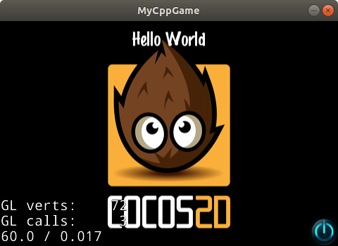
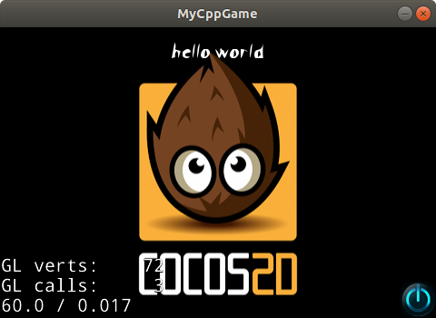
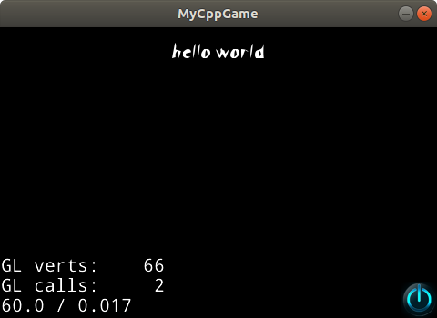

## CMake 快速上手

在开始之前, 我们假定您有使用过 Cocos2d-x 的经验, 且对 `C++` 语言比较熟悉. 这对于本文的理解很有帮助. 在这里我们会一步一步地创建HelloWorld 并让它运行起来. 并且使用 `CMake` 完成几个常见的工程修改. 

> 本文只是做一些实用性的介绍, 不能让您掌握 CMake. 如果需要更完整的文档, 请参考 [cmake.org](https://cmake.org/documentation/). 

### 前置工作

在我们开始之前, 您需要[把 Cocos2d-x 配置好 ](./index.md).


### 创建项目

首先需要一个用于存放游戏的目录, 我们可以通过下面的命令创建目录(这一步您也可以通过 鼠标右键 完成). 

```bash
~$ mkdir ~/Projects
```

然后进入目录

```bash
~$ cd ~/Projects
```
 如果我们之前已经配置没有错误的话, 我们现在应该以及可以直接在`Terminal` 中执行 `cocos` 命令. 

 通过下面的命令, 我们在当前目录创建一个子目录 `MyCppGame/`. 游戏相关的所有 资源都会存放在这个目录中. 

 ```cpp
 ~/Projects$ cocos new -lcpp
 ```
> 更详细的命令行解释在[这里cocos]()

我们进入目录`MyCppGame/` 可以看到这样的目录结构. 

```
├── Classes/
├── CMakeLists.txt
├── cocos2d/
├── proj.android/
├── proj.ios_mac/
├── proj.linux/
├── proj.win32/
└── Resources/
```

这里简要介绍下每个目录/文件的内容

|目录或者文件|介绍|
|----------|--------|
|`Classes/`|项目中的C++源码|
|`CMakeLists.txt`|CMake的输入文件|
|`cocos2d/`|引擎的源码和依赖的第三方库|
|`proj.android/`|android平台的源码|
|`proj.ios_mac/`|android平台相关的代码|
|`proj.linux/`|linux平台相关的代码|
|`proj.win32/`|windows平台相关代码|
|`Resources/`|图片/音频等资源文件|

看起来很多? 通过后续的过程, 您可以了解我们会怎么使用这些目录. 


### 运行起来


如果您了解过`CMake` 就会知道, CMake 需要生成其他项目配置才能 运行. 

按照习惯, 我们会在 `CMakeLists.txt` 的同级目录下 创建一个新的 `build/` 路径. 

```bash

 ~/Projects/MyCppGame$ mkdir build/
~/Projects/MyCppGame$ cd build/
```
执行 `CMake` 命令, 生成 `Xcode` 工程文件. 

```bash
~/Projects/MyCppGame/build$ cmake .. -G Xcode
```
> 更详细的命令行解释在[这里CMake]()

在 `build/` 会创建 `MyCppGame.xcodeproj/` 目录.  您可以使用 `Xcode` 直接打开,编译,运行项目. 因为本文的主要目的在于介绍CMake 的使用, 所以这里会继续使用命令行. 

下一步我们要编译项目, 生成可执行文件. 

```bash
~/Projects/MyCppGame/build$ cmake --build . --target MyCppGame
```
等待4分钟, 这一步完成之后, 我们就得到了一个可执行的 二进制文件. 

启动游戏

```bash
~/Projects/MyCppGame/build$ open bin/MyCppGame/Debug/MyCppGame.app 
```

游戏成功启动了!


我们已经完成了重要而且基础的一步, 接下来要做的是 开发中最常见的一些操作.  

### 添加图片资源

在不同的平台上, 资源管理会有差异. 好在 CMake 已经帮我们处理了大部分工作. 我们要做的就是把您准备好的资源放到 `Resources/` 目录下!

为了能在看到效果, 我们尝试用新的图片替代原来的图片.  

点击保存[图片](./img/powered.png) 到 `Resources/` 目录下. 
重命名为 `HelloWorld2.png`. 

您可以用任意编辑器 编辑 `Classes/HelloWorldScene.cpp`, 作出下面类似的修改. 

```diff
@@ -101,10 +101,10 @@ bool HelloWorld::init()
     }
 
     // add "HelloWorld" splash screen"
-    auto sprite = Sprite::create("HelloWorld.png");
+    auto sprite = Sprite::create("HelloWorld2.png");
     if (sprite == nullptr)
     {
-        problemLoading("'HelloWorld.png'");
+        problemLoading("'HelloWorld2.png'");
     }
     else
     {

```


再次编译

```bash
~/Projects/MyCppGame$ cd build/ 
~/Projects/MyCppGame/build$ cmake --build . --target MyCppGame
```
运行
```bash
~/Projects/MyCppGame/build$ open bin/MyCppGame/Debug/MyCppGame.app 
```

您会看到原本的图片被您替换了




### 添加字体资源


添加字体资源和添加图片资源的操作是类似的, 但在 iOS 平台上多了一个步骤. 

和处理图片的过程相似, 第一步是把 字体 添加到 `Resources/fonts` 目录. 

再次编辑 `Classes/HelloWorldScene.cpp`, 使用新的字体

```diff
@@ -85,7 +85,7 @@ bool HelloWorld::init()
     // add a label shows "Hello World"
     // create and initialize a label
 
-    auto label = Label::createWithTTF("Hello World", "fonts/Marker Felt.ttf", 24);
+    auto label = Label::createWithTTF("Hello World", "fonts/Scissor Cuts.ttf", 24);
```

编译 & 运行


```bash
~/Projects/MyCppGame/build$ cmake --build . --target MyCppGame
~/Projects/MyCppGame/build$ open bin/MyCppGame/Debug/MyCppGame.app 
```



如果没出错的话, `Hello World` 的字体以已经更新了. 

**如果在 iOS 上添加字体, 则需要一个额外的步骤.**

在 `proj.ios_mac/ios/Info.plist` 中添加 `UIAppFonts`.
```diff
@@ -29,7 +29,9 @@
     <key>LSRequiresIPhoneOS</key>
     <true/>
     <key>UIAppFonts</key>
-    <array/>
+    <array>
+           <string>fonts/Scissor Cuts.ttf</string>
+    </array>
     <key>UILaunchStoryboardName</key>
```

### 添加源文件

一般我们会把游戏相关的源码要放在 `Classes/` 目录下. 但只做这一步是不够的, 我们可能会遇到类似的编译错误.

```
__/HelloWorldScene.cpp:__: undefined reference to `Effect::update()'
```

我们需要在 `CMakeLists.txt` 中添加我们的源码路径

```diff
@@ -52,10 +52,12 @@ endif()
 list(APPEND GAME_SOURCE
      Classes/AppDelegate.cpp
      Classes/HelloWorldScene.cpp
+     Classes/SkillEffects/Effects.cpp
      )
 list(APPEND GAME_HEADER
      Classes/AppDelegate.h
      Classes/HelloWorldScene.h
+     Classes/SkillEffects/Effects.cpp
      )
 
 if(ANDROID)
```

然后重新更新 *本地项目文件*

```bash
~/Projects/MyCppGame/build$ cmake ..
```
通过命令行编译, 当然, 也是可以使用IDE编译. 
```bash
~/Projects/MyCppGame/build$ cmake --build . --target MyCppGame
```

### 添加 代码库

有的时候我们需要复用已有的代码库. 我们可以使用 CMake 提供的指令 [`add_subdirectory`](https://cmake.org/cmake/help/v3.0/command/add_subdirectory.html). 

首先, 您需要把原有的代码使用CMake改造. 如果这个库支持CMake, 那么我们后续的步骤就会比较简单. 

我们以`nanomsg`为例. 

```bash
mkdir deps
cp -r ~/Downloads/nanomsg-1.1.5 deps/
```

然后需要在 CMakeLists.txt 中添加下面的内容

```diff
@@ -129,6 +131,16 @@ target_include_directories(${APP_NAME}
         PRIVATE ${COCOS2DX_ROOT_PATH}/cocos/audio/include/
 )
 
+set(NN_STATIC_LIB ON)
+set(NN_ENABLE_DOC OFF)
+set(NN_TESTS OFF)
+set(NN_TOOLS OFF)

+add_subdirectory(deps/nanomsg-1.1.5)

+target_link_libraries(${APP_NAME} nanomsg)
+
+target_include_directories(${APP_NAME} PRIVATE deps/nanomsg-1.1.5/src)
+
+
 # mark app resources
 setup_cocos_app_config(${APP_NAME})

```
这里的前4行的`set`的作用是设置`nanomsg`的编译选项.

更详细的介绍可以参考 [`target_include_directories`](https://cmake.org/cmake/help/v3.0/command/target_include_directories.html) 和 [`target_link_libraries`](https://cmake.org/cmake/help/v3.0/command/target_link_libraries.html).

之后我们就可以在`Classes/HelloWorldScene.cpp`中使用这个库了 

```diff
@@ -24,6 +24,10 @@
#include "HelloWorldScene.h"
+#include "nn.h"
```


### 添加宏和include路径 

[target_include_directories](https://cmake.org/cmake/help/v3.0/command/target_include_directories.html)
[target_compile_definitions](https://cmake.org/cmake/help/v3.0/command/target_compile_definitions.html)

#### 在CMake中区分不同平台的代码

项目里总是会需要一些平台相关的代码, 我们可以参考 CMakeLists.txt 现有的代码, 在不同的分支中添加文件. 

```cmake

if(ANDROID)
    # change APP_NAME to the share library name for Android, it's value depend on AndroidManifest.xml
    set(APP_NAME MyGame)
    list(APPEND GAME_SOURCE
         proj.android/app/jni/hellocpp/main.cpp
         )
elseif(LINUX)
    list(APPEND GAME_SOURCE
         proj.linux/main.cpp
         )
elseif(WINDOWS)
    list(APPEND GAME_HEADER
         proj.win32/main.h
         proj.win32/resource.h
         )
    list(APPEND GAME_SOURCE
         proj.win32/main.cpp
         proj.win32/game.rc
         ${common_res_files}
         )
...
```

#### 集成`protobuf`生成协议文件

//TODO

#### 在编译文件中添加 commit id

//TODO

### 常见问题

#### 为什么添加了图片后 找不到资源 ?

在 Windows 和 Linux 上您可能会经常遇到类似于

```log
Error while loading: 'HelloWorld2.png'
```

的报错. 



您打开`Resource/`反复确认文件是存在的. 这的确会让人感到困惑. 

您在工程目录中执行下面命令

```bash
~/Projects/MyCppGame$ find . -name Resources
```
会发现 有两个 `Resources/` 目录
```
./Resources
./build/bin/MyCppGame/Resources
```

其中 第二个 目录是前者的一个副本, 如果发生变更 就会存在同步问题. 新增资源 找不到 也是同步问题中的一种. 
您可能会有疑问: 为什么需要拷贝? 在什么时候拷贝?

在 iOS,Android 平台, 生成的**目标对象**是一个程序包. 除了可执行文件,还包括了所需要的资源文件. 资源文件和可执行程序一起发布, 所以不再依赖原本的资源文件(`Resources/`目录中的内容). 但是 在Windows和Linux上, 生成的**目标对象** 只有一个**可执行文件**, 并不包含资源文件. 比如在Windows上就只有一个`MyCppGame.exe`文件. 为了让**可执行文件**能够找到资源, 我们需要把整个 `Resources/` 拷贝到 和它同一个目录中. 这就解释了为什么需要拷贝. 

实际上我们并没有提供给开发者 拷贝资源文件的 命令行. 我们通过
`CMake` 把这个过程交给了 `native build environment`. 

Cocos2d-x 提供了类似与下面代码片段的过程

```cmake
add_custom_command(TARGET MyCppGame POST_BUILD
                COMMAND cmake -E copy_directory ./Resources ./build/bin/MyCppGame/Resources
            )
```
这里的重点在 `POST_BUILD`, 只有 `Build`发生变化. 如果源文件发生了变化, 在编译完成后才会出发 拷贝资源的动作. 这里有一个问题, 如果资源文件发生了变化, 比如添加,删除, 拷贝动作会被触发吗? 答案是:不会. 这就是运行时找不到资源的原因. 

了解了导致错误的原因, 解决这个问题就不会很难. 一个简单的解决办法就是修改 `Classes/` 中的源码(比如添加空行,然后删除,保存), 从而触发 `Build` 和 `POST_BUILD`. 

在 Mac 平台也会有一样的问题, 导致问题的原因不太相同.  Mac 项目不需要拷贝, 只需要把 `Resources/` 中的文件标记为 资源文件. 但这一步是在生成 `cmake ../ -GXcode` 时做的. 后续 资源文件的更新不会同步到 `Xcode` 项目中. 解决这个问题的方法也很简单, 重新执行 `cmake`会更新 `Xcode` 项目文件. 

```bash
~/Projects/MyCppGame/build$ cmake ..
```


